继《面向开发者的ChatGPT提示工程》一课爆火之后，时隔一个月，吴恩达教授再次推出了另外三门免费的AI课程，今天要讲的就是其中联合了 LangChain 一起授课的——《基于LangChain的大语言模型应用开发》。

这门课程将系统地介绍 LangChain 的常见组件及其应用，包括：

-   模型，提示和输出解析（第1章节）
-   记忆（第2章节）
-   链（第3章节）
-   基于文档的问答（第4章节）
-   评估（第5章节）
-   代理（第6章节）

在线观看链接：[https://www.deeplearning.ai/]("https://www.deeplearning.ai/short-courses/langchain-for-llm-application-development/")





## 介绍

### LangChain是什么？

一个开源的、用于构建LLM应用的开发框架。

### LangChain做了什么工作？

虽然通过提示（Prompt），可以加速开发LLM应用的进程，但过程中可能会产生很多胶水代码。

LangChain所做的，就是**把其中一些公共的部分抽象出来**。

### LangChain有什么特点？
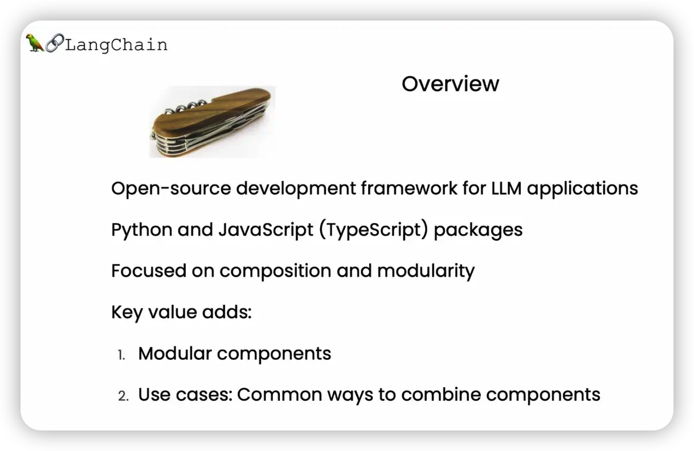

**LangChain注重组合和模块化**。

LangChain拥有许多独立组件，可以单独使用，也可以与其他组件组合使用。

通过将模块化的组件链式组合，可以构建一个更完整的应用程序。

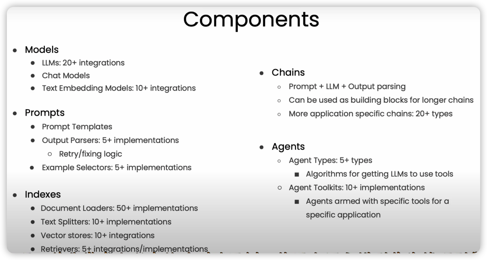

## 模型、提示与输出解析

先理清几个概念：

| 概念   | 解释                                         |
| ------ | -------------------------------------------- |
| 模型   | 语言模型，用于生成文本。                     |
| 提示   | 用于向模型传递信息。                         |
| 解析器 | 接收模型的输出，并将其解析成更结构化的格式。 |

LangChain提供了一套简单的抽象，用于简化原先需要对模型反复提示与解析的操作。

## 直接调用API vs 使用LangChain

使用LangChain访问ChatGPT，与直接使用OpenAI API有什么区别？让我们用一个例子来对比一下。

任务是将文本按指定风格翻译成目标语言。

### 直接调用API

#### 步骤1：定义辅助函数，用于调用OpenAI API

```python
def get_completion(prompt, model="gpt-3.5-turbo"):
    messages = [{"role": "user", "content": prompt}]
    response = openai.ChatCompletion.create(
        model=model,
        messages=messages,
        temperature=0, 
    )
    return response.choices[0].message["content"]
```

#### 步骤2：定义待翻译文本与翻译风格

```python
# 文本
customer_email = """
Arrr, I be fuming that me blender lid \
flew off and splattered me kitchen walls \
with smoothie! And to make matters worse,\
the warranty don't cover the cost of \
cleaning up me kitchen. I need yer help \
right now, matey!
"""

# 风格
style = """American English \
in a calm and respectful tone
"""
```

#### 步骤3：定义提示，用于指定目标语言，并以字符串插值的形式插入文本与风格

```python
prompt = f"""Translate the text \
that is delimited by triple backticks 
into a style that is {style}.
text: ```{customer_email}```
"""
```

#### 步骤4：调用函数并打印结果

```python
response = get_completion(prompt)
print(response)
```

### 使用LangChain

#### 步骤1：创建ChatOpenAI实例

```python
# 导入ChatOpenAI，这是LangChain对ChatGPT API访问的抽象
from langchain.chat_models import ChatOpenAI
# 要控制 LLM 生成文本的随机性和创造性，请使用 temperature = 0.0
chat = ChatOpenAI(temperature=0.0)
```

#### 步骤2：创建提示模板实例

```python
# 模板字符串，用于指定目标语言，拥有两个输入变量，"style"和"text"
template_string = """Translate the text \
that is delimited by triple backticks \
into a style that is {style}. \
text: ```{text}```
"""
# 构建一个ChatPromptTemplate实例，用于模板的重用
from langchain.prompts import ChatPromptTemplate
prompt_template = ChatPromptTemplate.from_template(template_string)
```

#### 步骤3：定义翻译风格与待翻译文本，作为输入变量传入提示模板

```python
# 风格
customer_style = """American English \
in a calm and respectful tone
"""

# 文本
customer_email = """
Arrr, I be fuming that me blender lid \
flew off and splattered me kitchen walls \
with smoothie! And to make matters worse, \
the warranty don't cover the cost of \
cleaning up me kitchen. I need yer help \
right now, matey!
"""

# 将风格和文本作为输入变量传入提示模板
customer_messages = prompt_template.format_messages(
                    style=customer_style,
                    text=customer_email)
```

#### 步骤4：调用LLM翻译成指定风格，并打印结果

```python
customer_response = chat(customer_messages)
print(customer_response.content)
```

可以看出，使用LangChain访问ChatGPT，与直接使用OpenAI API相比，主要区别是：

-   对ChatGPT API的访问做了抽象，简化调用
-   改用提示模板，而不是"f"字符串，方便重用

### 为什么要使用提示模板？

随着构建应用程序的复杂度增加时，提示可能会需要更长且更详细。

**提示模板作为一种抽象，可以让我们适时重用提示**。

此外，LangChain还为一些常见操作提供了提示，如摘要、回答问题、连接到SQL数据库或连接到不同的API。

通过使用LangChain的内置提示，可以快速地使应用程序运行，而无需设计自己的提示。

## LangChain输出解析器的作用
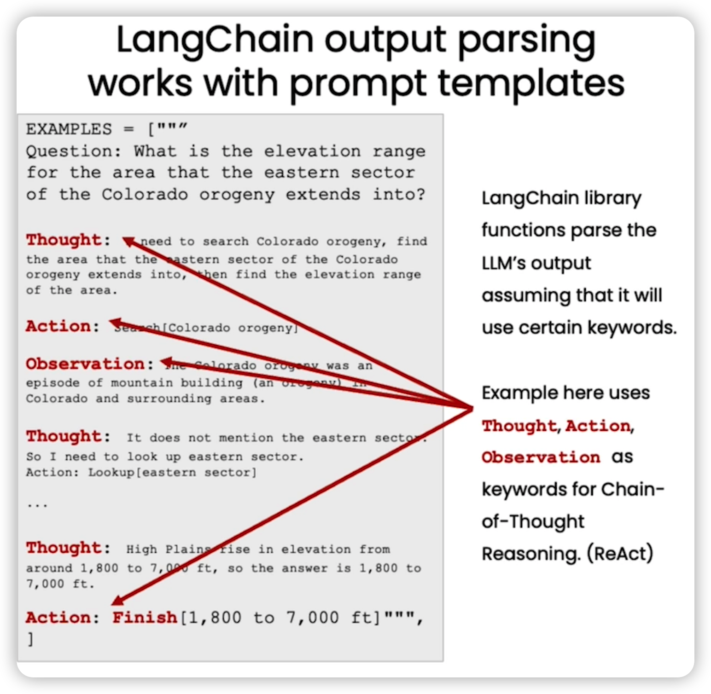

**输出解析器可以提取模型输出中的特定字段，解析为更易于处理的格式**。

比如，解析为 Python 字典：

#### 步骤1：指定返回的JSON的格式规范

```python
from langchain.output_parsers import ResponseSchema
from langchain.output_parsers import StructuredOutputParser

# 礼物规范
gift_schema = ResponseSchema(name="gift",
                             description="Was the item purchased\
                             as a gift for someone else? \
                             Answer True if yes,\
                             False if not or unknown.")
# 送货日期规范
delivery_days_schema = ResponseSchema(name="delivery_days",
                                      description="How many days\
                                      did it take for the product\
                                      to arrive? If this \
                                      information is not found,\
                                      output -1.")
# 价格值规范
price_value_schema = ResponseSchema(name="price_value",
                                    description="Extract any\
                                    sentences about the value or \
                                    price, and output them as a \
                                    comma separated Python list.")
```

#### 步骤2：创建解析器实例，获取格式指令

```python
# 将格式规范放到一个列表里
response_schemas = [gift_schema, 
                    delivery_days_schema,
                    price_value_schema]
# 构建一个StructuredOutputParser实例
output_parser = StructuredOutputParser.from_response_schemas(response_schemas)
# 获取将发送给LLM的格式指令
format_instructions = output_parser.get_format_instructions()

print(format_instructions)
```

格式指令用于让LLM生成指定的内容格式，以便解析器可以解析，打印得到其内容如下：

````
The output should be a markdown code snippet formatted in the following schema, including the leading and trailing "\`\`\`json" and "\`\`\`":

```json
{
"gift": string  // Was the item purchased as a gift for someone else? Answer True if yes, False if not or unknown.
"delivery_days": string  // How many days did it take for the product to arrive? If this information is not found,                                      output -1.
"price_value": string  // Extract any sentences about the value or price, and output them as a comma separated Python list.
}
\```
````

#### 步骤3：创建提示模板实例，将文本和格式指令作为输入变量传入

```python
# 提示
review_template_2 = """\
For the following text, extract the following information:

gift: Was the item purchased as a gift for someone else? \
Answer True if yes, False if not or unknown.

delivery_days: How many days did it take for the product\
to arrive? If this information is not found, output -1.

price_value: Extract any sentences about the value or price,\
and output them as a comma separated Python list.

text: {text}

{format_instructions}
"""

# 构建一个ChatPromptTemplate实例，用于模板的重用
prompt = ChatPromptTemplate.from_template(template=review_template_2)
# 将文本和格式指令作为输入变量传入
messages = prompt.format_messages(text=customer_review, 
                                format_instructions=format_instructions)
```

### 步骤4：调用LLM解析文本，并打印结果

```python
response = chat(messages)
print(response.content)
```

打印结果如下：

```python
```json
{
"gift": true,
"delivery_days": "2",
"price_value": ["It's slightly more expensive than the other leaf blowers out there, but I think it's worth it for the extra features."]
}
\```
````

### 步骤5：将结果解析为字典类型，并提取与送货天数相关联的值

```python
output_dict = output_parser.parse(response.content)
print(output_dict.get('delivery_days'))
```

提取到的值如下：

```
'2'
```

## 记忆(Memory)

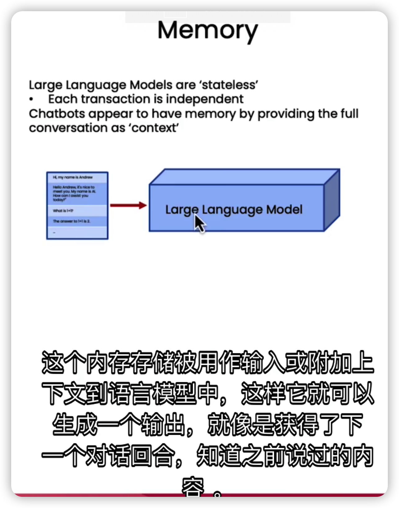

当我们与模型互动时，由于模型本身是无状态的，因此它通常无法记住之前对话的历史消息。

每个请求交互，每次调用API都是独立的，这对于构建流畅的对话应用是个问题。

为此，LangChain提供了多种记忆存储管理策略。

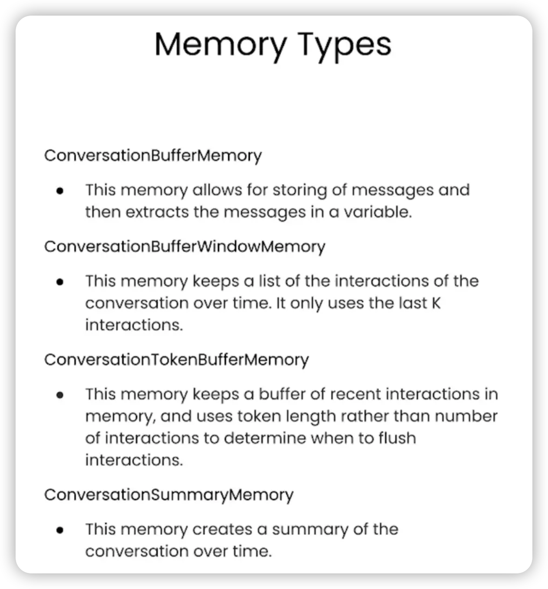

| 策略                            | 特点                 |
| ------------------------------- | -------------------- |
| ConversationBufferMemory        | 存储完整的对话历史   |
| ConversationBufferWindowMemory  | 只保留最后几轮对话   |
| ConversationalTokenBufferMemory | 限制存储的令牌数量   |
| ConversationSummaryBufferMemory | 使用摘要存储对话历史 |

## ConversationBufferMemory

ConversationBufferMemory可用于临时存储完整的对话历史。

例子如下：

#### 步骤1：创建对话链实例

```python
from langchain.chat_models import ChatOpenAI
from langchain.chains import ConversationChain
from langchain.memory import ConversationBufferMemory

llm = ChatOpenAI(temperature=0.0)
memory = ConversationBufferMemory()
conversation = ConversationChain(
    llm=llm, 
    memory = memory,
    verbose=True
)
```

#### 步骤2：使用"conversation.predict"函数进行对话

```python
conversation.predict(input="Hi, my name is Andrew")
conversation.predict(input="What is 1+1?")
conversation.predict(input="What is my name?")
```

也可使用"memory.save\_context"直接往存储里添加新内容

```python
memory.save_context({"input": "Not much, just hanging"}, 
                    {"output": "Cool"})
```

由于我们把"verbose"变量改成"True，因此可以看到LangChain运行时的更多细节：

> \> Entering new ConversationChain chain...
>
> Prompt after formatting:
>
> The following is a friendly conversation between a human and an AI. The AI is talkative and provides lots of specific details from its context. If the AI does not know the answer to a question, it truthfully says it does not know.
>
> Current conversation:
>
> Human: Hi, my name is Andrew
>
> AI: Hello Andrew, it's nice to meet you. My name is AI. How can I assist you today?
>
> Human: What is 1+1?
>
> AI: The answer to 1+1 is 2.
>
> Human: What is my name?
>
> AI:
>
> \> Finished chain.
>
> 'Your name is Andrew, as you mentioned earlier.'

可以看到，记忆存储包含了到目前为止的所有对话消息，并用作LLM的输入或额外上下文。

这样，它在生成输出时，就可以基于之前所说过的会话内容，再生成新的会话，让你感觉它好像“记得”你说过的话。

#### 步骤3：打印当前对话存储的所有历史消息

```python
print(memory.buffer)
```

> Human: Hi, my name is Andrew
>
> AI: Hello Andrew, it's nice to meet you. My name is AI. How can I assist you today?
>
> Human: What is 1+1?
>
> AI: The answer to 1+1 is 2.
>
> Human: What is my name?
>
> AI: Your name is Andrew, as you mentioned earlier.

或者，

```python
print(memory.load_memory_variables({}))
```

> {'history': "Human: Hi, my name is Andrew\\nAI: Hello Andrew, it's nice to meet you. My name is AI. How can I assist you today?\\nHuman: What is 1+1?\\nAI: The answer to 1+1 is 2.\\nHuman: What is my name?\\nAI: Your name is Andrew, as you mentioned earlier."}

但随着对话的进行，记忆存储的大小会增加，发送Token的成本也会增加，为此，LangChain提供了另外几种策略。

## ConversationBufferWindowMemory

ConversationBufferWindowMemory只保留窗口记忆，也即只保留最后几轮对话。它有一个变量k，表示想记住最后几轮对话。

比如，当k等于1时，表示仅记住最后一轮对话。

例子如下：

```python
from langchain.memory import ConversationBufferWindowMemory

llm = ChatOpenAI(temperature=0.0)
memory = ConversationBufferWindowMemory(k=1)
conversation = ConversationChain(
    llm=llm, 
    memory = memory,
    verbose=False
)
```

我们可以在进行几轮对话之后，尝试让其回顾之前的对话内容：

```python
conversation.predict(input="Hi, my name is Andrew")
# "Hello Andrew, it's nice to meet you. My name is AI. How can I assist you today?"

conversation.predict(input="What is 1+1?")
# 'The answer to 1+1 is 2.'

conversation.predict(input="What is my name?")
# "I'm sorry, I don't have access to that information. Could you please tell me your name?"
```

这时我们会发现，由于窗口记忆的限制，它会丢失了前面有关名字的交流，从而无法说出我的名字。

这个功能可以防止记忆存储量随着对话的进行而无限增长。当然在实际使用时，k不会设为1，而是会通常设置为一个较大的数字。

## ConversationalTokenBufferMemory

很多LLM定价是基于Token的，Token调用的数量直接反映了LLM调用的成本。

使用ConversationalTokenBufferMemory，可以限制保存在记忆存储的令牌数量。

例子如下：

```python
from langchain.memory import ConversationTokenBufferMemory
from langchain.llms import OpenAI

llm = ChatOpenAI(temperature=0.0)

# 指定LLM和Token限制值
memory = ConversationTokenBufferMemory(llm=llm, max_token_limit=30)
```

在插入一些消息之后，我们可以打印其实际保存的历史消息。

```python
# 插入一些消息
memory.save_context({"input": "AI is what?!"},
                    {"output": "Amazing!"})
memory.save_context({"input": "Backpropagation is what?"},
                    {"output": "Beautiful!"})
memory.save_context({"input": "Chatbots are what?"}, 
                    {"output": "Charming!"})

# 打印历史消息
memory.load_memory_variables({})
```

打印内容如下：

> {'history': 'AI: Beautiful!\\nHuman: Chatbots are what?\\nAI: Charming!'}

我们会发现，当把Token限制值调得比较高时，它几乎可以包含整个对话。

**而如果减少值，它会删掉对话最早的那部分消息，只保留最近对话的消息，并且保证总的消息内容长度不超过Token限制值**。

另外，之所以还要指定一个LLM参数，是因为不同的LLM使用不同的Token计算方式。

这里是告诉它，使用ChatOpenAI LLM使用的计算Token的方法。

## ConversationSummaryBufferMemory

ConversationSummaryBufferMemory试图将消息的显性记忆，保持在我们设定的Token限制值之下，也即

1.  当Token限制值能覆盖文本长度时，会存储整个对话历史。
2.  而当Token限制值小于文本长度时，则会为所有历史消息生成摘要，改在记忆中存储历史消息的摘要。

以情况2为例：

```python
from langchain.memory import ConversationSummaryBufferMemory

# 创建一个长字符串
schedule = "There is a meeting at 8am with your product team. \
You will need your powerpoint presentation prepared. \
9am-12pm have time to work on your LangChain \
project which will go quickly because Langchain is such a powerful tool. \
At Noon, lunch at the italian resturant with a customer who is driving \
from over an hour away to meet you to understand the latest in AI. \
Be sure to bring your laptop to show the latest LLM demo."

memory = ConversationSummaryBufferMemory(llm=llm, max_token_limit=100)
memory.save_context({"input": "Hello"}, {"output": "What's up"})
memory.save_context({"input": "Not much, just hanging"},
                    {"output": "Cool"})
memory.save_context({"input": "What is on the schedule today?"}, 
                    {"output": f"{schedule}"})
                    
conversation = ConversationChain(
    llm=llm, 
    memory = memory,
    verbose=True
)
conversation.predict(input="What would be a good demo to show?")

```

运行的细节如下：

> \> Entering new ConversationChain chain...
>
> Prompt after formatting:
>
> The following is a friendly conversation between a human and an AI. The AI is talkative and provides lots of specific details from its context. If the AI does not know the answer to a question, it truthfully says it does not know.
>
> Current conversation:
>
> System: The human and AI engage in small talk before discussing the day's schedule. The AI informs the human of a morning meeting with the product team, time to work on the LangChain project, and a lunch meeting with a customer interested in the latest AI developments.
>
> Human: What would be a good demo to show?
>
> AI:
>
> \> Finished chain.
>
> "Based on the customer's interest in AI developments, I would suggest showcasing our latest natural language processing capabilities. We could demonstrate how our AI can accurately understand and respond to complex language queries, and even provide personalized recommendations based on the user's preferences. Additionally, we could highlight our AI's ability to learn and adapt over time, making it a valuable tool for businesses looking to improve their customer experience."

可以看到，由于超过了设定的Token限制值，它为历史会话的生成了一个摘要，并放在系统消息的提示词中。

## 其他记忆存储管理策略

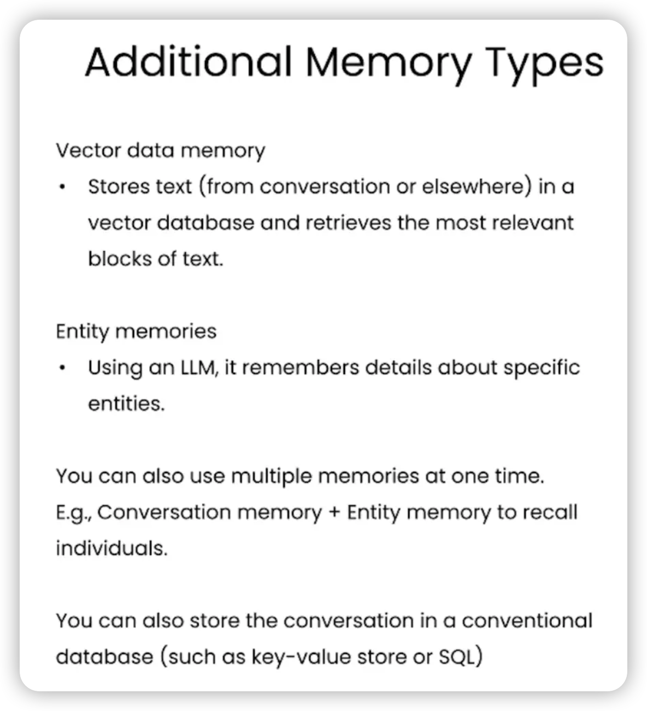

| 策略                             | 特点                                                 |
| -------------------------------- | ---------------------------------------------------- |
| 向量数据存储（VectorDataMemory） | 存储嵌入向量，用于检索相关文本块                     |
| 实体记忆存储（EntityMemories）   | 记住特定实体的详细信息，比如对话中某个重要人物的信息 |

除了这些记忆存储类型，也可将整个对话存储在传统数据库中，如键值存储（key-value store）或SQL数据库。

这样就可以回顾整个对话，进行审计或进一步改进系统。

## 链

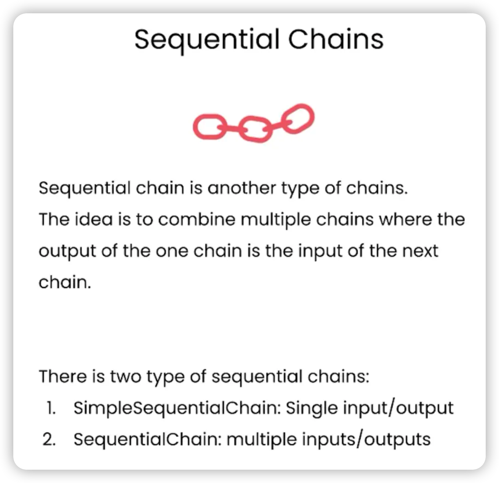

**链（Chain）是LangChain中最关键的构建模块**。

除了将 LLM 与提示结合在一起，还可以通过组合多个链，对文本或其他数据执行一系列的操作。

LangChain提供了多种可用的链类型：

| 类型                                | 场景                               |
| ----------------------------------- | ---------------------------------- |
| LLM链（LLMChain）                   | 将LLM和提示结合在一起              |
| 简单顺序链（SimpleSequentialChain） | 只需要一个输入并且只返回一个输出   |
| 常规顺序链（SequentialChain）       | 有多个输入或多个输出               |
| 路由链（RouterChain）               | 根据输入的具体内容路由到不同的子链 |

下面让我们来逐一了解一下。

首先，用 pandas DataFrame 加载一些稍后要用到的数据。

```python
import pandas as pd
df = pd.read_csv('Data.csv')

df.head()
```
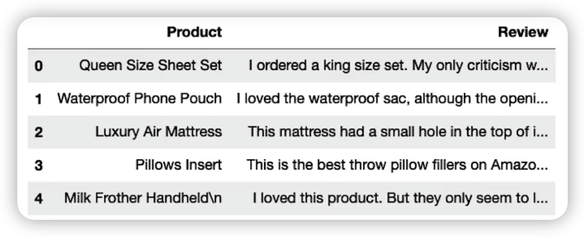

## LLM链（LLMChain）

LLM链是一个简单但非常强大的链，它是我们后面要讨论的其他链类型的基础，用于将LLM和提示结合在一起。

例子如下：

#### 步骤1：初始化语言模型和提示

```python
from langchain.chat_models import ChatOpenAI
from langchain.prompts import ChatPromptTemplate
from langchain.chains import LLMChain

# 用一个比较高的temperature值以获得一些更有意思的结果
llm = ChatOpenAI(temperature=0.9)
# 接收一个名为“product”的变量，要求LLM生成描述生产该产品的公司的最佳名称
prompt = ChatPromptTemplate.from_template(
    "What is the best name to describe \
    a company that makes {product}?"
)
```

#### 步骤2：将产品传入链中，并运行链

```python
chain = LLMChain(llm=llm, prompt=prompt)
product = "Queen Size Sheet Set"
chain.run(product)
```

运行链后，它将在后台格式化提示词，然后将格式化后的完整提示词传递给LLM，然后得到结果：

> 'Royal Beddings.'

## 简单顺序链（SimpleSequentialChain）

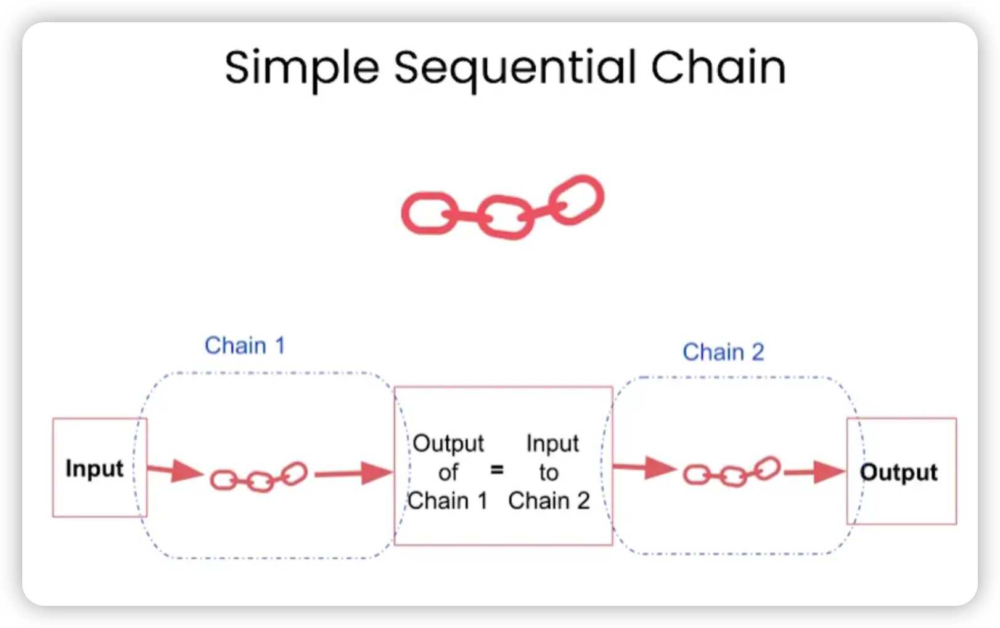

当我们的子链只需要一个输入并且只返回一个输出时，简单顺序链很有效。

例子如下：

#### 步骤1：初始化语言模型

```python
from langchain.chains import SimpleSequentialChain

llm = ChatOpenAI(temperature=0.9)
```

#### 步骤2：创建第一个链

```python
# 提示模板1：接受产品并返回描述该公司的最佳名称
first_prompt = ChatPromptTemplate.from_template(
    "What is the best name to describe \
    a company that makes {product}?"
)

# 第一个链
chain_one = LLMChain(llm=llm, prompt=first_prompt)
```

#### 步骤3：创建第二个链

```python
# 提示模板2：获取公司名称，然后输出该公司的 20 字描述
second_prompt = ChatPromptTemplate.from_template(
    "Write a 20 words description for the following \
    company:{company_name}"
)
# 第二个链
chain_two = LLMChain(llm=llm, prompt=second_prompt)
```

#### 步骤4：创建简单顺序链实例，并运行链

```python
# 第一个链的输出将传递到第二个链
overall_simple_chain = SimpleSequentialChain(chains=[chain_one, chain_two],
                                             verbose=True
                                            )
overall_simple_chain.run(product)
```

运行的细节如下：

> \> Entering new SimpleSequentialChain chain...
>
> "Royal Bedding Co."
>
> "Royal Bedding Co. offers luxurious and comfortable bedding solutions for a restful and regal sleep experience fit for royalty."
>
> \> Finished chain.

可以看到，它首先输出公司名称，然后将其传递到第二条链，并给出该公司可能的业务描述。

## 常规顺序链（SequentialChain）

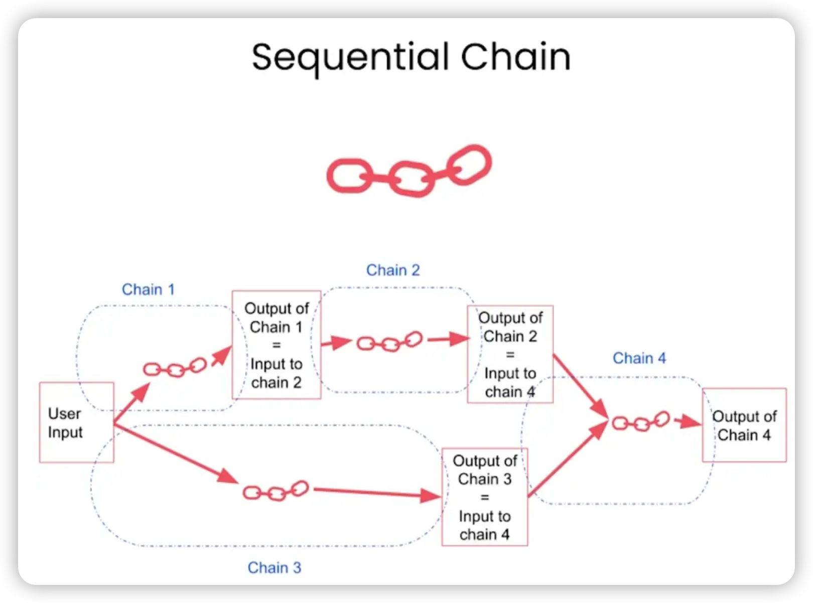

当有多个输入或多个输出时，可以使用常规顺序链。

例子如下：

#### 步骤1：初始化语言模型

```python
from langchain.chains import SequentialChain

llm = ChatOpenAI(temperature=0.9)
```

#### 步骤2：创建一堆将依次使用的链

```python
# 第一条链，将评论翻译成英语。
first_prompt = ChatPromptTemplate.from_template(
    "Translate the following review to english:"
    "\n\n{Review}"
)
chain_one = LLMChain(llm=llm, prompt=first_prompt, 
                     output_key="English_Review"
                    )
           
# 第二条链，用一句话总结该评论       
second_prompt = ChatPromptTemplate.from_template(
    "Can you summarize the following review in 1 sentence:"
    "\n\n{English_Review}"
)
chain_two = LLMChain(llm=llm, prompt=second_prompt, 
                     output_key="summary"
                    )

# 第三条链，检测原始评论的语言
third_prompt = ChatPromptTemplate.from_template(
    "What language is the following review:\n\n{Review}"
)
chain_three = LLMChain(llm=llm, prompt=third_prompt,
                       output_key="language"
                      )

# 第四条链，接收第二条链的摘要内容("summary"变量)，以及第三条链的语言类别("language"变量)，要求后续回复摘要内容时使用指定语言。
fourth_prompt = ChatPromptTemplate.from_template(
    "Write a follow up response to the following "
    "summary in the specified language:"
    "\n\nSummary: {summary}\n\nLanguage: {language}"
)
chain_four = LLMChain(llm=llm, prompt=fourth_prompt,
                      output_key="followup_message"
                     )

```

常规顺序链中的任何一个步骤，都可以接收来自上游的多个输入变量，特别当你有复杂的下游链需要和多个上游链组合时，这会非常有用。

#### 步骤3：将这些链组合在顺序链中，并指定输入与输出变量

```python
overall_chain = SequentialChain(
    chains=[chain_one, chain_two, chain_three, chain_four],
    input_variables=["Review"],
    output_variables=["English_Review", "summary","followup_message"],
    verbose=True
)
```

让这些变量名称准确排列非常重要，因为有很多不同的输入和输出。如果你遇到任何问题，请检查它们排列顺序是否正确。

#### 步骤4：选择一条评论并将其传递到整个链中

```python
review = df.Review[5]
overall_chain(review)
```

执行的细节如下：

> \> Entering new SequentialChain chain...
>
> \> Finished chain.
>
> {'Review': "Je trouve le goût médiocre. La mousse ne tient pas, c'est bizarre. J'achète les mêmes dans le commerce et le goût est bien meilleur...\\nVieux lot ou contrefaçon !?",
>
> 'English\_Review': "I find the taste mediocre. The foam doesn't hold up, it's weird. I buy the same ones in stores and the taste is much better... Old batch or counterfeit!?",
>
> 'summary': 'The reviewer expresses dissatisfaction with the taste and foam of the product, suspecting that it might be an old batch or counterfeit.',
>
> 'followup\_message': "Réponse : Le critique exprime sa déception quant au goût et à la mousse du produit, soupçonnant qu'il s'agit peut-être d'un lot périmé ou contrefait. Il est important que les fabricants prennent des mesures pour garantir la qualité de leurs produits afin de maintenir la confiance de leurs clients. Nous espérons que ce problème sera rapidement résolu pour que les consommateurs puissent profiter du produit tel qu'il est censé être."}

可以看到，其最终采用了检测到的原始语言——法语对摘要内容进行了回复。

## 路由链（RouterChain）

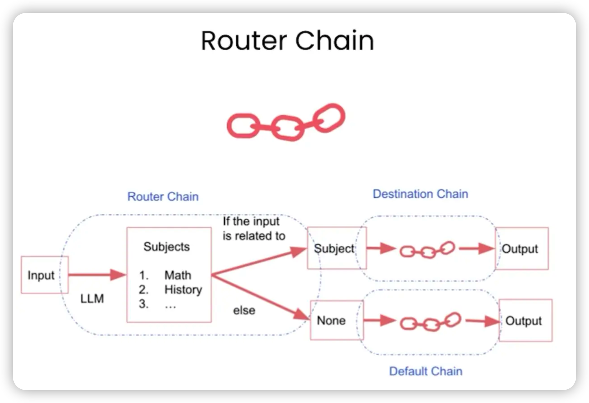

如果你有多个子链，且每个子链专门负责处理某种特定类型的输入，这种情况就可以使用路由链。

**路由链会根据输入的具体内容路由到不同的子链**。

它会首先判断该使用哪个子链，然后将输入传递到相应的子链。

例子如下：

#### 步骤1：提供多个特定类型的提示模板

```python
# 第一个提示，适合回答物理问题
physics_template = """You are a very smart physics professor. \
You are great at answering questions about physics in a concise\
and easy to understand manner. \
When you don't know the answer to a question you admit\
that you don't know.

Here is a question:
{input}"""

# 第二个提示，适合回答数学问题
math_template = """You are a very good mathematician. \
You are great at answering math questions. \
You are so good because you are able to break down \
hard problems into their component parts, 
answer the component parts, and then put them together\
to answer the broader question.

Here is a question:
{input}"""

# 第三个提示，适合回答历史问题
history_template = """You are a very good historian. \
You have an excellent knowledge of and understanding of people,\
events and contexts from a range of historical periods. \
You have the ability to think, reflect, debate, discuss and \
evaluate the past. You have a respect for historical evidence\
and the ability to make use of it to support your explanations \
and judgements.

Here is a question:
{input}"""

# 第四个提示,适合回答计算机科学问题。
computerscience_template = """ You are a successful computer scientist.\
You have a passion for creativity, collaboration,\
forward-thinking, confidence, strong problem-solving capabilities,\
understanding of theories and algorithms, and excellent communication \
skills. You are great at answering coding questions. \
You are so good because you know how to solve a problem by \
describing the solution in imperative steps \
that a machine can easily interpret and you know how to \
choose a solution that has a good balance between \
time complexity and space complexity. 

Here is a question:
{input}"""
```

#### 步骤2：为每个提示模板提供更多相关信息

这些信息将传递给路由链，以帮助路由链决定何时使用哪条子链。

```python
prompt_infos = [
    {
        "name": "physics", 
        "description": "Good for answering questions about physics", 
        "prompt_template": physics_template
    },
    {
        "name": "math", 
        "description": "Good for answering math questions", 
        "prompt_template": math_template
    },
    {
        "name": "History", 
        "description": "Good for answering history questions", 
        "prompt_template": history_template
    },
    {
        "name": "computer science", 
        "description": "Good for answering computer science questions", 
        "prompt_template": computerscience_template
    }
]
```

#### 步骤3：导入需要的链类型，定义使用的语言模型

MultiPromptChain是一种特定类型的链，用于在多个不同提示模板之间进行路由。

LLMRouterChain会借助语言模型的帮助，让语言模型根据上面提供的名称和描述等信息，判断如何路由。

RouterOutputParser将LLM输出解析成一个字典，根据字典内容确定下游使用哪条链，以及链的输入应该是什么。

```python
from langchain.chains.router import MultiPromptChain
from langchain.chains.router.llm_router import LLMRouterChain,RouterOutputParser
from langchain.prompts import PromptTemplate

llm = ChatOpenAI(temperature=0)
```

#### 步骤4：创建目标链

路由链会根据输入内容调用这些目标链的其中一个。

```python
destination_chains = {}
for p_info in prompt_infos:
    name = p_info["name"]
    prompt_template = p_info["prompt_template"]
    prompt = ChatPromptTemplate.from_template(template=prompt_template)
    chain = LLMChain(llm=llm, prompt=prompt)
    destination_chains[name] = chain  
    
destinations = [f"{p['name']}: {p['description']}" for p in prompt_infos]
destinations_str = "\n".join(destinations)
```

#### 步骤5：创建默认链

默认链是在路由找不到合适的子链调用时，用来备用的一条链路。

```python
default_prompt = ChatPromptTemplate.from_template("{input}")
default_chain = LLMChain(llm=llm, prompt=default_prompt)
```

#### 步骤6：定义一个路由提示模板

LLM 会根据提示词的内容在不同链之间路由。

```python
MULTI_PROMPT_ROUTER_TEMPLATE = """Given a raw text input to a \
language model select the model prompt best suited for the input. \
You will be given the names of the available prompts and a \
description of what the prompt is best suited for. \
You may also revise the original input if you think that revising\
it will ultimately lead to a better response from the language model.

<< FORMATTING >>
Return a markdown code snippet with a JSON object formatted to look like:
\```json
{{{{
    "destination": string \ name of the prompt to use or "DEFAULT"
    "next_inputs": string \ a potentially modified version of the original input
}}}}
\```

REMEMBER: "destination" MUST be one of the candidate prompt \
names specified below OR it can be "DEFAULT" if the input is not\
well suited for any of the candidate prompts.
REMEMBER: "next_inputs" can just be the original input \
if you don't think any modifications are needed.

<< CANDIDATE PROMPTS >>
{destinations}

<< INPUT >>
{{input}}

<< OUTPUT (remember to include the ```json)>>"""

```

#### 步骤7：组合语言模型、路由提示模板，构成路由链

```python
router_template = MULTI_PROMPT_ROUTER_TEMPLATE.format(
    destinations=destinations_str
)
router_prompt = PromptTemplate(
    template=router_template,
    input_variables=["input"],
    output_parser=RouterOutputParser(),
)

router_chain = LLMRouterChain.from_llm(llm, router_prompt)
```

#### 步骤8：组合路由链、目标链和默认链，创建整条链

```python
chain = MultiPromptChain(router_chain=router_chain, 
                         destination_chains=destination_chains, 
                         default_chain=default_chain, verbose=True
                        )
```

#### 步骤9：提问不同类型的问题

```python
# 物理问题
chain.run("What is black body radiation?")
```

输出如下：

> \> Entering new MultiPromptChain chain...
>
> physics: {'input': 'What is black body radiation?'}
>
> \> Finished chain.
>
> "Black body radiation refers to the electromagnetic radiation emitted by a perfect black body, which is an object that absorbs all radiation that falls on it and emits radiation at all wavelengths. The radiation emitted by a black body depends only on its temperature and follows a specific distribution known as Planck's law. This type of radiation is important in understanding the behavior of stars, as well as in the development of technologies such as incandescent light bulbs and infrared cameras."

```
# 数学问题
chain.run("what is 2 + 2")
```

输出如下：

> \> Entering new MultiPromptChain chain...
>
> math: {'input': 'what is 2 + 2'}
>
> \> Finished chain.
>
> 'As an AI language model, I can answer this question easily. The answer to 2 + 2 is 4.'

```
# 生物问题，无匹配，走默认链
chain.run("Why does every cell in our body contain DNA?")
```

> \> Entering new MultiPromptChain chain...
>
> None: {'input': 'Why does every cell in our body contain DNA?'}
>
> \> Finished chain.
>
> 'Every cell in our body contains DNA because DNA carries the genetic information that determines the characteristics and functions of each cell. DNA contains the instructions for the synthesis of proteins, which are essential for the structure and function of cells. Additionally, DNA is responsible for the transmission of genetic information from one generation to the next. Therefore, every cell in our body needs DNA to carry out its specific functions and to maintain the integrity of the organism as a whole.'

## 相关链接

- langchain中文社区 https://www.langchain.cn/

- langchain教程 https://python.langchain.com/docs/get_started/introduction.html


