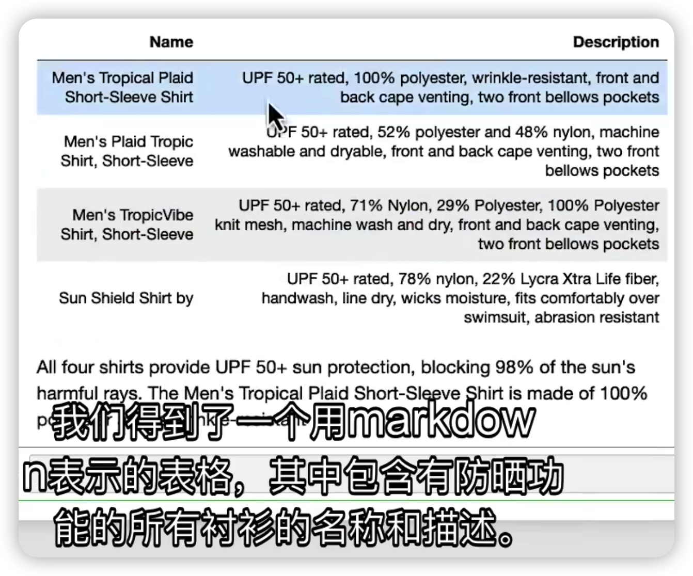

## 基于文档的问答

LLM可以根据从PDF文件、网页或公司内部文档中提取的文本来回答问题，这使得LLM能够与未经训练的数据结合起来，从而更灵活地适配不同应用场景。

要构建一个基于文档的问答系统，需要引入 LangChain 的更多关键组件，例如嵌入（Embedding）模型和向量存储（Vector Stores）。

## 简单实现，以轻松完成文档问答功能

首先，需要导入一些辅助构建链的工具：

```python
from langchain.chains import RetrievalQA
from langchain.chat_models import ChatOpenAI
from langchain.document_loaders import CSVLoader
from langchain.vectorstores import DocArrayInMemorySearch
from IPython.display import display, Markdown
```

| 工具                   | 用途                                                 |
| ---------------------- | ---------------------------------------------------- |
| RetrievalQA            | 检索文档                                             |
| CSVLoader              | 加载专用数据(如CSV)，用来与模型结合使用              |
| DocArrayInMemorySearch | 内存方式的向量存储，不需要连接到任何类型的外部数据库 |

#### 步骤1：初始化CSV加载器，为其指定一个CSV文件的路径

```python
file = 'OutdoorClothingCatalog_1000.csv'
loader = CSVLoader(file_path=file)
```

#### 步骤2：创建一个内存方式的向量存储，传入上一步创建的️️加载器。

```python
from langchain.indexes import VectorstoreIndexCreator

index = VectorstoreIndexCreator(
    vectorstore_cls=DocArrayInMemorySearch
).from_loaders([loader])
```

#### 步骤3：定义查询内容，并使用index.query生成响应

```python
query ="Please list all your shirts with sun protection \
in a table in markdown and summarize each one."

response = index.query(query)

```

#### 步骤4：展示查询结果的表格以及摘要

```python
display(Markdown(response))
```


## 文档问答功能的底层原理


要想让语言模型与大量文档相结合，有一个关键问题必须解决。

那就是，语言模型每次只能处理几千个单词，如何才能让它对一个大型文档的全部内容进行问答呢？

这里就要用到嵌入（Embedding）和向量存储（Vector Stores）这两个技术。

### 嵌入（Embedding）


**嵌入是一种将文本片段转换为数字表示的方法，这些数字能够反映文本的语义信息**。

语义相近的文本会有相近的向量，这样我们就可以在向量空间中对文本进行比较。

比如，

-   两个同样描述宠物的句子的向量，其相似度会非常高。
-   而与一个描述汽车的句子的向量相比较，其相似度则会很低。

**通过向量相似度，我们可以轻松地找出文本片段之间的语义关系**。

利用这个特性，我们可以从文档中检索出与问题语义最匹配的文本片段，然后将它们和问题一起交给语言模型来生成答案。

### 向量数据库（Vector Database）


**向量数据库是用于保存嵌入向量表示的数据库**。

我们可以将大型文档拆分成较小的块，为每个块生成一个嵌入，并将其和原始块一起存储到数据库中。

这就是我们创建索引的过程。

索引创建好后，我们就可以用它来查询与问题最相关的文本片段：

1.  当一个问题进来后，为问题生成嵌入；
2.  将其与向量存储中的所有向量进行比较，选择最相似的n个文本片段；
3.  将这些文本片段和问题一起传递给语言模型；
4.  让语言模型根据检索到的文档内容生成最佳答案。

## 详细实现，以查看每一步的执行过程

#### 步骤1：初始化CSV加载器，为其指定一个CSV文件的路径

```python
loader = CSVLoader(file_path=file)
docs = loader.load()
```

#### 步骤2：为加载的所有文本片段生成嵌入，并存储在一个向量存储器中

```python
from langchain.embeddings import OpenAIEmbeddings
embeddings = OpenAIEmbeddings()

db = DocArrayInMemorySearch.from_documents(
    docs, 
    embeddings
)
```

我们可以用一段特定文本来查看生成的嵌入内容形式：

```python
embed = embeddings.embed_query("Hi my name is Harrison")

# 打印嵌入的维度
print(len(embed))
# 1536

# 打印前5个数字
print(embed[:5])
# [-0.021930990740656853, 0.006712669972330332, -0.018181458115577698, -0.039156194776296616, -0.014079621061682701]
```

从打印结果可知，这个嵌入是一个1536维的向量，以及向量中的数字是如何表示的。

我们也可以直接输入一段查询内容，查看通过向量存储器检索到的与查询内容相似的文本片段：

```python
query = "Please suggest a shirt with sunblocking"
docs = db.similarity_search(query)

# 打印检索到的文本片段数
len(docs)
# 4

# 打印第一个文本片段内容
docs[0]
# Document(page_content=': 255\nname: Sun Shield Shirt by\ndescription: "Block the sun, not the fun – our high-performance sun shirt is guaranteed to protect from harmful UV rays. \n\nSize & Fit: Slightly Fitted: Softly shapes the body. Falls at hip.\n\nFabric & Care: 78% nylon, 22% Lycra Xtra Life fiber. UPF 50+ rated – the highest rated sun protection possible. Handwash, line dry.\n\nAdditional Features: Wicks moisture for quick-drying comfort. Fits comfortably over your favorite swimsuit. Abrasion resistant for season after season of wear. Imported.\n\nSun Protection That Won\'t Wear Off\nOur high-performance fabric provides SPF 50+ sun protection, blocking 98% of the sun\'s harmful rays. This fabric is recommended by The Skin Cancer Foundation as an effective UV protectant.', metadata={'source': 'OutdoorClothingCatalog_1000.csv', 'row': 255})
```

从打印结果可知，检索到了4个相似的文本片段，而返回的第一个文本片段也确实与查询内容相关。

#### 步骤3：使用RetrievalQA链对查询进行检索，然后在检索的文档上进行问答

```python
retriever = db.as_retriever()
llm = ChatOpenAI(temperature = 0.0)

# stuff表示将文本片段合并成一段文本
qa_stuff = RetrievalQA.from_chain_type(
    llm=llm, 
    chain_type="stuff", 
    retriever=retriever, 
    verbose=True
)
```

RetrievalQA链其实就是把合并文本片段和调用语言模型这两步骤封装起来，如果没有RetrievalQA链，我们需要这样子实现：

1.将检索出来的文本片段合并成一段文本

```python
qdocs = "".join([docs[i].page_content for i in range(len(docs))])
```

2.将合并后的文本和问题一起传给LLM

```python
response = llm.call_as_llm(f"{qdocs} Question: Please list all your \
shirts with sun protection in a table in markdown and summarize each one.") 
```

#### 步骤4：创建一个查询，并把查询的内容传入链并运行

```python
response = qa_stuff.run(query)
```

#### 步骤5：展示查询结果的表格以及摘要

```python
display(Markdown(response))
```


## 可选的链类型(chain\_type)

### stuff


将所有内容放入一个提示中，发送给语言模型并获取一个回答。这种方法简单、廉价且效果不错。

当文档数量较少且文档长度较短的情况下，这种方法是可行的。

### Map\_reduce


将每个内容和问题一起传递给语言模型，并将所有单独的回答汇总成最终答案。

这种方法可以处理任意数量的文档，并且可以并行处理各个问题。

### Refine


迭代地处理多个文档，它会基于前一个文档的答案来构建答案。

这种方法适合组合信息和逐步构建答案，但速度较慢。

### Map\_rerank


每个文档进行单独的语言模型调用，并要求返回一个分数，然后选择最高分数的答案。

这种方法需要告诉语言模型如何评分，并且需要针对这部分指令进行优化。

## 评估

评估有两个目的：

-   检验LLM应用是否达到了验收标准
-   分析改动对于LLM应用性能的影响

基本的思路就是利用语言模型本身和链本身，来辅助评估其他的语言模型、链和应用程序。

我们还是以上一节课的文档问答应用为例。

评估过程需要用到评估数据集，我们可以直接硬编码一些示例数据集，比如：

```python
examples = [
    {
        "query": "Do the Cozy Comfort Pullover Set\
        have side pockets?",
        "answer": "Yes"
    },
    {
        "query": "What collection is the Ultra-Lofty \
        850 Stretch Down Hooded Jacket from?",
        "answer": "The DownTek collection"
    }
]
```

但这种方式不太方便扩展，也比较耗时，所以，我们可以——

#### 步骤1：使用语言模型自动生成评估数据集

QAGenerateChain链用于接收文档，并借助语言模型为每个文档生成一个问答对。

```python
from langchain.evaluation.qa import QAGenerateChain

example_gen_chain = QAGenerateChain.from_llm(ChatOpenAI())

new_examples = example_gen_chain.apply_and_parse(
    [{"doc": t} for t in data[:5]]
)
```

我们可以打印看下其返回的内容：

```python
print(new_examples[0])

{'query': "What is the weight of each pair of Women's Campside Oxfords?",
 'answer': "The approximate weight of each pair of Women's Campside Oxfords is 1 lb. 1 oz."}
```

#### 步骤2：将生成的问答对添加到已有的评估数据集中

```python
examples += new_examples
```

#### 步骤3：为所有不同的示例生成实际答案

```python
# 这里的qa对应的是上一节课的RetrievalQA链
predictions = qa.apply(examples) 
```

#### 步骤4：对LLM应用的输出进行评估

```python
from langchain.evaluation.qa import QAEvalChain
llm = ChatOpenAI(temperature=0)
eval_chain = QAEvalChain.from_llm(llm)
# 传入示例列表和实际答案列表
graded_outputs = eval_chain.evaluate(examples, predictions)
```

#### 步骤5：打印问题、标准答案、实际答案和评分

```python
for i, eg in enumerate(examples):
    print(f"Example {i}:")
    print("Question: " + predictions[i]['query'])
    print("Real Answer: " + predictions[i]['answer'])
    print("Predicted Answer: " + predictions[i]['result'])
    print("Predicted Grade: " + graded_outputs[i]['text'])
    print()
```

列举其中的前3个评估结果如下：

```python
Example 0:
Question: Do the Cozy Comfort Pullover Set have side pockets?
Real Answer: Yes
Predicted Answer: The Cozy Comfort Pullover Set, Stripe does have side pockets.
Predicted Grade: CORRECT

Example 1:
Question: What collection is the Ultra-Lofty 850 Stretch Down Hooded Jacket from?
Real Answer: The DownTek collection
Predicted Answer: The Ultra-Lofty 850 Stretch Down Hooded Jacket is from the DownTek collection.
Predicted Grade: CORRECT

Example 2:
Question: What is the weight of each pair of Women's Campside Oxfords?
Real Answer: The approximate weight of each pair of Women's Campside Oxfords is 1 lb. 1 oz.
Predicted Answer: The weight of each pair of Women's Campside Oxfords is approximately 1 lb. 1 oz.
Predicted Grade: CORRECT

...

```

对比第一个评估结果的两个答案可以看到，其标准答案较为简洁，而实际答案则较为详细，但表达的意思都是正确的，语言模型也能识别，因此才把它标记为正确的。

虽然这两个字符串完全不同，以致于使用传统的正则表达式等手段是无法对它们进行比较的。

这里就体现了**使用语言模型进行评估的优势——同一个问题的答案可能有很多不同的变体，只要意思相通，就应该被认为是相似的**。

## 使用LangChain评估平台

以上操作都可以在LangChain评估平台上以可视化UI界面的形式展示，并对数据进行持久化，包括：

### 查看和跟踪评估过程中的输入和输出


### 可视化链中每个步骤输出的信息


### 将示例添加到数据集中，以便持久化和进一步评估


## 代理

大型语言模型可以作为一个推理引擎，只要给它提供文本或其他信息源，它就会利用互联网上学习到的背景知识或你提供的新信息，来回答问题、推理内容或决定下一步的操作。

这就是LangChain的代理框架能够帮我们实现的事情，而代理也正是LangChain最强大的功能之一。

## 使用内置于 LangChain 的工具

#### 步骤1：初始化语言模型

```python
from langchain.agents.agent_toolkits import create_python_agent
from langchain.agents import load_tools, initialize_agent
from langchain.agents import AgentType
from langchain.tools.python.tool import PythonREPLTool
from langchain.python import PythonREPL
from langchain.chat_models import ChatOpenAI

llm = ChatOpenAI(temperature=0)
```

-   temperature参数

语言模型作为代理的推理引擎，会连接到其他数据和计算资源，我们会希望这个推理引擎尽可能地好用且精确，因此需要把temperature参数设为0。

#### 步骤2：加载工具

```python
# llm-math：解决数学问题
# wikipedia：查询维基百科
tools = load_tools(["llm-math","wikipedia"], llm=llm)
```

#### 步骤3：初始化代理

```python
agent= initialize_agent(
    tools, 
    llm, 
    agent=AgentType.CHAT_ZERO_SHOT_REACT_DESCRIPTION,
    handle_parsing_errors=True,
    verbose = True)
```

-   agent参数

agent参数 CHAT\_ZERO\_SHOT\_REACT\_DESCRIPTION中的CHAT部分，表示这是一个专门为Chat模型优化的代理。REACT部分表示一种组织Prompt的技术，能够最大化语言模型的推理能力。

-   handle\_parsing\_errors

true表示当内容无法被正常解析时，会将错误内容传回语言模型，让它自行纠正。

#### 步骤4：向代理提问

数学问题：

```
agent("What is the 25% of 300?")
```


百科问题：

```python
question = "Tom M. Mitchell is an American computer scientist \
and the Founders University Professor at Carnegie Mellon University (CMU)\
what book did he write?"
result = agent(question) 
```


从打印出来的中间步骤详细记录中，我们可以看到几个关键词，其表示的含义分别是：

| 关键词      | 表示含义                 |
| ----------- | ------------------------ |
| Thought     | LLM在思考的内容          |
| Action      | 执行特定的动作           |
| Observation | 从这个动作中观察到了什么 |

## 使用 Python 代理工具

类似于ChatGPT的代码解释器，Python 代理工具可以让语言模型编写并执行Python代码，然后将执行的结果返回给代理，让它决定下一步的操作。

我们的任务目标是对一组客户名单按照姓氏和名字进行排序。

#### 步骤1：创建Python代理

```python
agent = create_python_agent(
    llm,
    tool=PythonREPLTool(),
    verbose=True
)
```

#### 步骤2：要求代理编写排序代码，并打印输出结果

```python
customer_list = [["Harrison", "Chase"], 
                 ["Lang", "Chain"],
                 ["Dolly", "Too"],
                 ["Elle", "Elem"], 
                 ["Geoff","Fusion"], 
                 ["Trance","Former"],
                 ["Jen","Ayai"]
                ]
                
agent.run(f"""Sort these customers by \
last name and then first name \
and print the output: {customer_list}""") 
```


## 使用自定义的工具

代理的一个优势就是你可以将其连接到你自己的信息来源、API、数据。

#### 步骤1：定义一个工具，用于获取当前日期

```python
from langchain.agents import tool
from datetime import date

@tool
def time(text: str) -> str:
    """Returns todays date, use this for any \
    questions related to knowing todays date. \
    The input should always be an empty string, \
    and this function will always return todays \
    date - any date mathmatics should occur \
    outside this function."""
    return str(date.today())
```

除了函数名称，这里还写了一份详细的注释说明，**代理会根据注释中的信息来判断何时应该调用、以及应该如何调用这个工具**。

#### 步骤2：初始化代理，将自定义工具加到现有工具列表里

```python
agent= initialize_agent(
    tools + [time], 
    llm, 
    agent=AgentType.CHAT_ZERO_SHOT_REACT_DESCRIPTION,
    handle_parsing_errors=True,
    verbose = True)
```

#### 步骤3：调用代理，获取当前日期

```python
try:
    result = agent("whats the date today?") 
except: 
    print("exception on external access")
```


