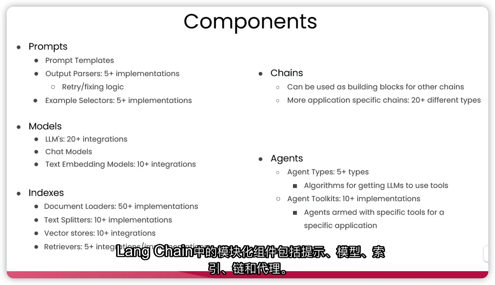
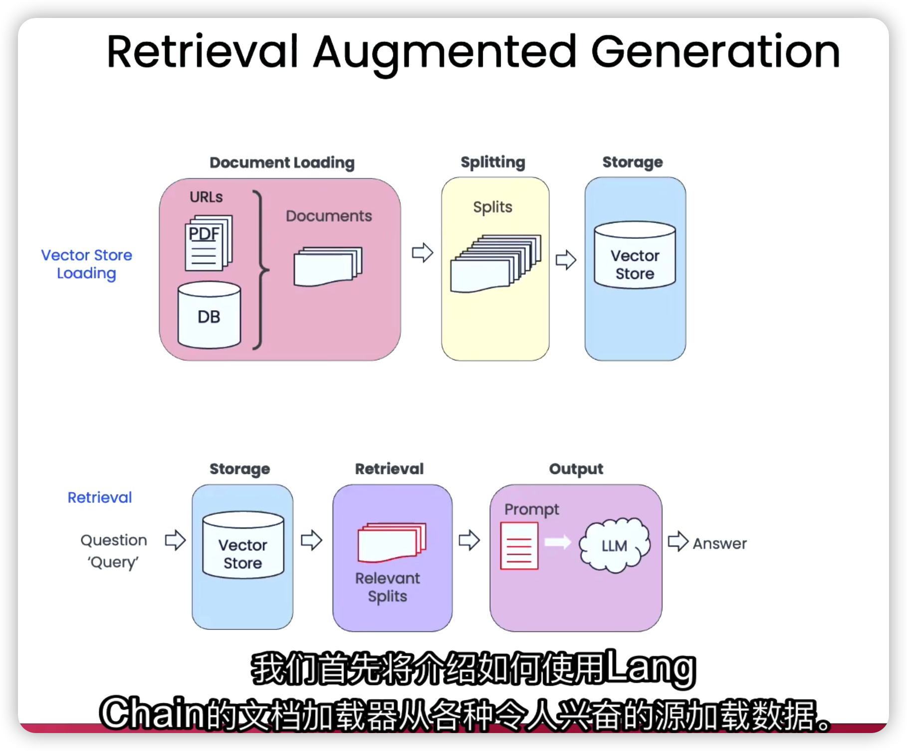
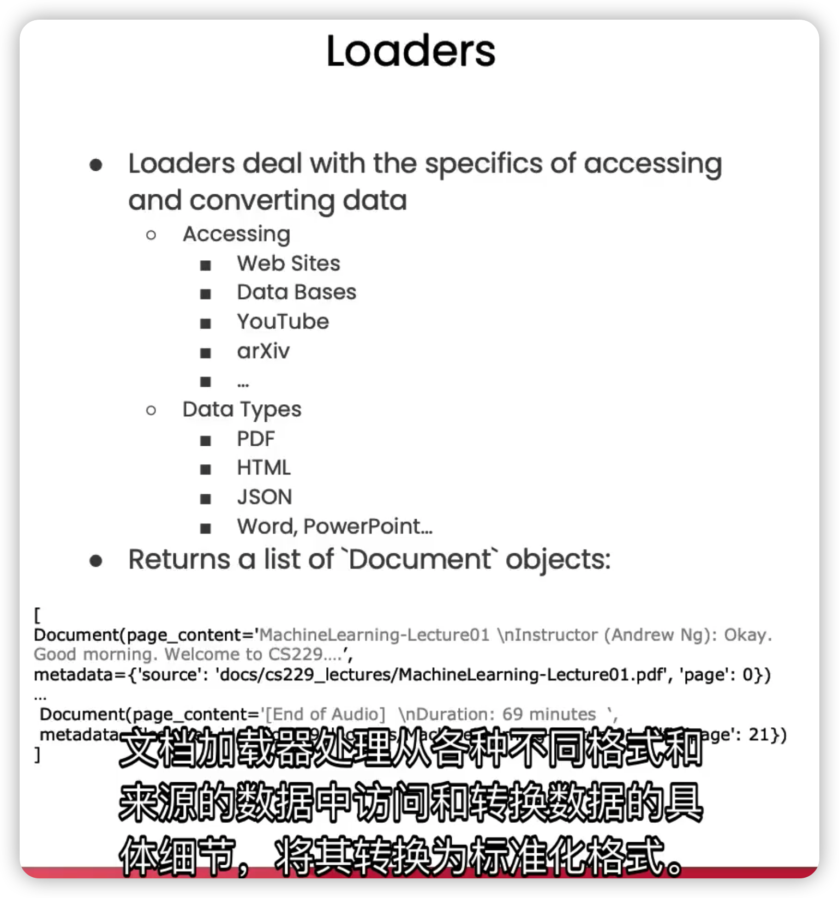
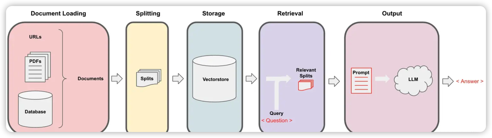
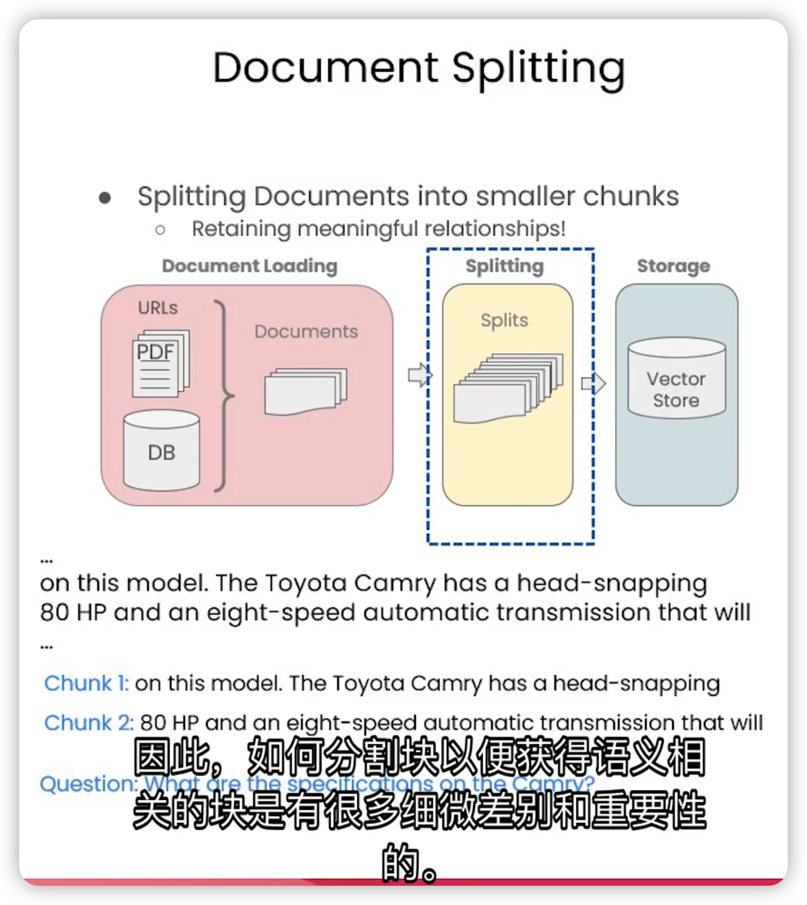
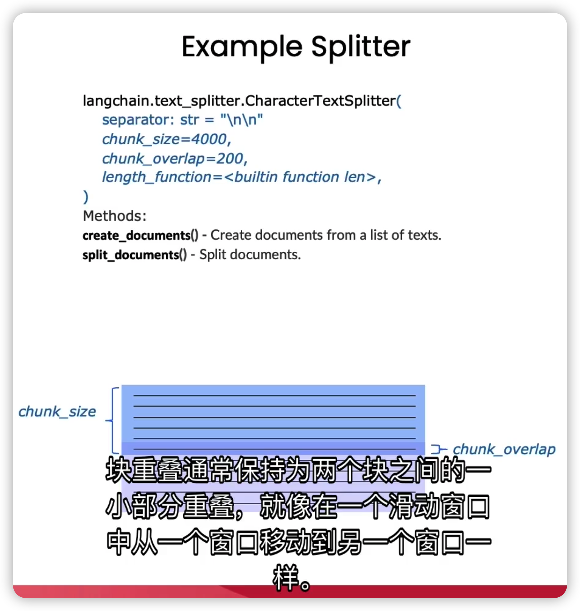
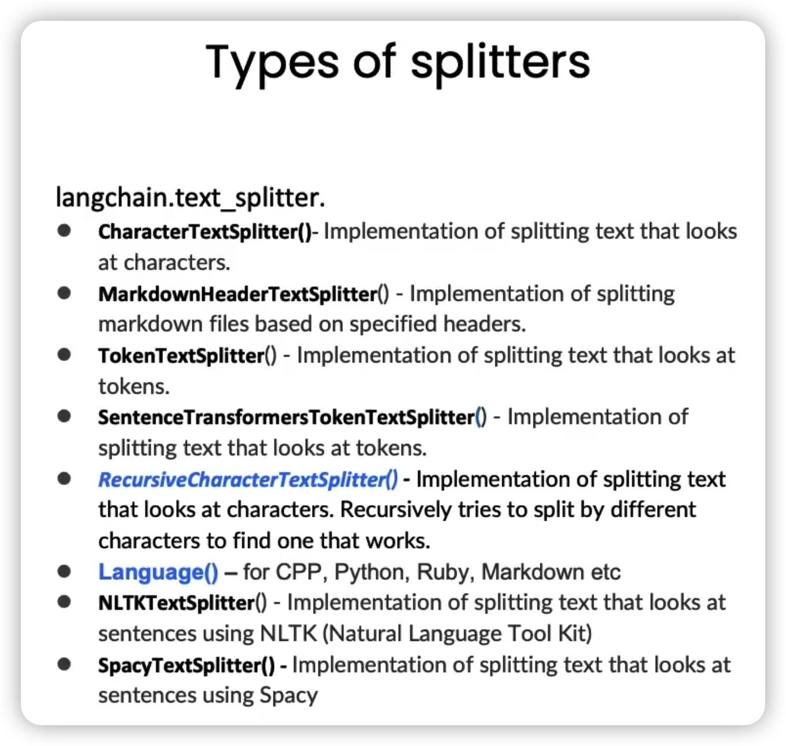
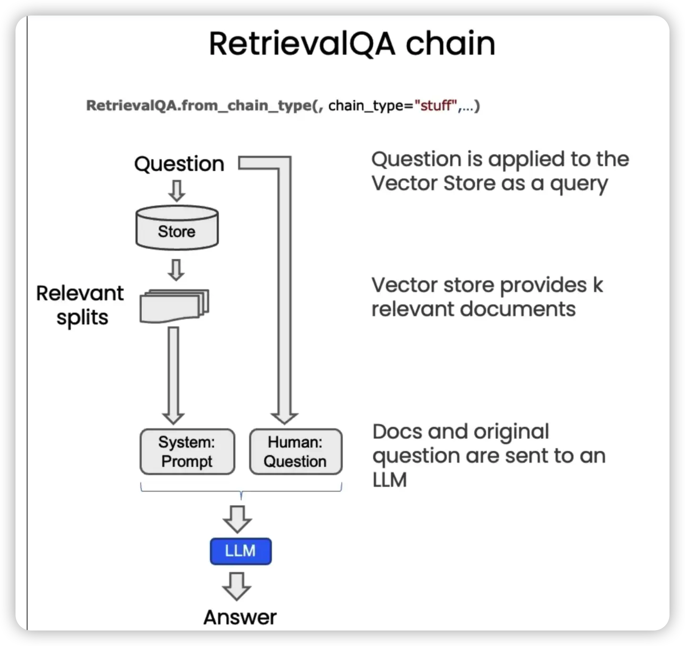
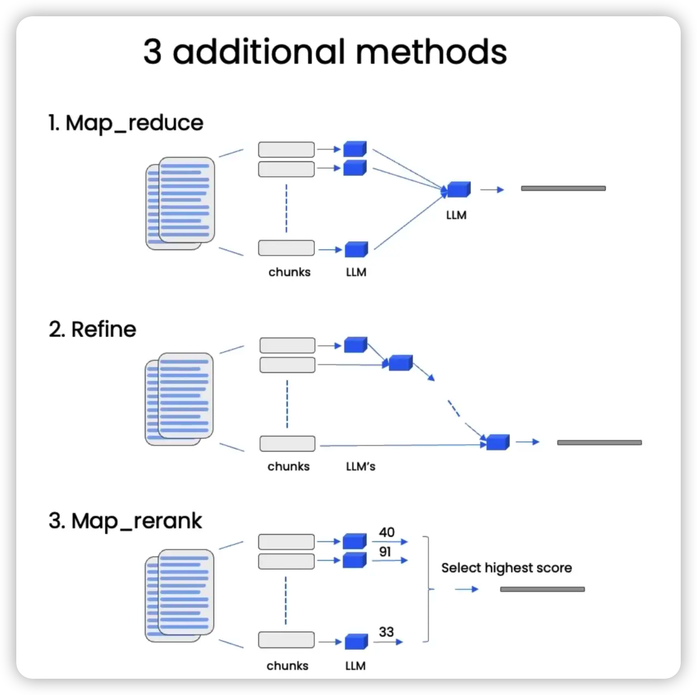

https://www.deeplearning.ai/short-courses/langchain-chat-with-your-data/



## 文档加载
### 文档加载器的介绍





**文档加载器的作用，是将不同格式和来源的数据加载到标准的文档对象中，包括内容本身以及关联的元数据**。



LangChain提供了多种类型的文档加载器，用于处理非结构化数据，根据数据来源的不同大致可分为：

-   公共数据源加载器，如YouTube、Twitter；

-   专有数据源加载器，如Figma、Notion。

文档加载器也可以加载结构化数据，比如基于表格中包含的文本数据，对问题进行回答或语义搜索。

这种技术我们称之为检索增强生成（RAG，Retrieval-Augmented Generation）。



**在RAG中，LLM会从外部数据集中检索上下文文档，作为其执行的一部分，这对于询问特定文档的问题非常有用**。

下面我们来实际使用其中的一些文档加载器。

## 加载PDF文档

```python
# 导入PyPDFLoader文档加载器
from langchain.document_loaders import PyPDFLoader
# 将位于特定路径下的PDF文档放入到加载器中
loader = PyPDFLoader("docs/cs229_lectures/MachineLearning-Lecture01.pdf")
# 加载PDF文档
pages = loader.load()
```

默认情况下，这将加载一系列的文档。以页面为单位，每个页面都是一个独立的文档。

```python
# PDF的总页数
len(pages)
# 22
```

每个文档都包含「页面内容」和「与文档关联的元数据」。

页面内容：

```python
# 仅打印前500个字符
print(page.page_content[0:500]) 
```

> MachineLearning-Lecture01  
> Instructor (Andrew Ng): Okay. Good morning. Welcome to CS229, the machine learning class. So what I wanna do today is ju st spend a little time going over the logistics of the class, and then we'll start to talk a bit about machine learning.  
> By way of introduction, my name's Andrew Ng and I'll be instru ctor for this class. And so I personally work in machine learning, and I' ve worked on it for about 15 years now, and I actually think that machine learning i

元数据：

```python
page.metadata
# source: 源信息，这里对应PDF的文件名
# page：页码信息，这里对应PDF的页码
# {'source': 'docs/cs229_lectures/MachineLearning-Lecture01.pdf', 'page': 0}
```

## 加载YouTube视频

### 步骤1：导入几个关键部分，包括

-   YouTube音频加载器：从YouTube视频加载音频文件

-   OpenAI Whisper解析器：使用OpenAI的Whisper模型(一个语音转文本的模型)，将YouTube音频转换为我们可以处理的文本格式


```python
from langchain.document_loaders.generic import GenericLoader
from langchain.document_loaders.parsers import OpenAIWhisperParser
from langchain.document_loaders.blob_loaders.youtube_audio import YoutubeAudioLoader
```

### 步骤2：指定URL及保存音频文件的目录，创建组合了步骤1两个关键部分的通用加载器并执行加载

```python
url="https://www.youtube.com/watch?v=jGwO_UgTS7I"
save_dir="docs/youtube/"
loader = GenericLoader(
    YoutubeAudioLoader([url],save_dir),
    OpenAIWhisperParser()
)
docs = loader.load()
```

### 步骤3：查看加载完成的视频文稿

```python
docs[0].page_content[0:500]
```

## 加载网络URL

```python
from langchain.document_loaders import WebBaseLoader

loader = WebBaseLoader("https://github.com/basecamp/handbook/blob/master/37signals-is-you.md")

docs = loader.load()

print(docs[0].page_content[:500])
```

## 文档分割

在上一节中，我们将不同格式和来源的数据加载到了标准的文档对象中。但是，这些文档经过转换后依然很大，而我们通常只需要检索文档中与主题最相关的内容，可能只是几个段落或句子，而不需要整个文档。

因此，在这一节中，我们将使用LangChain的文本分割器，把大型的文档分割成更小的块。

## 文档分割的重要性

**文档分割发生在数据加载之后，放入向量存储之前**。



如果简单地按字符长度来分割文档，可能会造成句子的断裂，导致语义的丢失或混乱。这样的分割方式，无法为我们正确地回答问题。

合理的做法，是尽量保持语义的连贯性和完整性，分隔出有意义的块。

## 文档分割的方式

在LangChain中，所有的文本分割器都遵循同一个原理，就是根据「块大小(chunk\_size)」和「两个块之间的重叠大小(chunk\_overlap)」进行分割。



`chunk_size`指的是每个块包含的字符或Token（如单词、句子等）的数量。

`chunk_overlap`指的是两个块之间共享的字符或Token的数量。chunk\_overlap可以帮助保持上下文的连贯性，避免因为分割而丢失重要的信息。

LangChain提供了多种类型的分割器，主要差别在于如何确定块的边界、块由哪些字符或Token组成、以及如何测量块的大小（按字符还是按Token）。



元数据（Metadata）是块分割的另一个重要部分，我们需要在所有块中保持元数据的一致性，同时在需要的时候添加新的元数据。

## 基于字符的分割

如何分割块通常取决于我们正在处理的文档类型。

比如，处理代码的分割器拥有许多不同编程语言的分隔符，如Python、Ruby、C等。当分割代码文档时，它会考虑到不同编程语言之间的差异。

### 步骤1：导入文本分割器

```python
# RecursiveCharacterTextSplitter-递归字符文本分割器
# CharacterTextSplitter-字符文本分割器
from langchain.text_splitter import RecursiveCharacterTextSplitter, CharacterTextSplitter
```

### 步骤2：设定块大小和块重叠大小

```python
chunk_size =26
chunk_overlap = 4
```

### 步骤3：初始化文本分割器

```python
r_splitter = RecursiveCharacterTextSplitter(
    chunk_size=chunk_size,
    chunk_overlap=chunk_overlap
)
c_splitter = CharacterTextSplitter(
    chunk_size=chunk_size,
    chunk_overlap=chunk_overlap
)
```

### 步骤4：使用不同的分割器对字符串进行分割

#### 递归字符文本分割器

```python
text2 = 'abcdefghijklmnopqrstuvwxyzabcdefg'
r_splitter.split_text(text2)
# ['abcdefghijklmnopqrstuvwxyz', 'wxyzabcdefg']
```

可以看到，第二个块是从「wxyz」开始的，刚好是我们设定的块重叠大小。

```python
text3 = "a b c d e f g h i j k l m n o p q r s t u v w x y z"
r_splitter.split_text(text3)
# ['a b c d e f g h i j k l m', 'l m n o p q r s t u v w x', 'w x y z']
```

#### 字符文本分割器

```python
c_splitter.split_text(text3)
# ['a b c d e f g h i j k l m n o p q r s t u v w x y z']
```

可以看到，字符文本分割器实际并没有分割这个字符串，这是因为字符文本分割器默认是以换行符为分隔符的，为此，我们需要将分隔符设置为空格。

```python
c_splitter = CharacterTextSplitter(
    chunk_size=chunk_size,
    chunk_overlap=chunk_overlap,
    separator = ' '
)
c_splitter.split_text(text3)
# ['a b c d e f g h i j k l m', 'l m n o p q r s t u v w x', 'w x y z']
```

### 步骤5：递归分割长段落

```python
some_text = """When writing documents, writers will use document structure to group content. \
This can convey to the reader, which idea's are related. For example, closely related ideas \
are in sentances. Similar ideas are in paragraphs. Paragraphs form a document. \n\n  \
Paragraphs are often delimited with a carriage return or two carriage returns. \
Carriage returns are the "backslash n" you see embedded in this string. \
Sentences have a period at the end, but also, have a space.\
and words are separated by space."""

r_splitter = RecursiveCharacterTextSplitter(
    chunk_size=150,
    chunk_overlap=0,
    separators=["\n\n", "\n", " ", ""]
)
r_splitter.split_text(some_text)
```

这里，我们传入一个分隔符列表，依次为双换行符、单换行符、空格和一个空字符。

这就意味着，当你分割一段文本时，它会首先采用双换行符来尝试初步分割，并视情况依次使用其他的分隔符来进一步分割。

最终分割结果如下：

> \["When writing documents, writers will use document structure to group content. This can convey to the reader, which idea's are related. For example, closely related ideas are in sentances. Similar ideas are in paragraphs. Paragraphs form a document.",
>
> 'Paragraphs are often delimited with a carriage return or two carriage returns. Carriage returns are the "backslash n" you see embedded in this string. Sentences have a period at the end, but also, have a space.and words are separated by space.'\]

如果需要按照句子进行分隔，则还要用正则表达式添加一个句号分隔符：

```python
r_splitter = RecursiveCharacterTextSplitter(
    chunk_size=150,
    chunk_overlap=0,
    separators=["\n\n", "\n", "(?<=\. )", " ", ""]
)
r_splitter.split_text(some_text)
```

> \["When writing documents, writers will use document structure to group content. This can convey to the reader, which idea's are related.",
>
> 'For example, closely related ideas are in sentances. Similar ideas are in paragraphs. Paragraphs form a document.',
>
> 'Paragraphs are often delimited with a carriage return or two carriage returns.',
>
> 'Carriage returns are the "backslash n" you see embedded in this string.',
>
> 'Sentences have a period at the end, but also, have a space.and words are separated by space.'\]

这就是递归字符文本分割器名字中“递归”的含义，总的来说，我们更建议在通用文本中使用递归字符文本分割器。

## 基于Token的分割

很多LLM的上下文窗口长度限制是按照Token来计数的。因此，以LLM的视角，按照Token对文本进行分隔，通常可以得到更好的结果。

为了理解基于字符分割和基于Token分割的区别，我们可以用一个简单的例子来说明。

```python
from langchain.text_splitter import TokenTextSplitter
text_splitter = TokenTextSplitter(chunk_size=1, chunk_overlap=0)
text1 = "foo bar bazzyfoo"
text_splitter.split_text(text1)
```

这里，我们创建了一个Token文本分割器，将块大小设为1，块重叠大小设为0，相当于将任意字符串分割成了单个Token组成的列表，每个Token的内容如下：

```python
['foo', ' bar', ' b', 'az', 'zy', 'foo']
```

因此，Token的长度和字符长度是不一样的，Token通常为4个字符。

## 分割Markdown文档

**分块的目的旨在将具有共同上下文的文本放在一起**。

通常，我们可以通过使用指定分隔符来进行分隔，但有些类型的文档（例如 Markdown）本身就具有可用于分割的结构（如标题）。

Markdown标题文本分割器会根据标题或子标题来分割一个Markdown文档，并将标题作为元数据添加到每个块中。

### 步骤1：定义一个Markdown文档

```python
from langchain.document_loaders import NotionDirectoryLoader
from langchain.text_splitter import MarkdownHeaderTextSplitter

markdown_document = """# Title\n\n \
## Chapter 1\n\n \
Hi this is Jim\n\n Hi this is Joe\n\n \
### Section \n\n \
Hi this is Lance \n\n 
## Chapter 2\n\n \
Hi this is Molly"""
```

### 步骤2：定义想要分割的标题列表和名称

```python
headers_to_split_on = [
    ("#", "Header 1"),
    ("##", "Header 2"),
    ("###", "Header 3"),
]
```

### 步骤3：初始化Markdown标题文本切分器，分割Markdown文档

```python
markdown_splitter = MarkdownHeaderTextSplitter(
    headers_to_split_on=headers_to_split_on
)
md_header_splits = markdown_splitter.split_text(markdown_document)

md_header_splits[0]
# Document(page_content='Hi this is Jim  \nHi this is Joe', metadata={'Header 1': 'Title', 'Header 2': 'Chapter 1'})

md_header_splits[1]
# Document(page_content='Hi this is Lance', metadata={'Header 1': 'Title', 'Header 2': 'Chapter 1', 'Header 3': 'Section'})
```

可以看到，每个块都包含了页面内容和元数据，元数据中记录了该块所属的标题和子标题。

我们已经了解了如何将长文档分割为语义相关的块，并且包含正确的元数据。接下来要做的就是将这些块放入到一个索引中，这样当我们要回答某个数据集相关的问题时，就能轻松地检索到对应的块。

要实现这一目标，我们需要用到两个技术：嵌入(Embedding)和向量存储(Vector Store) 。

## 向量存储和嵌入

嵌入是将一段文本转化为数值形式。**具有相似内容的文本在数值空间中会有相似的向量**，这就意味着我们可以通过比较这些向量，来找出相似的文本片段。

而向量存储是一种数据库，它用来存储分割后的文档片段以及它们对应的嵌入，方便我们后续根据问题查找相关的文档。

整个过程如下：

1.  提出一个问题，并为它生成一个嵌入；
2.  将它跟向量存储里的所有不同的向量进行比较；
3.  选出最相似的前n个片段；
4.  将选出的片段和问题一起输入到LLM里，得到一个答案。

为了帮助理解，我们先看一个简单的例子：

### 步骤1：提供一些例句，其中前两句非常相似，第三句则与前两句关联不大

```python
sentence1 = "i like dogs"
sentence2 = "i like canines"
sentence3 = "the weather is ugly outside"
```

### 步骤2：使用Embbeding类为每个句子生成一个嵌入

```python
from langchain.embeddings.openai import OpenAIEmbeddings
embedding = OpenAIEmbeddings()

embedding1 = embedding.embed_query(sentence1)
embedding2 = embedding.embed_query(sentence2)
embedding3 = embedding.embed_query(sentence3)
```

### 步骤3：用点积(dot product)来计算两两之间的嵌入相似度

```python
import numpy as np

np.dot(embedding1, embedding2)
# 0.9631853877103518

np.dot(embedding1, embedding3)
# 0.7709997651294672

np.dot(embedding2, embedding3)
# 0.7596334120325523
```

点积的值越大，代表相似度就越高。

再来看一个实际的例子：

目标是为提供的所有PDF文档生成嵌入，并把它们存储在一个向量存储里。

### 步骤1：加载PDF文档

```python
from langchain.document_loaders import PyPDFLoader

# 加载 PDF
loaders = [
    # 重复加载第一个文档，模拟一些脏数据
    PyPDFLoader("docs/cs229_lectures/MachineLearning-Lecture01.pdf"),
    PyPDFLoader("docs/cs229_lectures/MachineLearning-Lecture01.pdf"),
    PyPDFLoader("docs/cs229_lectures/MachineLearning-Lecture02.pdf"),
    PyPDFLoader("docs/cs229_lectures/MachineLearning-Lecture03.pdf")
]
docs = []
for loader in loaders:
    docs.extend(loader.load())
```

### 步骤2：用递归字符文本分割器来把文档分成块

```python
# 分割
from langchain.text_splitter import RecursiveCharacterTextSplitter
text_splitter = RecursiveCharacterTextSplitter(
    chunk_size = 1500,
    chunk_overlap = 150
)

splits = text_splitter.split_documents(docs)
```

### 步骤3：为每个块生成嵌入，并创建Chroma向量存储

这里用到的向量存储是Chroma。Chroma是一种轻量级、基于内存的向量存储，使用起来很方便。

```python
from langchain.vectorstores import Chroma

# 可先用[rm -rf ./docs/chroma]移除可能存在的旧数据库数据
persist_directory = 'docs/chroma/'

# 传入之前创建的分割和嵌入，以及持久化目录
vectordb = Chroma.from_documents(
    documents=splits,
    embedding=embedding,
    persist_directory=persist_directory
)
```

### 步骤4：用相似性搜索方法来查找文档

```python
question = "is there an email i can ask for help"
# K=3用于指定返回的文档数量
docs = vectordb.similarity_search(question,k=3)
```

可以打印文档的长度和内容来检查：

```python
len(docs)
# 3

docs[0].page_content
```


### 步骤5：持久化向量数据库，以便以后使用

```python
vectordb.persist()
```

接下来我们将讨论一些边缘案例，展示几种可能出现失败情况：

### 失败情况1：重复的块导致重复的冗余信息

```python
question = "what did they say about matlab?"
docs = vectordb.similarity_search(question,k=5)

docs[0]
docs[1]
```

其中，docs\[0\] 和 docs\[1\] 得到的结果是相同的，这是因为我们在一开始就有意重复加载了第一个文档。

这样做的结果是，我们把两个内容相同的分块都传给了语言模型。而第二个分块是没有价值的，如果换成一个内容不同的分块会更好，这样至少语言模型可以从中获取更多信息。

在下一课中，我们将讨论如何在保证检索到相关的块的同时，也能保证每个块都是唯一的。

### 失败情况2：无法完整捕捉到问题中的关键信息

比如下面这个问题，“第三堂课里他们讲了什么关于回归的内容？”

```python
question = "what did they say about regression in the third lecture?"
docs = vectordb.similarity_search(question,k=5)
```

一般来说，我们应该能看出，问题的提问者是想要从第三堂课里找到答案的。

但实际上，当我们遍历所有文档，并打印出元数据后会发现，结果里实际上混合了多个文档的内容。

```python
for doc in docs:
    print(doc.metadata)
    
# {'source': 'docs/cs229_lectures/MachineLearning-Lecture03.pdf', 'page': 0}
# {'source': 'docs/cs229_lectures/MachineLearning-Lecture03.pdf', 'page': 14}
# {'source': 'docs/cs229_lectures/MachineLearning-Lecture02.pdf', 'page': 0}
# {'source': 'docs/cs229_lectures/MachineLearning-Lecture03.pdf', 'page': 6}
# {'source': 'docs/cs229_lectures/MachineLearning-Lecture01.pdf', 'page': 8}
```

这是因为，我们只是基于嵌入做了一个语义搜索，它为整个句子生成了一个嵌入，并且可能会更关注于“回归”这个词。

当我们查看第五个文档时，就会发现它确实提到了“回归”这个词。

### 失败情况3：随着检索文档数量的增加，相关性逐渐降低

当我们尝试改变k值，也就是检索的文档数量时，我们会得到更多的文档，但结果列表后面的文档可能没有前面的那些相关性强。

## 检索

在这一课中，我们将深入探讨「检索」技术，并介绍一些更先进的方法来克服上一课的边缘情况。

**检索是检索增强生成（RAG）流程的核心**。

## 解决多样性：最大边缘相关性

最大边缘相关性(MMR, Maximum Marginal Relevance)背后的理念是，**如果我们总是选择与查询在嵌入空间中最相似的文档，我们可能会错过一些多元化的信息**。

MMR可以帮助我们选择一个更多样化的文档集合。

**MMR在保持查询相关性的同时，尽量增加结果之间的多样性**，它的做法是：

1.  首先发送一个查询，得到一组回答；
2.  用"fetch\_k"参数指定我们想要获取的响应数量，这完全基于语义相似性；
3.  然后，针对这个较小的文档集合，从多样性方面进行优化；
4.  最后从这组文档中，选择"k"个响应返回给用户。

我们用一个简单的例子来帮助理解：

目标是查询有指定特征的蘑菇信息。

### 步骤1：创建Chroma向量存储

```python
from langchain.vectorstores import Chroma
from langchain.embeddings.openai import OpenAIEmbeddings
persist_directory = 'docs/chroma/'

embedding = OpenAIEmbeddings()
vectordb = Chroma(
    persist_directory=persist_directory,
    embedding_function=embedding
)
```

### 步骤2：用少量信息创建一个小型数据库

```python
# 鹅膏菌有一个巨大而雄伟的子实体(地上部分)。
# 有大子实体的蘑菇是鹅膏菌。有些品种是全白色的。
# 鹅膏菌，又叫死亡帽，是所有已知蘑菇中毒性最强的一种。
texts = [
    """The Amanita phalloides has a large and imposing epigeous (aboveground) fruiting body (basidiocarp).""",
    """A mushroom with a large fruiting body is the Amanita phalloides. Some varieties are all-white.""",
    """A. phalloides, a.k.a Death Cap, is one of the most poisonous of all known mushrooms.""",
]

smalldb = Chroma.from_texts(texts, embedding=embedding)
```

### 步骤3：进行相似性搜索

```python
# 告诉我有关带有大子实体的全白蘑菇的信息
question = "Tell me about all-white mushrooms with large fruiting bodies"

smalldb.similarity_search(question, k=2)
# [Document(page_content='A mushroom with a large fruiting body is the Amanita phalloides. Some varieties are all-white.', metadata={}),
# Document(page_content='The Amanita phalloides has a large and imposing epigeous (aboveground) fruiting body (basidiocarp).', metadata={})]
```

可以看到，它根据k值返回了两个最相关的文档，但没有提到它们有毒的事实。

### 步骤4：进行MMR搜索

```python
smalldb.max_marginal_relevance_search(question,k=2, fetch_k=3)
# [Document(page_content='A mushroom with a large fruiting body is the Amanita phalloides. Some varieties are all-white.', metadata={}),
# Document(page_content='A. phalloides, a.k.a Death Cap, is one of the most poisonous of all known mushrooms.', metadata={})]
```

这里我们传入了"k=2"，表示仍然想返回两个文档，但我们设置了"fetch\_k=3"，表示想获取三个文档。然后我们就可以看到，返回的文档中包含了它们有毒的事实。

现在我们试着用这个方法来处理上一节课中的失败情况1：

```python
question = "what did they say about matlab?"
docs_mmr = vectordb.max_marginal_relevance_search(question,k=3)

docs_mmr[0].page_content[:100]
# 'those homeworks will be done in either MATLA B or in Octave, which is sort of — I \nknow some people '

docs_mmr[1].page_content[:100]
# 'algorithm then? So what’s different? How come  I was making all that noise earlier about \nleast squa'
```

可以看到，第一个文档跟之前一样，因为它最相关。而第二个文档这次就不同了，这说明MMR让回答中增加了一些多样性。

## 解决特殊性：使用自查询检索器处理元数据

自查询使用语言模型将原始问题分割为两个独立的部分，一个过滤器和一个搜索项。

搜索项就是我们在语义上想要查找的问题内容。

过滤器则是包含我们想要过滤的元数据。

比如，“1980年制作的关于外星人的电影有哪些”，语义部分就是“关于外星人的电影”，元数据部分则是“电影年份应为1980年”。

我们先手动指定一个元数据过滤器来验证它的效果。

目标是处理上一节课的失败情况2：

```python
question = "what did they say about regression in the third lecture?"
# 指定源为第三堂课的PDF文档
docs = vectordb.similarity_search(
    question,
    k=3,
    filter={"source":"docs/cs229_lectures/MachineLearning-Lecture03.pdf"}
)

for d in docs:
    print(d.metadata)
# {'source': 'docs/cs229_lectures/MachineLearning-Lecture03.pdf', 'page': 0}
# {'source': 'docs/cs229_lectures/MachineLearning-Lecture03.pdf', 'page': 14}
# {'source': 'docs/cs229_lectures/MachineLearning-Lecture03.pdf', 'page': 4} 
```

可以看到，现在检索到的文档都来自那一堂课了。

我们还可以使用`SelfQueryRetriever`，从问题本身推断出元数据。

### 步骤1：提供元数据字段信息

```python
from langchain.llms import OpenAI
from langchain.retrievers.self_query.base import SelfQueryRetriever
from langchain.chains.query_constructor.base import AttributeInfo

metadata_field_info = [
    AttributeInfo(
        name="source",
        description="The lecture the chunk is from, should be one of `docs/cs229_lectures/MachineLearning-Lecture01.pdf`, `docs/cs229_lectures/MachineLearning-Lecture02.pdf`, or `docs/cs229_lectures/MachineLearning-Lecture03.pdf`",
        type="string",
    ),
    AttributeInfo(
        name="page",
        description="The page from the lecture",
        type="integer",
    ),
]
```

这个例子中的元数据只有两个字段，源（source）和页（page）。我们需要填写每个字段的名称、描述和类型。这些信息会被传给语言模型，所以需要尽可能描述得清楚。

### 步骤2：初始化自查询检索器

```python
# 指定文档实际内容的信息
document_content_description = "Lecture notes"
llm = OpenAI(temperature=0)
retriever = SelfQueryRetriever.from_llm(
    llm,
    vectordb,
    document_content_description,
    metadata_field_info,
    verbose=True
)
```

### 步骤3：运行自查询检索器搜索问题

```python
question = "what did they say about regression in the third lecture?"

docs = retriever.get_relevant_documents(question)

for d in docs:
    print(d.metadata)
# {'source': 'docs/cs229_lectures/MachineLearning-Lecture03.pdf', 'page': 0}
# {'source': 'docs/cs229_lectures/MachineLearning-Lecture03.pdf', 'page': 14}
# {'source': 'docs/cs229_lectures/MachineLearning-Lecture03.pdf', 'page': 4} 
```

可以看到，语义部分表明这是一个关于回归的查询。过滤器部分表明我们只想看那些source值为指定值的文档。

而从打印出的元数据看，它们都来自指定的那一堂课，说明自查询检索器确实可以用来精确地进行元数据过滤。

## 解决相关性：使用上下文压缩提取出与查询最相关的部分

提高检索文档质量的另一种方法是压缩。

当你提出一个问题时，你会得到整个存储的文档，但可能只有其中一小部分是跟问题相关的。

也就是说，与查询最相关的信息可能被隐藏在包含大量无关文本的文档里。

上下文压缩就是为了解决这个问题的。

**通过压缩，你可以先让语言模型提取出最相关的片段，然后只把最相关的片段传给最终的语言模型调用**。

这会增加语言模型调用的成本，但也会让最终的答案更集中在最重要的内容上，这需要我们自己权衡。

### 步骤1：创建上下文压缩检索器

```python
from langchain.retrievers import ContextualCompressionRetriever
from langchain.retrievers.document_compressors import LLMChainExtractor

# 包装我们的向量存储
llm = OpenAI(temperature=0)
compressor = LLMChainExtractor.from_llm(llm)

compression_retriever = ContextualCompressionRetriever(
    base_compressor=compressor,
    base_retriever=vectordb.as_retriever()
)
```

### 步骤2：提出问题，检索压缩后的相关文档

```python
question = "what did they say about matlab?"
compressed_docs = compression_retriever.get_relevant_documents(question)
pretty_print_docs(compressed_docs)
```

从压缩后的文档我们可以看到， 一，它们比普通的文档短得多； 二，仍然有重复的内容，这是因为底层我们还是用的语义搜索算法。

为了解决内容重复的问题，我们可以在创建检索器时，结合前面的内容，把搜索类型设置为MMR。

```python
compression_retriever = ContextualCompressionRetriever(
    base_compressor=compressor,
    base_retriever=vectordb.as_retriever(search_type = "mmr")
)

question = "what did they say about matlab?"
compressed_docs = compression_retriever.get_relevant_documents(question)
pretty_print_docs(compressed_docs)
```

重新运行之后，我们得到的就是一个没有任何重复信息的过滤后的结果集了。

下一步，我们将讨论如何使用这些检索到的文档来回答用户的问题。

## 问答

在这节课中，我们将学习如何利用检索到的文档来回答用户的问题。



整个过程可以拆分为以下几个步骤：

1.  用户输入一个问题（Question）
2.  从向量存储（Store）中检索出与问题相关的文档分块（Relavant splits）
3.  将这些分块连同系统提示（System:Prompt）和用户问题（Human:Question）一起作为输入传给语言模型（LLM）
4.  语言模型根据输入生成答案（Answer）

默认使用的是`stuff`方法，其特点如下：

| 特点                                                         | 优点                   | 缺点                                                         |
| ------------------------------------------------------------ | ---------------------- | ------------------------------------------------------------ |
| 将所有检索到的分块放入同一个上下文窗口中，只需要对语言模型进行一次调用。 | 简单、廉价且效果不错。 | 当检索到的文档过多时，由于上下文窗口长度有限，可能无法将所有分块都传入。 |



为了解决上下文窗口长度限制的问题，我们可以使用`Map-reduce`、`Refine`和`Map-rerank`三种方法，这些方法我们在之前的课程中已经简要介绍过了，今天我们将进一步深入了解。

## stuff

### 步骤1：加载之前保存的向量数据库

```python
from langchain.vectorstores import Chroma
from langchain.embeddings.openai import OpenAIEmbeddings
persist_directory = 'docs/chroma/'
embedding = OpenAIEmbeddings()
vectordb = Chroma(persist_directory=persist_directory, embedding_function=embedding)
```

### 步骤2：初始化将用于回答问题的语言模型

```python
llm_name = "gpt-3.5-turbo"
from langchain.chat_models import ChatOpenAI
llm = ChatOpenAI(model_name=llm_name, temperature=0)
```

temperature参数设置为0，可以帮助我们得到更准确的答案，因为它降低了语言模型的可变性，通常能给我们最高置信度、最可靠的答案。

### 步骤3：导入、创建、调用检索问答链，输入问题，并获取答案

```python
question = "What are major topics for this class?"

from langchain.chains import RetrievalQA
qa_chain = RetrievalQA.from_chain_type(
    llm,
    retriever=vectordb.as_retriever()
)
result = qa_chain({"query": question})
result["result"]
```

> 'The major topic for this class is machine learning. Additionally, the class may cover statistics and algebra as refreshers in the discussion sections. Later in the quarter, the discussion sections will also cover extensions for the material taught in the main lectures.'

### 步骤4：使用提示模板优化输出结果

提示模板是一种可以帮助语言模型生成更符合要求的输出结果的技巧，这里我们使用的提示模板主要是为了让输出结果更简洁、更少编造、更礼貌。

```python
from langchain.prompts import PromptTemplate

# 构建提示词
# {context}：上下文占位符，用于放置文档内容
# {question}：问题占位符，放置要查询的问题
template = """Use the following pieces of context to answer the question at the end. If you don't know the answer, just say that you don't know, don't try to make up an answer. Use three sentences maximum. Keep the answer as concise as possible. Always say "thanks for asking!" at the end of the answer. 
{context}
Question: {question}
Helpful Answer:"""
QA_CHAIN_PROMPT = PromptTemplate.from_template(template)

# 运行链
# return_source_documents=True用于支持查看检索到的文档
qa_chain = RetrievalQA.from_chain_type(
    llm,
    retriever=vectordb.as_retriever(),
    return_source_documents=True,
    chain_type_kwargs={"prompt": QA_CHAIN_PROMPT}
)

question = "Is probability a class topic?"
result = qa_chain({"query": question})
result["result"]
```

> 'Yes, probability is assumed to be a prerequisite for this class. The instructor assumes familiarity with basic probability and statistics, and will go over some of the prerequisites in the discussion sections as a refresher course. Thanks for asking!'

### 步骤5：查看返回的源文档，理解其从哪里获取数据

```python
result["source_documents"][0]
```

> Document(page\_content="of this class will not be very program ming intensive, although we will do some \\nprogramming, mostly in either MATLAB or Octa ve. I'll say a bit more about that later. \\nI also assume familiarity with basic proba bility and statistics. So most undergraduate \\nstatistics class, like Stat 116 taught here at Stanford, will be more than enough. I'm gonna \\nassume all of you know what ra ndom variables are, that all of you know what expectation \\nis, what a variance or a random variable is. And in case of some of you, it's been a while \\nsince you've seen some of this material. At some of the discussion sections, we'll actually \\ngo over some of the prerequisites, sort of as a refresher course under prerequisite class. \\nI'll say a bit more about that later as well. \\nLastly, I also assume familiarity with basi c linear algebra. And again, most undergraduate \\nlinear algebra courses are more than enough. So if you've taken courses like Math 51, \\n103, Math 113 or CS205 at Stanford, that would be more than enough. Basically, I'm \\ngonna assume that all of you know what matrix es and vectors are, that you know how to \\nmultiply matrices and vectors and multiply matrix and matrices, that you know what a matrix inverse is. If you know what an eigenvect or of a matrix is, that'd be even better. \\nBut if you don't quite know or if you're not qu ite sure, that's fine, too. We'll go over it in \\nthe review sections.", metadata={'source': 'docs/cs229\_lectures/MachineLearning-Lecture01.pdf', 'page': 4})

## Map-reduce

Map-reduce方法的特点如下：

| 特点                                                     | 优点                     | 缺点                                                         |
| -------------------------------------------------------- | ------------------------ | ------------------------------------------------------------ |
| 1.将每个文档单独发送到语言模型中，根据单个文档生成答案； | 可以处理任意数量的文档。 | 1.涉及到对语言模型的多次调用，速度较慢；                     |
| 2.将所有这些答案组合在一起，再调用语言模型生成最终答案。 |                          | 2.信息可能分散在不同的文档中，无法基于同一个上下文获取信息，结果可能不准确。 |

```python
qa_chain_mr = RetrievalQA.from_chain_type(
    llm,
    retriever=vectordb.as_retriever(),
    chain_type="map_reduce"
)

result = qa_chain_mr({"query": question})
result["result"]
```

> 'There is no clear answer to this question based on the given portion of the document. The document mentions familiarity with basic probability and statistics as a prerequisite for the class, and there is a brief mention of probability in the text, but it is not clear if it is a main topic of the class.'

### 使用LangSmith平台了解这些链内部的调用情况

LangSmith 是一个用于构建生产级 LLM 应用程序的平台。

它可以让您轻松地调试、测试、评估和监控基于任何 LLM 框架构建的链和智能代理，并与使用 LLM 构建的开源框架 LangChain 完美集成。

要体验这个平台的功能，你需要：

1.  前往[LangSmith平台](https://link.juejin.cn/?target=https%3A%2F%2Fsmith.langchain.com%2F "https://smith.langchain.com/")注册（可能需要排队）
2.  创建 API 密钥
3.  在以下代码中使用这个 API 密钥
4.  取消注释以下代码，并重新运行MapReduce链

```python
import os
os.environ["LANGCHAIN_TRACING_V2"] = "true"
os.environ["LANGCHAIN_ENDPOINT"] = "https://api.langchain.plus"
os.environ["LANGCHAIN_API_KEY"] = "..." # 替换...为你的 API 密钥
```

之后，就可以切换到LangSmith平台，找到刚刚运行的RetrievalQA，查看输入、输出以及调用链了：

可以看到，MapReduceDocumentChain中涉及到了对语言模型的四次独立调用，点击其中一个，就可以看到每个文档的具体输入和输出：

并且，可以看到，它们在最后的链中被合并为了StuffDocumentChain，也即把所有结果放到了最终调用中。点击进入就可以看到，系统消息中包含了来自前面文档的四个摘要：

## Refine

Refine方法的特点如下：

| 特点                                                         | 优点                           | 缺点     |
| ------------------------------------------------------------ | ------------------------------ | -------- |
| 迭代地处理多个文档，基于前一个文档的答案来构建一个更好的答案。 | 允许组合信息，更鼓励信息的传递 | 速度较慢 |

```python
qa_chain_mr = RetrievalQA.from_chain_type(
    llm,
    retriever=vectordb.as_retriever(),
    chain_type="refine"
)
result = qa_chain_mr({"query": question})
result["result"]
```

> "The main topic of the class is machine learning algorithms, including linear regression and classification. Basic probability and statistics, as well as linear algebra, are prerequisites for the class, but the instructor will provide a refresher course on these topics in some of the discussion sections. Later in the quarter, the discussion sections will also cover extensions for the material taught in the main lectures. The instructor will focus on a few important extensions that there wasn't enough time to cover in the main lectures."

现在还有一个问题，我们目前使用的链是没有“记忆”这个概念的，这就导致了它不会记住之前的问题或答案。为了解决这个问题，我们需要引入“记忆”功能，这就是我们下一节要讲的内容。

## Chat

在这节课中，我们将构建一个完整的问答聊天机器人，它将结合我们之前讲过的所有组件，并引入“聊天历史”这个概念，让它在回答问题时能够考虑到之前的对话或信息，也就是说，它能记住你之前说过什么。

### 步骤1：初始化用于保存大量文档内容的向量数据库

```python
from langchain.vectorstores import Chroma
from langchain.embeddings.openai import OpenAIEmbeddings
persist_directory = 'docs/chroma/'
embedding = OpenAIEmbeddings()
vectordb = Chroma(persist_directory=persist_directory, embedding_function=embedding)
```

### 步骤2：初始化将作为聊天机器人使用的语言模型

```python
llm_name = "gpt-3.5-turbo"
from langchain.chat_models import ChatOpenAI
llm = ChatOpenAI(model_name=llm_name, temperature=0)
```

### 步骤3：初始化提示模板，让输出结果更简介、更少编造、更礼貌

```python
# 构建提示
from langchain.prompts import PromptTemplate
template = """Use the following pieces of context to answer the question at the end. If you don't know the answer, just say that you don't know, don't try to make up an answer. Use three sentences maximum. Keep the answer as concise as possible. Always say "thanks for asking!" at the end of the answer. 
{context}
Question: {question}
Helpful Answer:"""
QA_CHAIN_PROMPT = PromptTemplate(input_variables=["context", "question"],template=template,)

```

### 步骤4：创建检索QA链，用于合并检索到的文本片段并调用语言模型

```python
# 运行链
from langchain.chains import RetrievalQA
qa_chain = RetrievalQA.from_chain_type(llm,
                                       retriever=vectordb.as_retriever(),
                                       return_source_documents=True,
                                       chain_type_kwargs={"prompt": QA_CHAIN_PROMPT})
```

### 步骤5：使用ConversationBufferMemory增加聊天机器人的记忆功能

```python
from langchain.memory import ConversationBufferMemory
memory = ConversationBufferMemory(
    memory_key="chat_history",
    return_messages=True
)
```

ConversationBufferMemory提供了一个聊天消息历史的记忆缓冲区，并且每次都会将这部分历史消息传入聊天机器人。

return\_messages=True表示将返回一个列表类型的聊天历史记录，而不是一个字符串。

### 步骤6：创建ConversationalRetrievalChain（对话检索链），传入语言模型、检索器和记忆系统

```python
from langchain.chains import ConversationalRetrievalChain
retriever=vectordb.as_retriever()
qa = ConversationalRetrievalChain.from_llm(
    llm,
    retriever=retriever,
    memory=memory
)
```

ConversationalRetrievalChain会在RetrievalQAChain的基础上，将聊天历史和新提的问题整合成一个新的独立问题，以传递给向量存储库，查找相关文档。

### 步骤7：使用PyPDFLoader加载所要参考的文档

```python
from langchain.embeddings.openai import OpenAIEmbeddings
from langchain.text_splitter import CharacterTextSplitter, RecursiveCharacterTextSplitter
from langchain.vectorstores import DocArrayInMemorySearch
from langchain.document_loaders import TextLoader
from langchain.chains import RetrievalQA,  ConversationalRetrievalChain
from langchain.memory import ConversationBufferMemory
from langchain.chat_models import ChatOpenAI
from langchain.document_loaders import TextLoader
from langchain.document_loaders import PyPDFLoader

def load_db(file, chain_type, k):
    # 加载文档
    loader = PyPDFLoader(file)
    documents = loader.load()
    ...
```

### 步骤8：分割文档，为每个分块创建嵌入，并存储到向量存储库中。

```python
def load_db(file, chain_type, k):
    ...
    # 分隔文档
    text_splitter = RecursiveCharacterTextSplitter(chunk_size=1000, chunk_overlap=150)
    docs = text_splitter.split_documents(documents)
    # 定义嵌入
    embeddings = OpenAIEmbeddings()
    # 基于文档数据创建向量数据库
    db = DocArrayInMemorySearch.from_documents(docs, embeddings)
    ...
```

### 步骤9：从向量数据库创建一个基于“相似度”的检索器。

```python
def load_db(file, chain_type, k):
    ...
    # 定义检索器
    retriever = db.as_retriever(search_type="similarity", search_kwargs={"k": k})
    ...
```

### 步骤10：创建对话检索链，用于将聊天历史和新提的问题整合成一个新的独立问题

```python
def load_db(file, chain_type, k):
    ...
    # create a chatbot chain. Memory is managed externally.
    qa = ConversationalRetrievalChain.from_llm(
        llm=ChatOpenAI(model_name=llm_name, temperature=0), 
        chain_type=chain_type, 
        retriever=retriever, 
        return_source_documents=True,
        return_generated_question=True,
    )
    return qa 
```

需要注意的是，这里我们并没有传入记忆系统，而是将记忆管理交给了GUI，这意味着聊天历史需要在链之外进行维护。

### 步骤11：提供一个与聊天机器人交互的用户界面

```python
import panel as pn
import param

class cbfs(param.Parameterized):
    chat_history = param.List([])
    answer = param.String("")
    db_query  = param.String("")
    db_response = param.List([])
    
    def __init__(self,  **params):
        super(cbfs, self).__init__( **params)
        self.panels = []
        self.loaded_file = "docs/cs229_lectures/MachineLearning-Lecture01.pdf"
        self.qa = load_db(self.loaded_file,"stuff", 4)
    
    def call_load_db(self, count):
        if count == 0 or file_input.value is None:  # init or no file specified :
            return pn.pane.Markdown(f"Loaded File: {self.loaded_file}")
        else:
            file_input.save("temp.pdf")  # local copy
            self.loaded_file = file_input.filename
            button_load.button_style="outline"
            self.qa = load_db("temp.pdf", "stuff", 4)
            button_load.button_style="solid"
        self.clr_history()
        return pn.pane.Markdown(f"Loaded File: {self.loaded_file}")

    def convchain(self, query):
        if not query:
            return pn.WidgetBox(pn.Row('User:', pn.pane.Markdown("", width=600)), scroll=True)
        result = self.qa({"question": query, "chat_history": self.chat_history})
        self.chat_history.extend([(query, result["answer"])])
        self.db_query = result["generated_question"]
        self.db_response = result["source_documents"]
        self.answer = result['answer'] 
        self.panels.extend([
            pn.Row('User:', pn.pane.Markdown(query, width=600)),
            pn.Row('ChatBot:', pn.pane.Markdown(self.answer, width=600, style={'background-color': '#F6F6F6'}))
        ])
        inp.value = ''  #clears loading indicator when cleared
        return pn.WidgetBox(*self.panels,scroll=True)

    @param.depends('db_query ', )
    def get_lquest(self):
        if not self.db_query :
            return pn.Column(
                pn.Row(pn.pane.Markdown(f"Last question to DB:", styles={'background-color': '#F6F6F6'})),
                pn.Row(pn.pane.Str("no DB accesses so far"))
            )
        return pn.Column(
            pn.Row(pn.pane.Markdown(f"DB query:", styles={'background-color': '#F6F6F6'})),
            pn.pane.Str(self.db_query )
        )

    @param.depends('db_response', )
    def get_sources(self):
        if not self.db_response:
            return 
        rlist=[pn.Row(pn.pane.Markdown(f"Result of DB lookup:", styles={'background-color': '#F6F6F6'}))]
        for doc in self.db_response:
            rlist.append(pn.Row(pn.pane.Str(doc)))
        return pn.WidgetBox(*rlist, width=600, scroll=True)

    @param.depends('convchain', 'clr_history') 
    def get_chats(self):
        if not self.chat_history:
            return pn.WidgetBox(pn.Row(pn.pane.Str("No History Yet")), width=600, scroll=True)
        rlist=[pn.Row(pn.pane.Markdown(f"Current Chat History variable", styles={'background-color': '#F6F6F6'}))]
        for exchange in self.chat_history:
            rlist.append(pn.Row(pn.pane.Str(exchange)))
        return pn.WidgetBox(*rlist, width=600, scroll=True)

    def clr_history(self,count=0):
        self.chat_history = []
        return 
```

```python
cb = cbfs()

file_input = pn.widgets.FileInput(accept='.pdf')
button_load = pn.widgets.Button(name="Load DB", button_type='primary')
button_clearhistory = pn.widgets.Button(name="Clear History", button_type='warning')
button_clearhistory.on_click(cb.clr_history)
inp = pn.widgets.TextInput( placeholder='Enter text here…')

bound_button_load = pn.bind(cb.call_load_db, button_load.param.clicks)
conversation = pn.bind(cb.convchain, inp) 

jpg_pane = pn.pane.Image( './img/convchain.jpg')

tab1 = pn.Column(
    pn.Row(inp),
    pn.layout.Divider(),
    pn.panel(conversation,  loading_indicator=True, height=300),
    pn.layout.Divider(),
)
tab2= pn.Column(
    pn.panel(cb.get_lquest),
    pn.layout.Divider(),
    pn.panel(cb.get_sources ),
)
tab3= pn.Column(
    pn.panel(cb.get_chats),
    pn.layout.Divider(),
)
tab4=pn.Column(
    pn.Row( file_input, button_load, bound_button_load),
    pn.Row( button_clearhistory, pn.pane.Markdown("Clears chat history. Can use to start a new topic" )),
    pn.layout.Divider(),
    pn.Row(jpg_pane.clone(width=400))
)
dashboard = pn.Column(
    pn.Row(pn.pane.Markdown('# ChatWithYourData_Bot')),
    pn.Tabs(('Conversation', tab1), ('Database', tab2), ('Chat History', tab3),('Configure', tab4))
)
dashboard
```

### 步骤12：在运行起来的用户界面上进行实际的问答对话。
