### 前言
转载自b站建议结合原视频动画看，文字版主要节约再次观看时间


### 向量
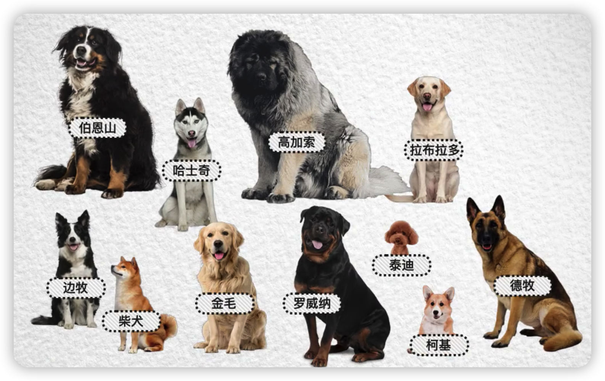
这里有一些狗  熟悉犬类的朋友  应该能很快的区分出它们的品种  

我们之所以能做到这一点  

是因为我们会从不同的角度来观察它们的特征  比如体型的大小

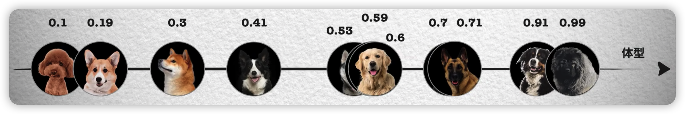
如果我们用一个坐标轴来表示这个特征  这些狗将落在不同的坐标  
然而单纯依靠体型这一个特征还不够  比如金毛和拉布拉多的体型就十分的接近  

所以需要继续观察其他的特征  比如毛发的长短  我们再建立一个坐标轴  这样就区分开了金毛和拉布拉多  
现在每只狗对应一个二维坐标点  

但这仍然不能够很好地区分  德国牧羊犬和挪威纳犬  因为无论是体型还是毛发的长短  他们都十分的接近  

所以我们需要继续从更多的角度来观察  比如鼻子的长短  再建立一个坐标轴  于是这两个全轴也被区分开来  现在每只狗对应一个三维的坐标点  
我们还可以有更多的角度  比如眼睛的大小  

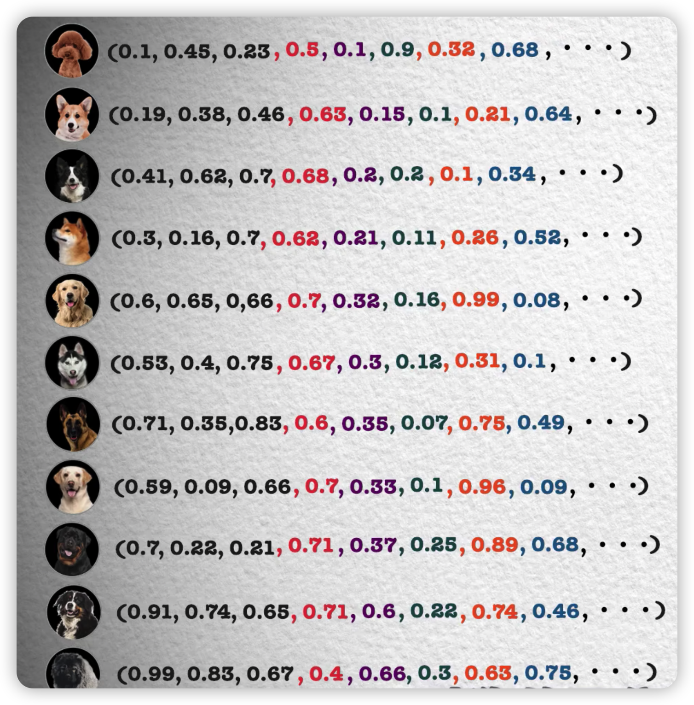
虽然作为三维生物  我们不可能在四维空间作图  但在坐标点的数值上却很容易实现  这一点  继续向后追加就好  
现在每只狗对应一个四维的坐标点  
如果我们从更多的角度或者说维度  来观察一只狗的特征  比如腿的粗  毛发的卷曲  甚至是一些抽象的角度  
比如服从性  攻击性等等等等  我们使用的维度越多  对狗的区分能力就越强  同时坐标点所在的空间维度也就越高  

不仅是狗  实际上几乎所有的事情都可以被这样表达  
可以是具象的山河日月鸟兽鱼虫  也可以是抽象的喜怒哀乐  悲欢离合

不同事物在不同的特征维度中有着不同的表现  或者说不同的数值  
所以最终都会在在一个高维的特征空间中  对应着一个坐标点
只不过在这些更大的范围内  我们可能需要更高的特征维度  
才能很好的对进行事物区分  可能几百几千乃至上万  
但由于我们无法做出超过三维的图 
所以接下来我们都是用二维坐标来讲解  你会发现这种表达事物的方式  有着很多美妙的特性  

那些概念上更为接近的点  在空间中更为聚集  

而那些概念上非常不同的点则距离很远  

更进一步  如果以坐标原点为起点  这些坐标点为终点  
我们知道  这就是我们熟悉的带有方向和大小的向量  

而从向量的角度  这种表达方式甚至有了一定的推理能力  

比如警察的向量减去小偷的向量得到的结果向和猫的向量减去老鼠的结果向量十分的相似 
这意味着猫和老鼠的关系  类似于警察和小偷的关系  

用向量化的数据来表达概念  不得不说是一个非常好的想法  

如果我们对图片进行向量化  那么就可以通过搜索相似的向量  实现图搜图的功能
如果对视频进行向量的话  就可以通过搜索相似的向量  实现相关视频的推荐  
如果对商品进行向量的话  就可以通过搜索相似的向量  针对用户当前浏览的商品进行相关推荐  
而如果对一个文本进行向量化  就能在一个智能问答系统  从根据用户当前的问题  找到一些已经解决过的相似的问题  以供参考

### 词向量

说到文本类的数据  近些年来对词汇进行向量化  在自然语言处理领域得到了巨大意义  
也就是所谓的**词向量**  
实际上语言作为概念的符号  
你会发现一个训练恰当的词向量集合  将和其所指代的事物之间的向量集合  十分的接近  
这很利于发现自然语言中所蕴含的实际概念  

除了词向量以外  
最近随着以chatgpt为代表的大语言模型的如火如荼  
人们又发现了向量数据的一些妙用  

如果我们把chatgpt的对话内容进行向量化  便可以用当前的对话  
搜索到历史中最为相似的一些对话  也就是找到和当前对话最相关的记忆  
而把这些最相关的记忆提示给模型  将极大地提高其输出的效果  

### 向量数据库
最近几年  一种叫做向量数据库的产品  正趁着ai的热潮开始崭露头角  
向量数据库的倡导者和创业者们  正是基于这样的一种设想  开始了他们的视野  
伴随着大ai时代的到来  向量将成为一种重要的数据形式  
而传统的数据库并不适合用来存储和检索  向量数据  
因此我们需要一种专门设计的数据库来处理这些问题  
这或许会成为未来数据层面的基础设施 

和存储数据表  然后用查询语句进行精准搜索的传统数据库不同  
向量数据库存储的是向量数据  而查询过程则是从库中搜索出和查询向量最为相似的一些向量 具有一定的模糊性  

### 最近邻搜索算法
通过以上这些例子不难看出  
向量数据的一个主要应用场景就是给定一个查询向量  然后从众多的向量中找到最为相似的一些  
这就是所谓的**最近邻问题**  
而能实现这一点的则称之为最近邻搜索算法  

一种最容易想到的方法可能就是**暴力搜索** 就是一路直接平推过去 

依次比较所有向量和查询向量的相似度  挑选出相似度最高的几个  

比较两个向量的相似度的具体方法有许多  
两个向量的夹角越小越相似  所以可以通过计算向量夹角的余弦值来判断  
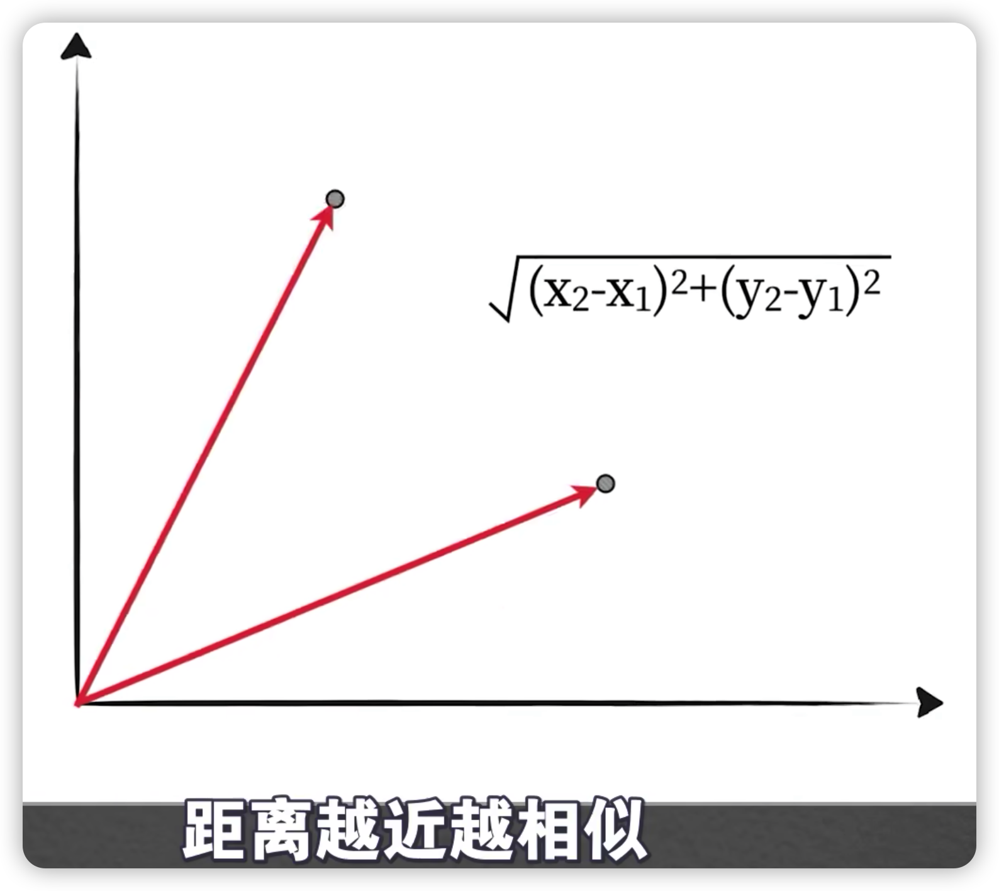
再比如直接计算两个向量的欧式距离 距离越近越相似  

显然如果库中的向量过多  这种毫无技术含量的暴力方法  将导致极高的搜索时间  
但这种方法也有着其他方法  永远无法到达的一个好处  **它的搜索质量是完美的**

因为它真的比较了每一个向量  所以如果库中数据规模较小  便你全部销量的时间可以接受

这也不失为一种好的方法  然而实际应用中的数据规模往往都不会太小  
所以我们必须找出一些方法进行优化  有一种朴素的想法  
指出了优化的大致思路  我们可以用一个寻人的例子来说明  
假如已经知道照片上的这个人在a城市  现在请你想一个办法把他找出来  
就相当于去找a城市的每一个人逐一比较  这样一定能够找到  
但要花费海量的时间  但我们通过他胸前的红领巾  就知道他是一名小学生  
所以就可以把寻找的范围  缩小到a城市的所有小学  如此就有可能将千万级别的查找次数  
降到只有几万的级别  所以对于向量的搜索问题  
假如能够为查询向量先划定一个大致的范围再搜索岂不美哉

有一种称之为**聚类**的算法可以实现这一点  

我们以最为流行的**k-means聚类算法**为例  
很简单我们先选定一个想要分类的数量  比如四类  然后随机生成四个点  称之为聚类中心点

然后这些向量和哪一个中心点  最近就被分为哪一类  再然后用当前被分为一类的向量  计算出一个平均的向量点 
把对应的中心点的位置更新为这个平均点  

再判断每个向量点和哪一个中心点最近
重新分类  然后继续用同一类的向量点计算出一个平均点  把中心点更新过去  再次重新分类  

如此反复  这个不断迭代的过程就称之为训练  
最后这些中心点将趋于稳定或者说收敛  最终将这些向量分成了四类  
如此在搜索的时候  只需要找出和查询向量最近的那个聚类中心  

搜索这个分类中的向量即可  也就实现了缩小搜索范围的目的 

当然聚类的方法并不能保证  不会出现遗漏的问题  
比如查询向量在这里  

他和这个分类的中心最近  但和它最近的向量 其实是在这个分类中  

有一些缓解这个问题的办法  比如我们增加聚类的数量  同时指定搜索多个最近的区域  减少遗漏  
但只要是试图提高搜索的质量  基本上都会增加搜索的时间 

实际上速度和质量往往是一对难以调和的矛盾  而几乎所有的算法都是在这两个指标上  

结合实际情况衡量的结果  所以现实就是  除了暴力搜索一定能够找到最近邻的一些向量以外
其他任何方法都不能保证这一点  而只能得到一些近似的结果  所以其实这些算法一般也被称之为近似最近邻算法  
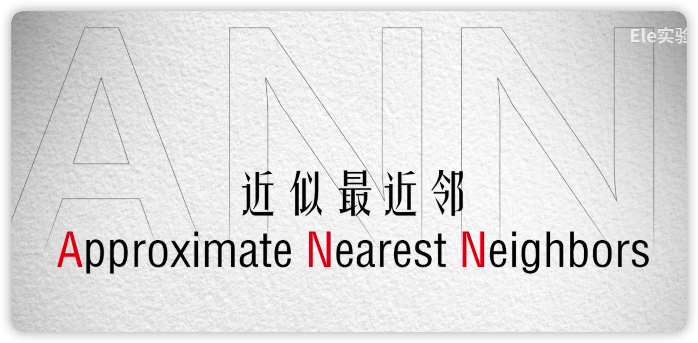
除了聚类以外  减少搜索范围的方式还有很多 

这里再介绍一种比较流行的基于哈希的方法

我们曾在md 的视频中介绍过哈希的概念  简单来说就是任何数据经过哈希函数计算之后  都会输出一个固定长度的哈希值
比如128位 

而且由于输入是任意的数据  而输出是固定长度的数  以有穷对无穷  
根据鸽巢原理  必然会出现数据不同  但哈希值相同的情况  这也被称之为碰撞  

通常情况下  哈希函数的设计一般力求减少这种碰撞的发生  但这里所构建的哈希函数却反其道而行  
它力求增大发生碰撞的可能  
因为哈希碰撞正是分组的依据  哈希值一样的向量被分到同一组 这些分组也被称之为桶 

除了容易发生碰撞以外  这个哈希函数还要具备这样的一个特性  
位置越近  或者说越相似的向量发生碰撞的概率越高  被分到同一个桶中的可能性越大  
如此在查询的时候  只需要计算一下查询向量的哈希值  找到其所在的桶  
再在这个桶中搜索就好了  因为和查询向量最相似的一些销量  
大概率都在这个图  我们把具有这种特性的哈希函数  称之为**位置敏感的哈希函数**  

这样的哈希函数怎么实现呢  我们来看一种常用的手法 
我们以a b c 个向量为例  首先随机生成一条直线  而且这条线区分正反两侧 

比如这边是正的一侧  这边是反的一侧  如果一个向量在这条线的正的一侧
那么他就是一  如果再反的一侧  那么就是零  
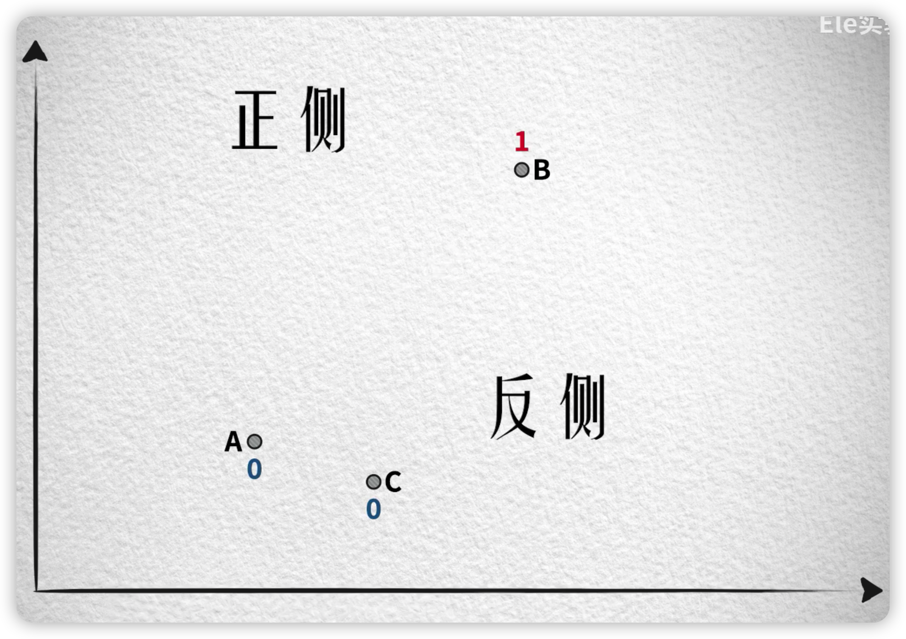
然后再随机生成一条直线  
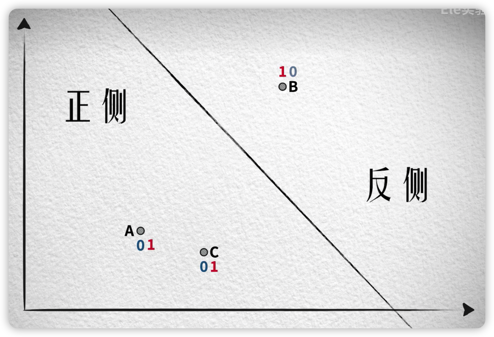
同样正侧的向量是一  反侧的向量是零  如此这般我们随机的生成若干个这样的直线

每次都根据所在的正反侧得到一或者零  如果一共使用四条随机的直线  
如此就为每个向量算出了四个零或者一 各自得到一个四位的二进制编码
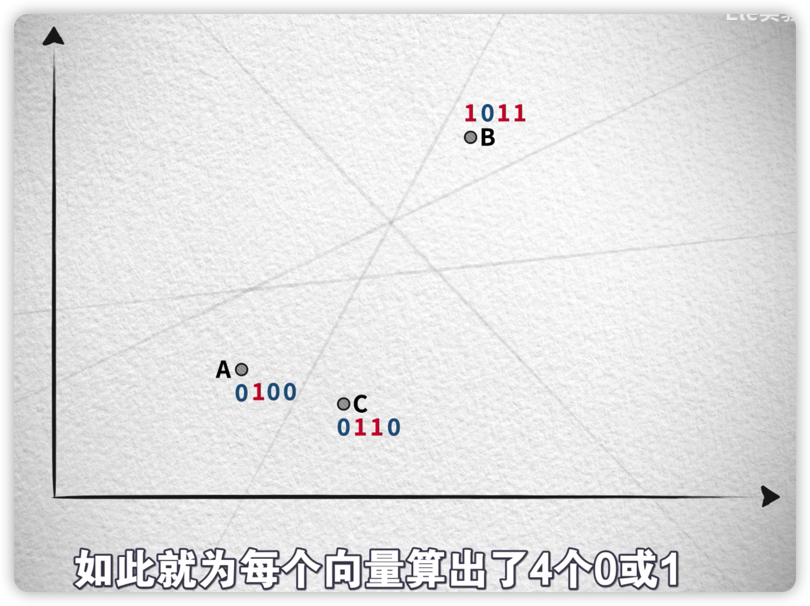

现在我们来观察一下  这三个二进制编码的相似程度  
很明显  ac这两个更近的向量的编码更为相似  

只有第三位不同  相似度高达3/4  而这个较远的b和ac的相似度都很低  一个是1/4  一个是零 
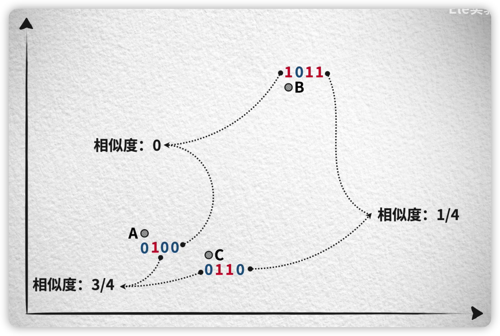
所以为什么向量越接近  得到的二进制编码就越相似呢  
我们直观的来定性分析一下  在计算这四个二进制编码的某一位的时候  
如果要让b和c的结果一样  那么这条线应该是这样的  
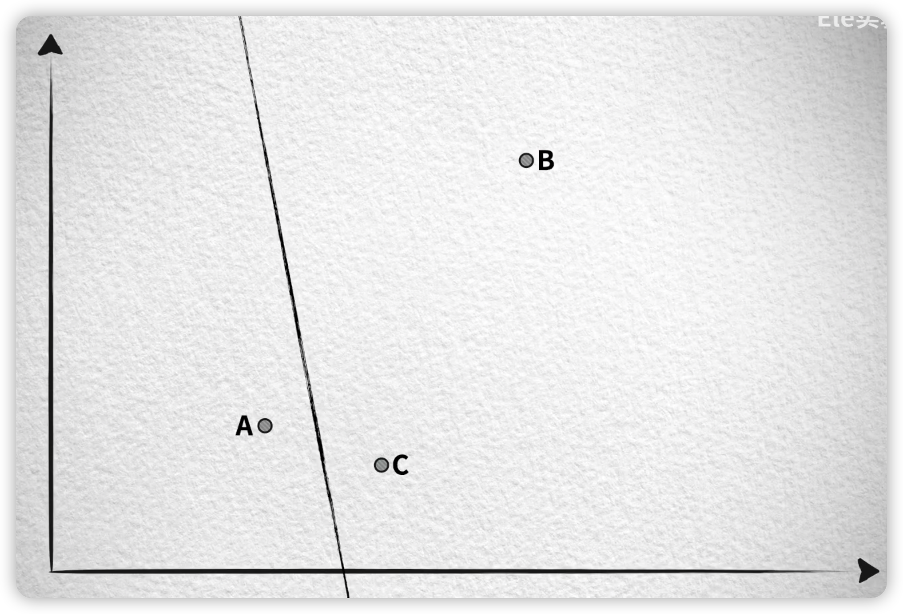

当然也可以是这样  
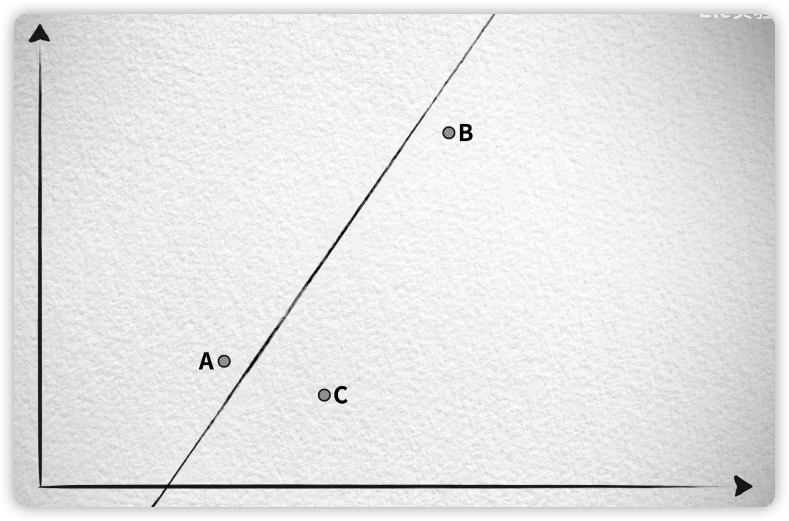
但不论如何  一定要从ac和ab之间穿过去 
同样如果要让a和c的结果一样  这条线应该从bc和ab之间穿过 
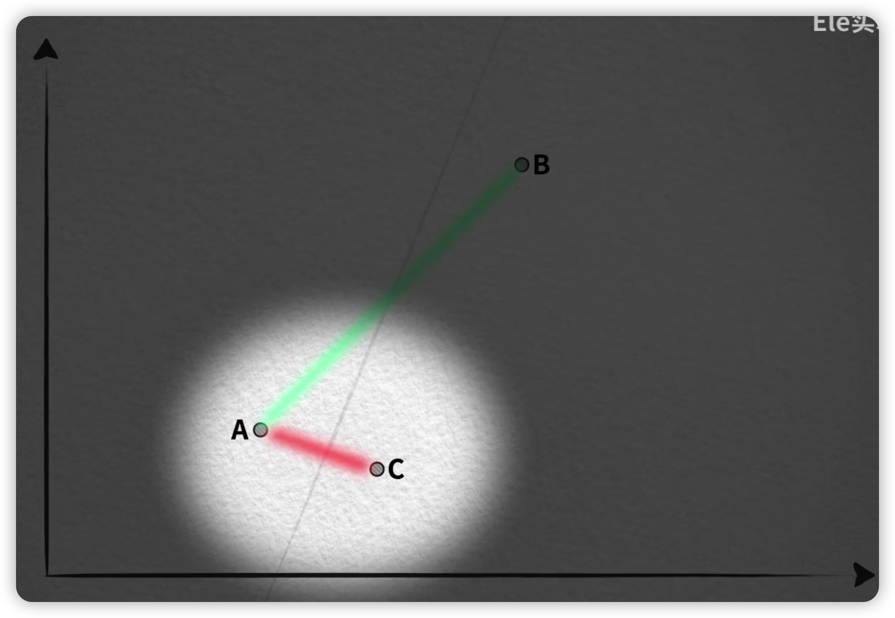

我们忽略共同穿越的AB 直观上来看  b和c之间的宽度  要远远大于a和c之间的宽度  
而我们的直线是随机生成的  所以从概率上来说  生成的直线从bc穿过的可能性  
要比从ac穿过的要更大  所以在生成二进制编码的过程中  c更有可能和a一样而不是b
同样如果要让a和b的编码值一样  直线要穿过ac和bc  而如果要让a和c的结果一样  
这条线应该从bc和ab之间穿过  忽略共同穿越的bc  ac间的宽度也远小ab  
所以a也是更可能和c一样  而不是b  
所以这串二进制编码便可以作为向量的哈希值
而这个生成的过程  就是一种我们所找寻的哈希函数  因为它满足我们刚才说的两个要求 
**容易碰撞  而且越相似的向量越容易碰撞  以至于被分到同一个桶中**  
当然这三个向量的哈希值并不完全相同  但如果我们再观察一个距离a更近的d  
你就会发现d最后的二进制编码  或者说哈希值和a一样发生的碰撞  
我们用四个向量  展示了这个方法的基本工作原理 
而对于真实情况中的许多向量而言  
每个向量通过这个哈希函数后  都会得到一串二进制编码的哈希值  而那些非常接近的  
像那样的哈希值大概率是一样的  也就被分到了同一个桶中  对于更高维度的向量  道理也是一样的 

比如三维 便可以使用三维空间中的一个随机平面  来做哈希函数的计算 

这个面也有正反正面的向量得到一  反面的向量得到零  若干个随机平面  
自然也就得到了一串二进制编码的哈希值  如果是更高的维度  虽然我们做不出图形  
但却可以理解  在这些更高维度中也存在着包围的超平面  同样也可以完成这样的哈希值生成  

所以我们把这种方法称之为  **随机超平面或者随机投影**  当然正如我们所言  
除了直接暴搜  任何试图减少搜索量的方法  方法都会在一定程度上降低搜索的质量  

比如还是这四个向量  现在我们用九条随机直线  每个向量生成长度为九的二进制哈希编码
可能是这样的过程  ad两个比较近的点的哈希值一致  被分到了同一个桶中  这是比较理想的结果
但因为直线是随机的  我们把握不住  所以这个过程也有可能是这样的  在生成第六个编码的时候 
这个直线真的就随机到了  从ad之间穿过  导致a和d的哈希编码的第六位不同  虽然我们说概率比较小
但毕竟是有可能发生的  最后a和d无法进入同一个痛  所以一般会采用一种分段的措施  来改善这种情况 
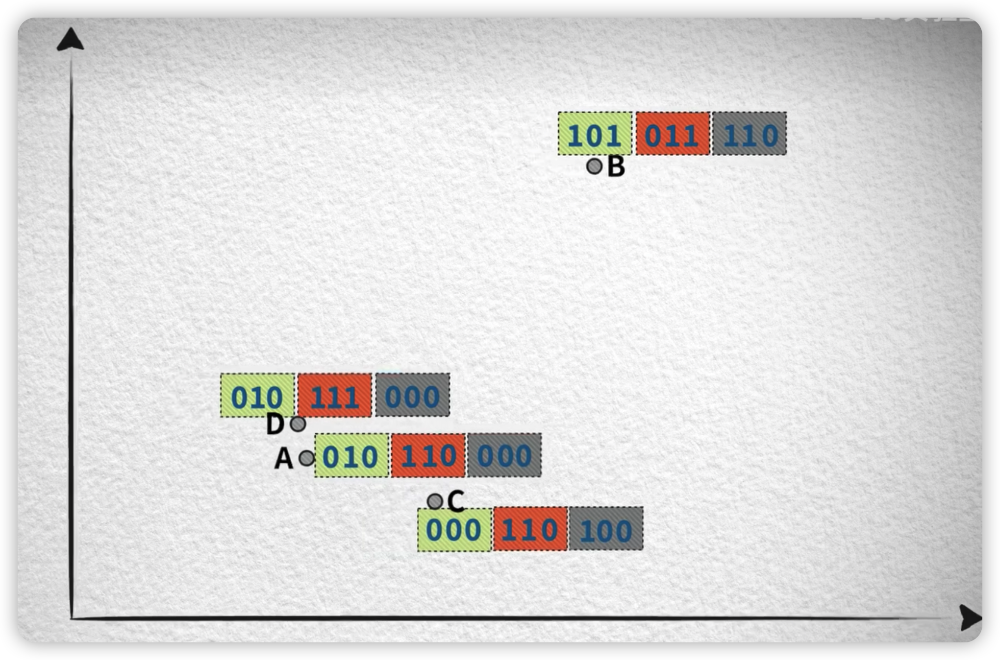
比如现在我们把这些二进制哈希值分成三段  然后独立的对这些片段进行分头  如此 
虽然d的第二个片段被分到了不同的桶中  但第个片段却被分到了同一个桶  我们可以采用只要匹配一个片段  

就将其作为候选项的策略  合理的扩充更多的搜索范围  你会发现在这种分段的措施下  a和c的第二段也被分到了同一个桶中 
两者由此成为了相似向量的候选项  因为他们比较接近  这是一种合理的扩充  而b则没有任何一个段和其他向量对应的段  
被分到同一个桶中  因为它们距离很远  这很合理    

 
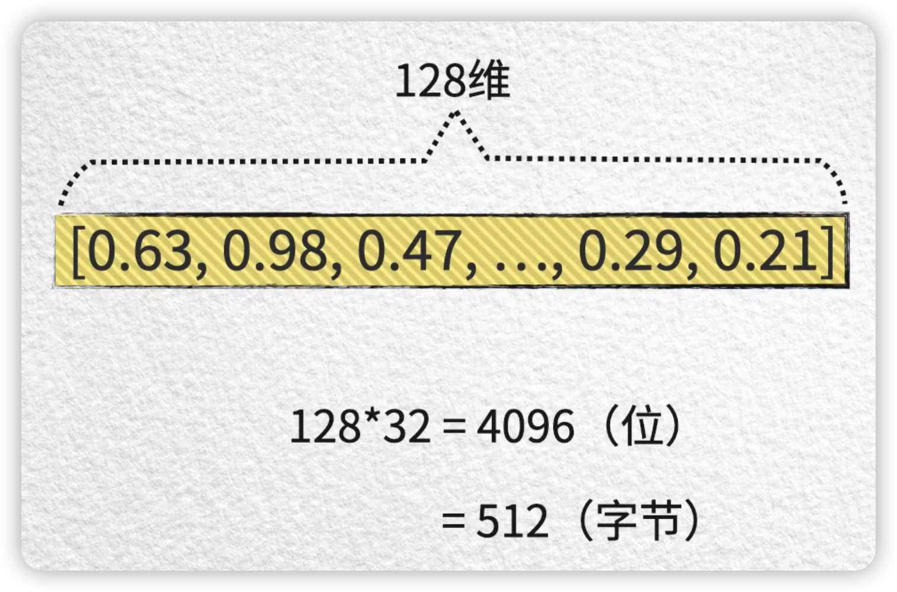
在上集中，我们简单介绍了一些提升搜索速度的方法，通过减少搜索范围来实现。但是对于海量的向量数据来说，除了搜索速度，内存开销也是一个巨大的挑战。

###  内存开销问题
举个例子，假设向量的维度是128，每个维度的值是一个32位浮点数，那么一个向量占用的内存就是512字节。如果数据库中有1000万个向量，总共占用的内存就是大约4.77GB。在实际应用中，上千维甚至上亿维的向量数量并不罕见，所以内存开销问题是非常严重的。

### 有损压缩方法 乘积量化 Product Quantization
每个向量都对应着一个有用的记录，所以无法通过删除向量来节省内存。唯一的选择就是降低每个向量本身的大小。
一种方法是使用k-means聚类算法，将相邻且有一定聚集性的向量分为一类，并用聚类中心（也叫质心）来代替该类中的其他向量。这种方法实际上是一种有损压缩的方法。
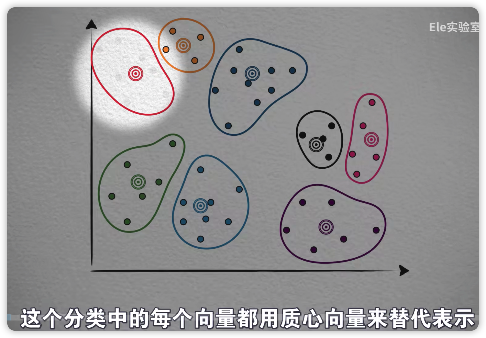

### 图像压缩的例子
举个图片的例子来说明，图片由像素点组成，每个像素点有RGB三个数值，可以将一个像素点看作是一个三维空间中的向量点。
通过聚类算法，在像素空间中将所有像素点替换为所在类别的质心点，可以实现图片的压缩。虽然质量有所下降，但仍然保留了原图的样貌。

### 向量量化
类似地，对于向量数据，可以使用向量量化的方法来降低内存开销。将每个向量用编码值来表示，然后将编码值和对应的质心记录下来，形成一个码本。
每次使用某个向量时，通过编码值从码本中找到对应的质心，再恢复出原始向量的具体值。虽然向量已经不再是原来的样子，但问题不大，因为量化过程仍然保留了一些原始信息。

### 量化的内存开销
量化后的向量占用的内存开销确实降低了，但是量化过程会产生一个额外的码本，这会增加内存开销。
随着数据量的增大，数据可能越来越稀疏，聚类的效果如果需要得到保证，可能需要的聚类质心也就越多。
在低维向量中，这个开销可能不明显，但在高维向量中，这个开销会变得非常大。为了保证量化质量，可能需要非常大的聚类数量，这被称为维度灾难问题。

### 基量化算法
为了解决维度灾难问题，可以将高维向量分割成低维子向量，然后在子向量上进行独 立的量化。将子向量的量化编码值合并在一起，就得到了原始向量的最终量化编码值。
这种方法被称为基量化算法（PQ）。通过基量化，可以大大减少内存开销。

Product quantization for nearest neighbor searchPQ原始论文:基于(乘)积量化的近邻搜索

### NSW算法
德劳内三角剖分法 Delaunay triangulation algorithm
NSW（Navigating Spreading-out Walk) 是一种基于图结构的近似最近邻算法。通过建立图结构，可以快速导航到目标节点，并通过精细化的搜索找到最相似的向量。
NSW算法的核心思想是先粗略搜索，再精细搜索。为了改善NSW算法的性能，可以使用HN-SW算法，它在NSW算法的基础上添加了多层结构，实现了由粗到细的搜索过程。

向量所有的点都先拿出来 在开始建立点之间的关系的时候，由于数据量较少，因此很稀疏（很容易演化成点之间的长连接），
随着数据的增加，点之间的联系会越来越密集。通过长连接快速到达点 再通过短连接细化到具体的点数据上。

Efficient and robust approximate nearest neighbor search using Hierarchical Navigable Small World graphs
使用分层导航小世界的高效且健壮的近似最近邻搜索

### 向量数据库的功能
向量数据库除了支持近似最近邻算法，还需要具备传统数据库的功能，如简单易用的访问接口、访问控制、权限管理、审计功能、数据备份等。
此外，向量数据库还需要具备多节点、容错性、监控和追踪功能，以满足大规模数据和访问量的需求。

在大AI时代的开端，向量数据库是一个具有广阔前景的领域，但也面临着工程上的挑战。一个可用的向量数据库产品需要解决诸多细节问题，并综合各种算法和功能，以提供高效、可靠的服务。

