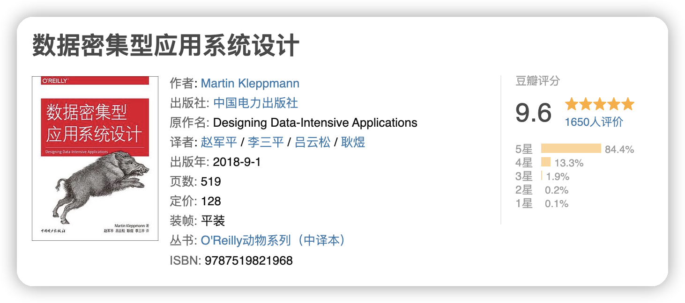
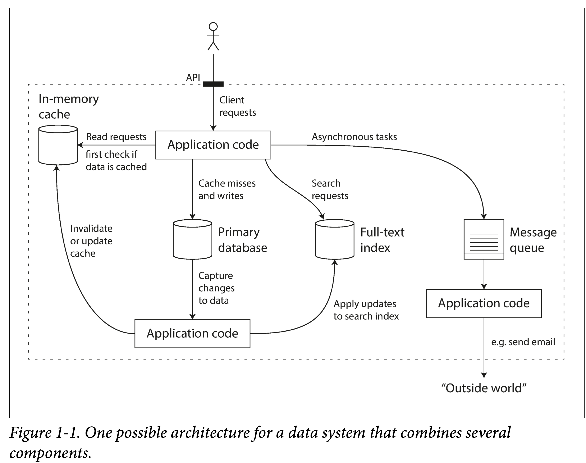
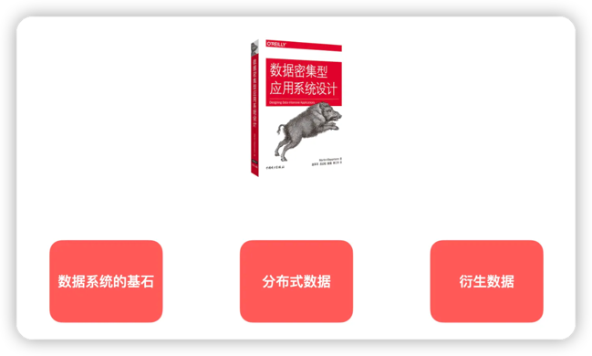

## 为什么推荐这本书
**《数据密集型应用系统设计》**，英文名称是 **《Designing Data-Intensive Application》**  ，也被简称为 **DDIA**。

### 面试八股文
#### 分布式系统有什么特点
分布式系统的设计目标是，最大化整体资源利用率的同时，处理局部错误、保持对外可用性。
在构建分布式系统时，在逻辑上要注意以下这些方面：
- 可扩展性：可扩展性是对分布式系统最本质的要求，即系统设计允许我们只通过增加机器来应对不断增长的外部需求。
- 容错性\可用性：这是可扩展性所带来的一个副作用，即在系统规模不断变大之后，单个机器故障便会成为常态。系统需要自动处理这些故障，对外保持可用性。
- 并发性：由于没有全局时钟进行协调，分散的机器天然处在“平行宇宙”中。系统需要引导这些并发变为协作，以拆解并执行集群任务。
- 异构性（对内）：系统需要处理进群内部不同硬件、不同操作系统、不同中间件的差异性，并且能够容纳新的异构组件加入系统。
- 透明性（对外）：对外屏蔽系统复杂性，提供逻辑上的单一性。

#### 有几种类型
在组织分布式系统时，在物理上可以有以下几种类型：
- 主从架构（master-workers）：有一个负责指挥的机器，其他机器负责干活，如 Hadoop。好处是设计和实现相对容易，坏处是单点瓶颈和故障。
- 点对点架构（peer-to-peer）：所有机器逻辑等价。如亚马逊 Dynamo，好处是没有单点故障，坏处是机器协调不好做、一致性也不好保证。不过，如果系统是无状态的，则这种架构很合适。
- 多层架构（multi-tier）：这是一种复合架构，实际中也最常用，比如今年来常说存储计算分离。每一层可以根据不同特点（IO 密集型、计算密集型）进行设计，甚至可以复用现有组件（云原生）。

#### 有哪些优劣
分布式系统是由于单机能力不匹配数据尺度的一种无奈之举。因此，在做系统设计时，优先考虑单机系统。毕竟，分布式系统的复杂度是指数上升的。

`优点`
高可用、高吞吐、高可扩展性
高可用、容错：一部分机器坏掉，仍可以正常对外提供服务。
无限扩展：只要设计的好，可以通过线性的增加机器资源来应对不断增长的需求。
低延迟：多地部署，将用户请求按地理路由到最近机房处理。

`缺点`
最大的问题是复杂性。
- 数据的一致性。考虑到大量的机器故障：宕机、重启、关机，数据可能丢失、陈旧、出错，如何让系统容纳这些问题，对外保证数据的正确性，需要相当复杂的设计。
- 网络和通信故障。网络的不可靠，消息可能丢失、早到、迟到、Hang 住，这给机器间的协调带来了极大的复杂度。像 TCP 等网络基础协议，能解决部分问题，但更多的需要系统层面自己处理。更不用说，开放式网络上可能存在的消息伪造。
- 管理复杂度。机器数量到达一定数量级时，如何对他们进行有效监控、收集日志、负载均衡，都是很大挑战。
- 延迟。网络通信延迟要比机器内通信高出几个数量级，而组件越多、网络跳数越多，延迟便会更高，这些最终都会作用于系统对外服务质量上。

### 这本书能够起到什么帮助
作为一个分布式系统初学者，面对网上未加归类、浩如烟海的学习资料，很容易两眼抓瞎。
这本书能够帮助你对数据库和分布式系统相关的论文有一定了解, 帮助你在脑海中构建一套数据系统体系.
帮助你在数据系统设计的时候,知道你选择的组件有哪些合适的场景,而不至于两眼一抹黑掉到坑里.
读完此书并不会马上给你带来什么显然易见的收获，也不会直接帮助你写代码。但是，时间久了，这本书带给你的思考的提升，最终会让你收获颇丰。

## 如何阅读一本书

阅读四问:
1. 整体来说，这本书到底在谈些什么？
    • 书的主题是什么？
    • 这本书在谈论什么东西？

2. 作者细部说了什么，怎么说的？
    • 这本书是如何讲述这个主题的？
    • 它的核心章节，或者是观点是什么？
3. 这本书说得有道理吗？是全部有道理，还是部分有道理？
    • 这本书讲的有道理吗？
    • 这个章节讲的有道理吗？
    • 他说的理论有对应的开源实现吗？
4. 这本书和我有什么关系？ 
    • 反问自己一句，读完这本书收获了多少？
    • 合上眼，能对着目录讲出这个章节大概内容吗？
    • 能把这本书用自己的话讲给别人听吗？

什么是「**数据密集型应用系统**」？

> 当数据（数据量、数据复杂度、数据变化速度）是一个应用的主要挑战，那么可以把这个应用称为数据密集型的。与之相对的是计算密集型——处理器速度是主要瓶颈。

其实我们平时遇到的大部分系统都是数据密集型的——应用代码访问内存、硬盘、数据库、消息队列中的数据，经过业务逻辑处理，再返回给用户。

- 很多应用都是在解决不同场景下的数据存储和检索问题——**MySQL，Redis，ElasticSearch，Tidb, HBase，Neo4j，……**
- 还有很多技术是围绕着数据展开——**kv存储(B+ tree/lsm tree)，编码（JSON, XML, Thrift, ProtoBuffer），行列存储, 文档存储, 对象存储 ……**
- 当数据在分布式处理时，要考虑——**数据复制，分区，事务……**
- 大数据场景下，我们会使用——**MapReduce，Spark，Flink 等批处理、流处理框架。**

这本书既有理论也有实践，基本没有公式，图很多，阅读起来很流畅，比较容易理解。

这本书分为了三部分：

- 第一部分：**数据系统的基石**，包括数据模型与查询语言、存储与检索、数据编码与演化；
- 第二部分：**分布式数据**，包括复制、分片、事务、一致性与共识；
- 第三部分：**衍生数据**，包括批处理、流处理、数据系统的未来。

第一，全书分三个部分。分别是单机，多机，衍生。从单机开始聊数据系统，可以摒除分布式庞杂理论的影响，专注在数据系统本身相关理论；
到第二个部分放开单机限制，着重讲将数据系统扩展到多机所面临的问题和一般解决方案；
最后一部分笔锋一转，着眼数据处理，以数据系统视角看，无非是一个数据集的变换，也即数据的派生。
三个部分，层层递进，相互正交。这种行文思路，正是大型工业代码组织思路：将复杂度拆解到几个正交、但又相互连结的模块，
从而使每个部分都相对内聚而简洁。

第二，具体到第一部分，开篇就给了三个总纲式的“心法”：可靠性、可伸缩性、可维护性。
然后，从上到下，由离用户最近的数据模型（比如关系模型）和查询语言（比如 SQL），
到稍微底层一点的存储引擎（比如 B+ tree 和 lsm tree）和查询引擎，
再到最底层的编码（数据结构的降维）和演化，层层下探，零碎知识，至此百川入海，万法归一。

第三，具体到每一章，也是节节递进，读起来无比丝滑。比如第三章，在讲存储引擎时，从一个仅由两个 shell 函数组成的“kv 引擎”起，
到一个简单的日志结构的存储（Bitcask），再到经典的 LSM-Tree。从一个最简单的数据库开始，越讲越深入，把常见数据库的存储与检索方式都讲完了。
这又是工程中惯用思路：从一个最小可用原型开始，不断增加需求、解决瓶颈，最终得到一个工业可用的存储引擎。

## 阅读建议

这本书比较厚，概念也比较多，而且很少有代码，基本都是在讲逻辑，因此有些「**太干了**」。
这本书的内容大而多，每一章都可以成为一本单独的书。如果你时间精力有限，不妨阅读你感兴趣的重点章节。

- **如果你对数据的编码、存储感兴趣，可以阅读第 1~4 章；**
    - **这些是比较基础的内容，阐述了数据库的原理，对工作比较有帮助**
- **如果你对分布式系统感兴趣（如分布式复制、分区、事务等），可以阅读第 5~9 章；**
    - **这部分内容比较偏向于概念和思维，挺抽象的，属于进阶内容，帮助拓展思维（和准备面试）。**
- **如果你对大数据计算（批处理、流处理）感兴趣，可以阅读第 10~12 章。**
    - **这部分内容工程实践比较强，如果你工作中用到了 Spark, Flink 等，可以在这些章节了解它们的原理**

## 阅读资源

### 推荐系列阅读资源：

- 《数据密集型应用系统设计》开源翻译仓库（9.3K star）：[https://github.com/Vonng/ddia](https://github.com/Vonng/ddia)
- 开源版本在线阅读：[https://vonng.gitbooks.io/ddia-cn/content/](https://vonng.gitbooks.io/ddia-cn/content/)
- ddia-references: [https://github.com/ept/ddia-references](https://github.com/ept/ddia-references)
- DDIA 逐章精读:  [https://ddia.qtmuniao.com/#/preface](https://ddia.qtmuniao.com/#/preface)
- 分布式系统学习资料汇总: [https://zhuanlan.zhihu.com/p/372646991](https://zhuanlan.zhihu.com/p/372646991)

### DDIA 逐章精读


### Book Review

这里有个很不错的 Book Review，是一个小哥讲了《DDIA》每一章的概述，作者很用心。
全英文的，在油管可以看到。地址是：
[https://www.youtube.com/watch?v=PdtlXdse7pw&list=PL4KdJM8LzAMecwInbBK5GJ3Anz-ts75RQ](https://www.youtube.com/watch?v=PdtlXdse7pw&list=PL4KdJM8LzAMecwInbBK5GJ3Anz-ts75RQ)

### MIT6.824

看这本书的时候，你可以结合 MIT6.824 分布式系统课程。油管上这门课程的视频版本，在 B 站有这个课程的中文字幕翻译合集地址：


这门课程的中文文字版，地址：[https://mit-public-courses-cn-translatio.gitbook.io/mit6-824/ ](https://mit-public-courses-cn-translatio.gitbook.io/mit6-824/ )

### DDIA作者Martin Kleppmann分布式系统


- 课件pdf：https://www.cl.cam.ac.uk/teaching/2122/ConcDisSys/dist-sys-notes.pdf
- 课程主页：https://www.cl.cam.ac.uk/teaching/2122/ConcDisSys/
- 视频合集：https://www.youtube.com/playlist?list=PLeKd45zvjcDFUEv_ohr_HdUFe97RItdiB
- 作者主页：https://martin.kleppmann.com/
