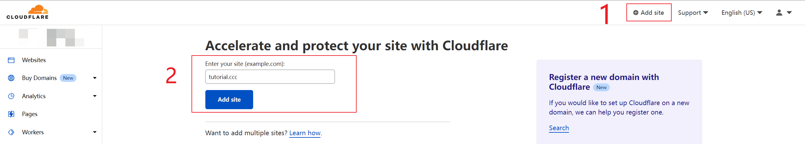
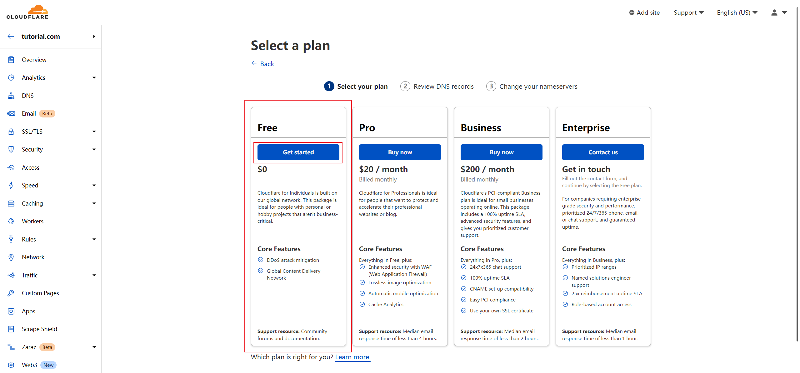
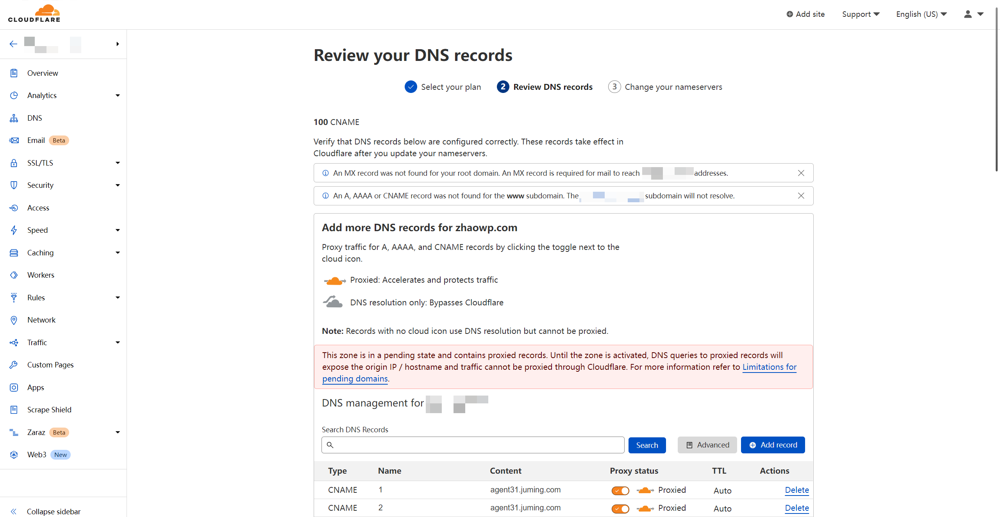
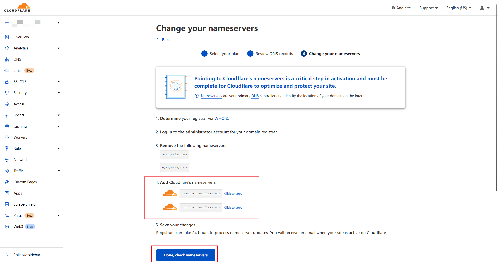
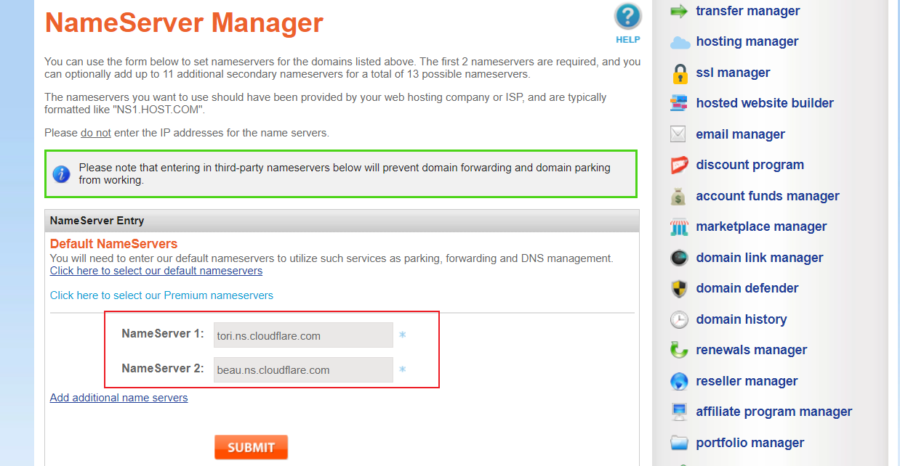
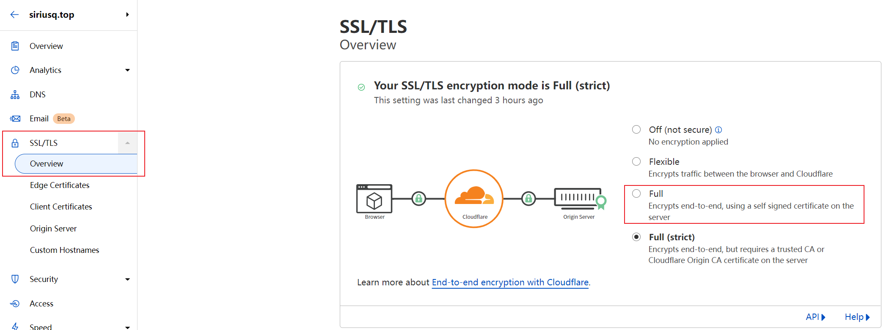
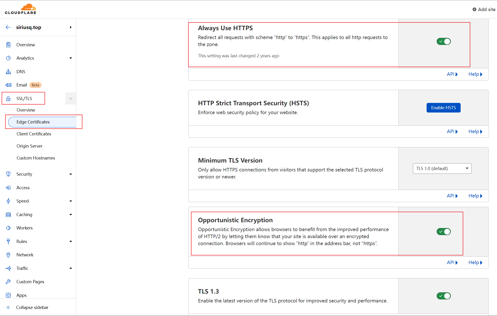
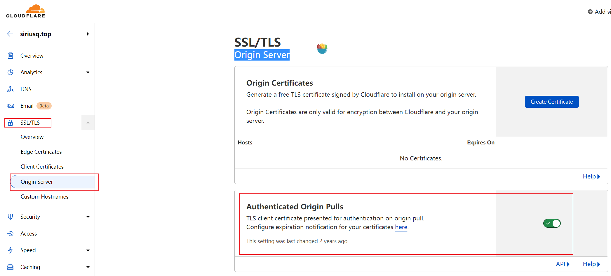
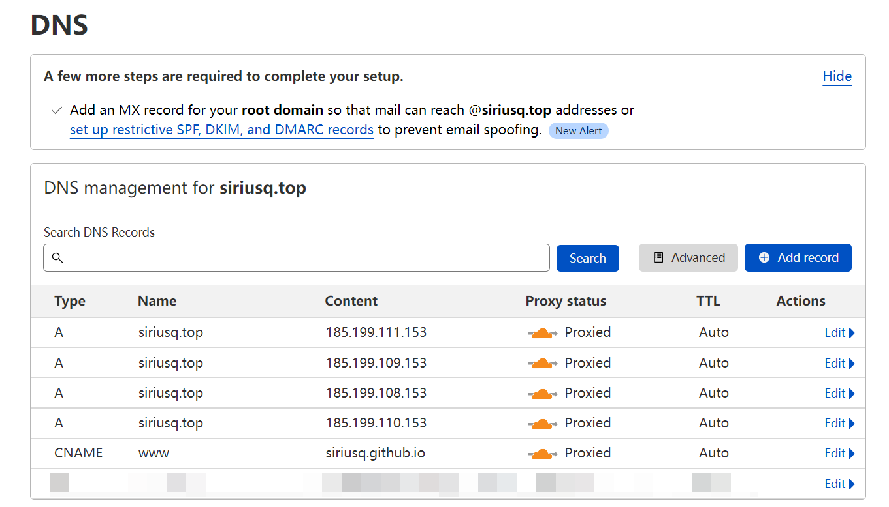

## 分支保护
GitHub 的分支保护选项允许存储库所有者对规定的分支设置一些特定的访问和修改规则，以增加代码健壮性和项目管理的效率。

照你描述的需求，你可以本地创建新的开发分支，完成开发后推送到 GitHub。然后你可以发起一个 pull request，请求合并你的开发分支到主分支。开发团队其他成员（或你自己）可以审查这个 pull request，在确认没有问题后将其合并到主分支。

以下是对分支保护选项的设置建议:

- **Protect matching branches**: 开启。你可能想要保护你的主分支，防止直接推送代码。

- **Require a pull request before merging**: 开启。此设置强制你必须通过 pull request 才能将更改合并到受保护的分支。

- **Require approvals**: 根据你的团队规模和审查需求来决定。如果你希望有人审核代码，那就开启这个选项。

- **Dismiss stale pull request approvals when new commits are pushed**: 开启。这确保每次新提交都得到审查。

- **Require review from Code Owners**: 可以按需开启。如果你的团队有指定代码所有者，那么他们的审查就变得非常重要。

- **Require approval of the most recent reviewable push**: 可以按需开启。这确保最新的提交已被审查。

- **Require status checks to pass before merging**: 如果你有 CI/CD 流程，那么你应该开启。这确保所有测试都通过后才能合并。

- **Require branches to be up to date before merging**: 应开启，以确保在合并之前所有的代码都是最新的。

- **Require conversation resolution before merging**: 可以按需开启。这确保所有的代码讨论都已经解决。

- **Require signed commits**: 可以按需开启。如果你需要确保提交的代码来源的身份验证和完整性，可以开启这个选项。

- **Require linear history**: 可以按需开启。如果你希望保持你的提交历史直线型，可以选择此项。

- **Require deployments to succeed before merging**: 如果你的项目有自动部署流程，那你可以开启这个选项。

- **Lock branch**: 除非你有特别的需求，否则一般不需要开启。

- **Do not allow bypassing the above settings**: 为确保所有设置都被执行，开启该选项。

- **Allow force pushes/Allow deletions**: 这两个选项的开启取决于你是否希望允许有权限访问的用户执行强制推送和删除分支。这些操作会改变历史记录，一般较少使用，如非必要，可以不选择开启。

值得注意的是，由于分支保护规则可能会阻止某些类型的拉取请求，所以对于希望构建和测试拉取请求的人来说，这可能会造成问题。你可以设置允许特定的人或团队推送到受保护的分支，或者允许那些提出拉取请求的人合并他们的改动。

## 配置多个账户
要在同一台机器上配置多个 GitHub 账户，你需要为每个账户创建一个新的 SSH 密钥，并在 `~/.ssh/config` 文件中为每个密钥创建一个新的 SSH 别名。以下是详细步骤：

1. **生成新的 SSH 密钥**：对于每个 GitHub 账户，你需要创建一个新的 SSH 密钥。你可以使用 `ssh-keygen` 命令来生成密钥：

   ```bash
   ssh-keygen -t ed25519 -C "your-email@example.com"
   ```
   当提示你输入文件以保存密钥时，输入一个新的文件名，例如 `~/.ssh/id_ed25519_github_username`。这将在 `~/.ssh` 目录下创建两个文件，一个是私钥（`id_ed25519_github_username`），另一个是公钥（`id_ed25519_github_username.pub`）。

2. **将新的公钥添加到 GitHub 账户**：登录到你的 GitHub 账户，然后打开 "Settings" -> "SSH and GPG keys" -> "New SSH key"。然后，打开你刚刚创建的公钥文件，将内容复制粘贴到 "Key" 字段，给密钥起个名字，点击 "Add SSH key"。

3. **在 `~/.ssh/config` 文件中创建新的 SSH 别名**：在 `~/.ssh/config` 文件中（如果文件不存在，你需要创建一个），为每个 SSH 密钥创建一个新的 Host。你需要为每个 Host 指定 HostName（总是 `github.com`），User（总是 `git`），以及你的私钥文件的位置。例如：

   ```bash
   # Account 1
   Host github.com-username1
       HostName github.com
       User git
       IdentityFile ~/.ssh/id_ed25519_github_username1

   # Account 2
   Host github.com-username2
       HostName github.com
       User git
       IdentityFile ~/.ssh/id_ed25519_github_username2
   ```

4. **在 Git 仓库中切换账户**：在你的 Git 仓库中，你可以通过更改仓库的 remote URL 来切换账户。例如，如果你想要将仓库的 owner 切换为 `username2`，你可以这样做：

   ```bash
   git remote set-url origin git@github.com-username2:username2/repo.git
   ```

这样，当你 push 到 `origin` 时，Git 会使用 `github.com-username2` 的 SSH 密钥，这个密钥是与你的 `username2` GitHub 账户关联的。

请注意，这种方法只能用于切换整个仓库的 owner，而不能在单个 commit 中切换账户。如果你需要在不同的 commits 中使用不同的账户，你可能需要考虑在每次 commit 之前更改你的 Git 配置（使用 `git config user.name` 和 `git config user.email`），或者使用不同的工作目录或 Git 工作树。

## github pages
*   **原文链接：** [https://siriusq.top/github-pages-启用-cloudflare-加速及-https.html](https://siriusq.top/github-pages-%E5%90%AF%E7%94%A8-cloudflare-%E5%8A%A0%E9%80%9F%E5%8F%8A-https.html "GitHub Pages 启用 Cloudflare 加速及 HTTPS")

1.  登录 [Cloudflare](https://dash.cloudflare.com/)， 然后点击顶栏的`Add site`
2.  输入自己的域名，然后点击`Add site`按钮，我这胡乱加了一个没人用的做示范
  
    

3.  选择方案，一般选`Free`就够用了
    
4.  然后Cloudflare会自动获取域名的DNS记录，这里跳过，拉到页面最底部，点击`Continue`按钮，待会回来再配置
    
5.  复制Cloudflare给出的域名服务器，回到域名注册商那里替换掉原有的
    
6.  回到Cloudflare，点击`Done, check nameservers`
    
7.  然后慢慢等待生效，生效后会有邮件提醒，等待生效的时候可以先设置`SSL/TLS`

- 1.  在Overview里，将Encryption Mode先设置为`Full`
    
- 2.  然后到Edge Certificates中，开启`Always Use HTTPS`、`Opportunistic Encryption`等
    
- 3.  到Origin Server中，开启`Authenticated Origin Pulls`
    

8.  生效后到`DNS`设置里添加四条A记录与一条CNAME记录
   - 1.  CNAME记录的NAME设置为`www`，Content设置为GitHub Pages默认的域名，`用户名.github.io`那个
   - 2.  A记录的Name都使用`@`或者自己的域名，Content依次设置为

9.  确认一下各个记录的Proxy status都是`Proxied`状态，即橙色的云朵
    

### GitHub Pages 配置

1.  打开自己的网站的仓库设置`Settings`\-`Pages`
2.  在`Custom domain`中填入自己的域名，点击Save后会自动生成一个CNAME文件

## 开启Encryption Full (strict)模式
这里没有测试成功
Full (strict)模式与Full模式的区别在于，Full (strict)模式使用的是由可信 CA 或 Cloudflare Origin CA 签名的有效证书并对每个请求验证证书，而非Full模式使用的无需验证的自签名证书。GitHub Pages可以通过开启`Enforce HTTPS`来获取免费的可信证书，满足开启Full (strict)模式的条件。下面就是我今天新发现的问题，我的Pages设置中不能开启`Enforce HTTPS`，勾选框一直是灰色的，折腾半天发现是Cloudflare的代理状态的造成的，解决方案如下

- 1.  在Cloudflare的DNS设置中把Proxy status全部设置为`DNS Only`状态，即灰色的云朵

- 2.  回到Pages设置，刷新一下就可以勾选`Enforce HTTPS`了
- 3.  GitHub会自动申请SSL证书，有了这个证书才能够在Cloudflare开启Full (strict)模式


- 4.  等待Pages的HTTPS生效后，回到Cloudflare，把刚才修改的Proxy status全部恢复为`Proxied`状态，即橙色的云朵
- 5.  到`SSL/TLS`设置中，将Encryption Mode设置为`Full (strict)`


## DNS记录类型科普

部分内容引用自 [维基百科](https://zh.m.wikipedia.org/zh-hans/DNS%E8%AE%B0%E5%BD%95%E7%B1%BB%E5%9E%8B%E5%88%97%E8%A1%A8)

### A记录

A记录(Address record)是用来指定主机名（或域名）对应的IP地址记录。用户可以将该域名下的网站服务器指向到自己的网页服务器(web server)上。同时也可以设置域名的子域名。它会传回一个32位元的IPv4地址。

### AAAA记录

AAAA记录(AAAA record)是用来将域名解析到IPv6地址的DNS记录。用户可以将一个域名解析到IPv6地址上，也可以将子域名解析到IPv6地址上。它会传回一个128位元的IPv6地址。

### CNAME记录

CNAME记录(Canonical Name Record)，用于将一个域名（同名）映射到另一个域名（真实名称），域名解析服务器遇到CNAME记录会以映射到的目标重新开始查询。CNAME 记录可用于 CDN 加速，通过 CDN 加速别名解析网站域名。

### NS记录

NS(Name Server)记录是域名服务器记录，用来指定该域名由哪个DNS服务器来进行解析。如果需要把子域名交给其他DNS服务商解析，就需要添加NS记录。

### MX记录

MX(mail exchanger)记录用于指定负责处理发往收件人域名的邮件服务器。

### TXT记录

TXT记录一般指为某个主机名或域名设置的说明。

### TTL

TTL(Time To Live)表示解析记录在DNS服务器中的缓存时间，长度为秒。当本地DNS服务器收到某一域名的解析请求时，需要向该域名指定的权威DNS服务器发送解析请求获取解析记录。获得的解析记录会在本地DNS服务器中保存一段时间。在这段时间内，如果本地DNS服务器再次收到该域名的解析请求，将不再向权威DNS服务器发送解析请求，而是直接返回保存在本地DNS服务器中的解析记录。

## 对比原来博文差距还是很大 有待进一步美化
没有自定义颜色 自定义背景
每一项分割线 字体都有待优化 
