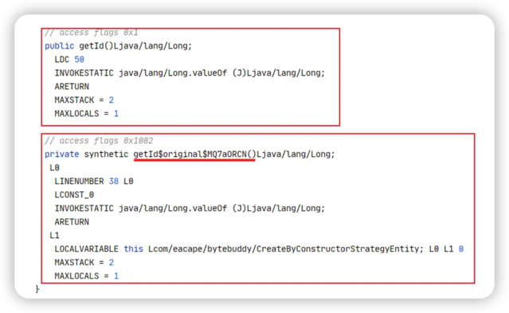

## 简介
- ByteBuddy支持检测和修改现有Java字节码的工具。
- 添加新的构造函数、方法和实例变量
- 删除现有构造函数、方法和实Ï例变量
- 修改实例变量的值。
- 修改方法参数的值。
- 检查现有的Java类结构、构造函数签名、方法签名和实例变量。
- 生成新的泛型Java类、构造函数、方法和实例变量（上界、下界、多界、通配符、参数化类型、方法类型参数）
- 搜索并替换方法中的代码。
- 添加和删除对Java类、构造函数、方法、实例变量和参数进行注释的注释
- 添加和修改Java内部类（添加第一级和第二级linner类，拦截内部类和匿名类）。
- 生成新的Java类、Java接口、枚举、注释和抽象类。
- 生成简单方法和lambda表达式。
- 在Advice代码之间共享数据。

## 代码初体验

在进行Byte Buddy之前先创建一个项目，然后引入相关依赖：

```xml

<dependencies>
    <dependency>
        <groupId>net.bytebuddy</groupId>
        <artifactId>byte-buddy</artifactId>
        <version>1.12.10</version>
    </dependency>
    <dependency>
        <groupId>org.junit.jupiter</groupId>
        <artifactId>junit-jupiter</artifactId>
        <version>5.6.3</version>
        <scope>test</scope>
    </dependency>
    <dependency>
        <groupId>commons-io</groupId>
        <artifactId>commons-io</artifactId>
        <version>2.11.0</version>
    </dependency>
    <dependency>
        <groupId>org.projectlombok</groupId>
        <artifactId>lombok</artifactId>
        <version>1.18.16</version>
    </dependency>

    <dependency>
        <groupId>org.slf4j</groupId>
        <artifactId>slf4j-log4j12</artifactId>
        <version>1.7.25</version>
    </dependency>
</dependencies>

```

测试类如下：

```java
public class CreateClassTest {
    private static String path;

    /**
     * 每个测试方法执行前获取CreateClassTest的路径
     */
    @BeforeAll
    private static void before(){
        path = CreateClassTest.class.getClassLoader().getResource("").getPath();
        System.out.println(path);

    }
    /**
     * 生成一个类
     */
    @Test
    public void create() throws IOException {
        //Unloaded代表生成字节码还未加载到jvm
        DynamicType.Unloaded<Object> unloaded = new ByteBuddy()
            //指定父类
            .subclass(Object.class)
            .make();
        //获取生成类的字节码
        byte[] bytes = unloaded.getBytes();
    }
}
```

- DynamicType：在运行时创建的动态类型，通常作为应用DynamicType.Builder或.AuxiliaryType的结果。

- Unloaded：尚未被给定ClassLoader加载的动态类型。

  `interface Unloaded<T> extends DynamicType`

  类型参数: -由该动态类型实现的最具体的已知加载类型，通常是类型本身、接口或直接的超类。

- ByteBuddy：在创建时，Byte Buddy会尝试发现当前JVM的版本。如果不可能，则创建与Java 6兼容的类文件。

- subclass：用于创建所提供类型的子类，如果提供的类型是接口，则创建实现此接口类型的新类。

  当扩展一个类时，Byte Buddy模仿子类类型的所有可见构造函数。任何构造函数都被实现为只调用其具有相同签名的超类型构造函数。另一种行为可以通过`subclass(Class, ConstructorStrategy)`提供显式的ConstructorStrategy来指定。 注意:如果所提供的类型声明了类型变量或所有者类型，则此方法以泛型状态实现它们。

  ```java
   /**
   * 通过构造器策略生成一个类
   */
  @Test
  public void createByConstructorStrategy() throws IOException {
      //Unloaded代表生成字节码还未加载到jvm
      DynamicType.Unloaded<CreateByConstructorStrategyEntity> unloaded = new ByteBuddy()
          //指定父类
          .subclass(CreateByConstructorStrategyEntity.class, ConstructorStrategy.Default.NO_CONSTRUCTORS)
          .make();
      //获取生成类的字节码
      byte[] bytes = unloaded.getBytes();
  }
  ```

### 实例化

```java
@Test
public void create() throws Exception {
    //Unloaded代表生成字节码还未加载到jvm
    DynamicType.Unloaded<Object> unloaded = new ByteBuddy()
        //指定父类
        .subclass(Object.class)
        .make();
    Class<?> loaded = unloaded.load(this.getClass().getClassLoader()).getLoaded();
    Method method = loaded.getMethod("toString");
    System.out.println(method.invoke(loaded.newInstance()));
}
```

### **构造器策略**

- NO_CONSTRUCTORS：此策略不添加构造函数
- DEFAULT_CONSTRUCTOR：这个策略是添加一个默认构造函数来调用它的超类型默认构造函数。
- IMITATE_SUPER_CLASS：这种策略是添加插装类型的超类的所有构造函数，其中每个构造函数都直接调用其签名等效的超类构造函数。
- IMITATE_SUPER_CLASS_PUBLIC：这种策略是添加插装类型的超类的所有构造函数，其中每个构造函数都直接调用其签名等效的超类构造函数，只添加公共构造函数。
- IMITATE_SUPER_CLASS_OPENING：这种策略是添加插装类型的超类的所有构造函数，其中每个构造函数都直接调用其签名等效的超类构造函数，为超类的任何可调用且声明为public的构造函数添加构造函数。

上面是Byte Buddy注释的直译，具体的一些解释会在下面测试中解释。

为了测试以上策略创建一个类作为生成类得超类，如下：

```java
public class CreateByConstructorStrategyEntity {
    private Long id;
    private String name;
    private String content;

    public CreateByConstructorStrategyEntity() {
    }

    protected CreateByConstructorStrategyEntity(Long id) {
        this.id = id;
    }

    private CreateByConstructorStrategyEntity(String name) {
        this.name = name;
    }

    public CreateByConstructorStrategyEntity(Long id, String name) {
        this.id = id;
        this.name = name;
    }

    public CreateByConstructorStrategyEntity(Long id, String name, String content) {
        this.id = id;
        this.name = name;
        this.content = content;
    }
}
```

然后用用上面五种策略分别生成新类，并保存到文件中

```java
@Test
public void createByConstructorStrategy() throws IOException {
    //Unloaded代表生成字节码还未加载到jvm
    DynamicType.Unloaded<CreateByConstructorStrategyEntity> unloaded = new ByteBuddy()
        //指定父类
        .subclass(CreateByConstructorStrategyEntity.class, ConstructorStrategy.Default.NO_CONSTRUCTORS)
        .make();
    unloaded.saveIn(new File(path));
}
```

- NO_CONSTRUCTORS：不生成构造器

  ```java
  public class CreateByConstructorStrategyEntity$ByteBuddy$3c1yosow extends CreateByConstructorStrategyEntity {
  }
  ```

- DEFAULT_CONSTRUCTOR：给一个默认构造器

  ```java
  public class CreateByConstructorStrategyEntity$ByteBuddy$sEqzBgYH extends CreateByConstructorStrategyEntity {
      public CreateByConstructorStrategyEntity$ByteBuddy$sEqzBgYH() {
      }
  }
  ```

- IMITATE_SUPER_CLASS：添加超类所有可访问的构造器

  ```java
  public class CreateByConstructorStrategyEntity$ByteBuddy$w3TC5Z4k extends CreateByConstructorStrategyEntity {
      public CreateByConstructorStrategyEntity$ByteBuddy$w3TC5Z4k(Long var1, String var2, String var3) {
          super(var1, var2, var3);
      }
  
      public CreateByConstructorStrategyEntity$ByteBuddy$w3TC5Z4k(Long var1, String var2) {
          super(var1, var2);
      }
  
      protected CreateByConstructorStrategyEntity$ByteBuddy$w3TC5Z4k(Long var1) {
          super(var1);
      }
  
      public CreateByConstructorStrategyEntity$ByteBuddy$w3TC5Z4k() {
      }
  }
  ```

- IMITATE_SUPER_CLASS_PUBLIC：添加超类所有Public修饰的构造器

  ```java
  public class CreateByConstructorStrategyEntity$ByteBuddy$AnM1yaqS extends CreateByConstructorStrategyEntity {
      public CreateByConstructorStrategyEntity$ByteBuddy$AnM1yaqS(Long var1, String var2, String var3) {
          super(var1, var2, var3);
      }
  
      public CreateByConstructorStrategyEntity$ByteBuddy$AnM1yaqS(Long var1, String var2) {
          super(var1, var2);
      }
  
      public CreateByConstructorStrategyEntity$ByteBuddy$AnM1yaqS() {
      }
  }
  ```

- IMITATE_SUPER_CLASS_OPENING：添加超类所有可访问的构造器并转换为Public

  ```java
  public class CreateByConstructorStrategyEntity$ByteBuddy$wMHt2jMn extends CreateByConstructorStrategyEntity {
      public CreateByConstructorStrategyEntity$ByteBuddy$wMHt2jMn(Long var1, String var2, String var3) {
          super(var1, var2, var3);
      }
  
      public CreateByConstructorStrategyEntity$ByteBuddy$wMHt2jMn(Long var1, String var2) {
          super(var1, var2);
      }
  
      public CreateByConstructorStrategyEntity$ByteBuddy$wMHt2jMn(Long var1) {
          super(var1);
      }
  
      public CreateByConstructorStrategyEntity$ByteBuddy$wMHt2jMn() {
      }
  }
  ```

### 文件保存

生成类字节码可以进行保存`unloaded.saveIn(new File(path));`，也就是将你生成的字节码以`.class`文件保存到相应的位置，但，继承jdk原生类和继承自定义类的保存位置不同。

- 继承jdk原生类，文件会被保存到

  ```
  net.bytebuddy.renamed
  ```

  路径下然后加超类的路径

  ```java
  net.bytebuddy.renamed.java.lang.Object$ByteBuddy$i0ivrOhL
  ```

- 继承用户自定义类，文件被保存和生成类同级路径下

  ```java
  com.importzhh.bytebuddy.CreateByConstructorStrategyEntity$ByteBuddy$AnM1yaqS
  ```

新增一个测试类
```java
public class UserService {
    public UserService() {
        System.out.println("UserService实例化成功");
    }

    public String queryUser(String userId) {
        System.out.println("queryUser() is invoked"+userId);
        return "hello:"+userId;
    }

    public void updateUser(String userId, String userName) {
        System.out.println("updateUser() is invoked");
    }

    public void deleteUser(String userId) {
        System.out.println("deleteUser() is invoked");
    }

    public String foo() {
        return "foo";
    }
}

```
测试字节码保存策略
```java
public class ByteBuddyDemo1 {
    String path;
    @BeforeEach
    public void init(){
        path = ByteBuddyDemo1.class.getResource("").getPath();
        System.out.println(path);
    }

    /**
     * 将字节码保存到文件
     */
    public void saveUnloaded(DynamicType.Unloaded<UserService> unloaded, String className) throws IOException {
        byte[] bytes = unloaded.getBytes();
        FileUtils.writeByteArrayToFile(new File(path + className), bytes);
    }


    /**
     * 对于生成的类的命名规则
     * 1：对于jdk的类   net.bytebuddy.renamed.java.lang.Object$ByteBuddy$QORhkzsm
     * 2：对于自定义的类 org.importzhh.Main$ByteBuddy$vfvp1e2G
     *
     * 指定生成的类的命名策略
     * org.importzhh.Main$suffix$oq9xJ5w5
     */
    @Test
    public void test1() throws Exception {
        // unloaded 表示生成的字节码还未加载到jvm中
        DynamicType.Unloaded<Object> unloaded = new ByteBuddy()
                .subclass(Object.class)
                .make();
        // net.bytebuddy.renamed.java.lang.Object$ByteBuddy$QORhkzsm


        byte[] bytes = unloaded.getBytes();
        System.out.println(bytes.length);
        unloaded.saveIn(new File(path));
    }

    @Test
    public void test2() throws Exception {
        // unloaded 表示生成的字节码还未加载到jvm中
        DynamicType.Unloaded<UserService> unloaded = new ByteBuddy()
                .subclass(UserService.class)
                .make();
        // org.itstack.Main$ByteBuddy$vfvp1e2G


        byte[] bytes = unloaded.getBytes();
        System.out.println(bytes.length);
        unloaded.saveIn(new File(path));
    }

    @Test
    public void test3() throws Exception {
        NamingStrategy.SuffixingRandom suffix = new NamingStrategy.SuffixingRandom("suffix");
        // unloaded 表示生成的字节码还未加载到jvm中
        DynamicType.Unloaded<UserService> unloaded = new ByteBuddy()
                // 不校验生成的类 默认是校验的
                .with(TypeValidation.DISABLED)
                .with(suffix)
                .subclass(UserService.class)
                .make();
        // org.itstack.Main$ByteBuddy$vfvp1e2G


        byte[] bytes = unloaded.getBytes();
        FileUtils.writeByteArrayToFile(new File(path + "TestMain1.class"), bytes);
//        System.out.println(bytes.length);
//        unloaded.saveIn(new File(path));
        // 生成的字节码还可以直接注入到某个jar包中
//        unloaded.inject(new File("a.jar"));
    }
}
```

### 命名策略

```java
public void createWithNameStrategy() throws IOException {
    NamingStrategy.SuffixingRandom suffixingRandom = new NamingStrategy.SuffixingRandom("importzhh");
    //Unloaded代表生成字节码还未加载到jvm
    DynamicType.Unloaded<CreateByConstructorStrategyEntity> unloaded = new ByteBuddy()
        .with(suffixingRandom)
        //指定父类
        .subclass(CreateByConstructorStrategyEntity.class)
        .make();
    unloaded.saveIn(new File(path));
}
```

生成的类名为`CreateByConstructorStrategyEntity$importzhh$OnHkVvgk`,如果不指定生成策略则生成的类名如下

超类类名+ByteBuddy+8位随机字符

增加`SuffixingRandom`则自定义的后缀将替换`ByteBuddy`，如果将命名策略改为PrefixingRandom则命名结果如下：

```java
package importzhh.com.importzhh.bytebuddy
```

**也可以直接指定类名**

```java
@Test
public void createWithName() throws IOException {
    //Unloaded代表生成字节码还未加载到jvm
    DynamicType.Unloaded<CreateByConstructorStrategyEntity> unloaded = new ByteBuddy()
        //指定父类
        .subclass(CreateByConstructorStrategyEntity.class)
        .name("cn.importzhh.NewCreateByConstructorStrategyEntity")
        .make();
    unloaded.saveIn(new File(path));
}
```

**自定义命名策略**

```java
@Test
public void createWithSelfDefineNameStrategy() throws IOException {
    DynamicType.Unloaded<CreateByConstructorStrategyEntity> unloaded = new ByteBuddy()
        //使用自定义命名策略
        .with(new NamingStrategy.AbstractBase() {
            protected String name(TypeDescription superClass) {
                return "com.test." + superClass.getSimpleName();
            }
        })
        .subclass(CreateByConstructorStrategyEntity.class)
        .make();
    String canonicalName = unloaded.load(this.getClass().getClassLoader()).getLoaded().getCanonicalName();
    System.out.println(canonicalName);
}
```

### 字节码注入jar包或指定目录

也可以将字节码注入到已有的jar中，代码和操作结果如下

```java
    /**
     * 从指定目录或jar包中获取类的信息
     * @throws IOException
     */
    @Test
    public void test9() throws IOException {
        //从当前目录下的jar文件中找到类文件。
        ClassFileLocator classFileLocator = ClassFileLocator.ForJarFile.of(new File("/Users/importzhh/.m2/repository/commons-io/commons-io/2.11.0/commons-io-2.11.0.jar"));
        //创建一个Compound对象 用于将多个ClassFileLocator组合在一起。这里只有一个ClassFileLocator
        ClassFileLocator.Compound compound = new ClassFileLocator.Compound(classFileLocator);
        //从compound中获取类的信息
        TypePool typePool = TypePool.Default.of(compound);
        //获取了"org.apache.commons.io.FileUtils"这个类的描述信息，并解析它。
        TypeDescription typeDescription = typePool.describe("org.apache.commons.io.FileUtils").resolve();
        new ByteBuddy()
                .redefine(typeDescription, classFileLocator)
                .method(ElementMatchers.named("sizeOf"))
                .intercept(FixedValue.nullValue())
                .make()
                .load(getClass().getClassLoader());
    }
```

### 类加载策略

DynamicType.Unloaded，代表一个尚未加载的类，顾名思义，这些类型不会加载到 Java 虚拟机中，它仅仅表示创建好了类的字节码，通过 DynamicType.Unloaded 中的 getBytes 方法你可以获取到该字节码。

在应用程序中，可能需要将该字节码保存到文件，或者注入的现在的 jar 文件中，因此该类型还提供了一个 saveIn(File) 方法，可以将类存储在给定的文件夹中； inject(File) 方法将类注入到现有的 Jar 文件中，另外你只需要将该字节码直接加载到虚拟机使用，你可以通过 ClassLoadingStrategy 来加载。

`ClassLoadingStrategy` 是 Byte Buddy 库中用于定义如何加载动态创建或修改的类的策略，内置的策略定义在枚举ClassLoadingStrategy.Default中

这个策略决定了新生成的类应该被哪个类加载器加载，以及生成的类应该如何与现有的类关联。这里有几种策略：
- `WRAPPER`：这个策略表示新生成的类将被与其父类相同的类加载器加载。
     在这种策略下，新生成的类不能访问到比其父类更高级的类加载器所加载的类。生成的类只能访问到其父类可以访问到的类。

- `WRAPPER_PERSISTENT`：这个策略与 `WRAPPER` 类似，但是它会在类被加载时生成一个类清单（manifest）。
     这个清单可以用于在运行时获取关于类的元数据。

- `CHILD_FIRST`：这个策略表示新生成的类将被一个新的类加载器加载，子加载器优先负责加载目标类
     这个新的类加载器将其父类的类加载器作为其父加载器。在这种策略下，新生成的类可以访问到比其父类更高级的类加载器所加载的类。

- `CHILD_FIRST_PERSISTENT`：这个策略与 `CHILD_FIRST` 类似，但是它也会在类被加载时生成一个类清单。

- `INJECTION`：这个策略表示新生成的类将直接被注入到其父类所在的类加载器。利用反射机制注入动态类型
     这需要类加载器支持类的动态注入。这些策略的选择取决于你的具体需求。例如，如果你需要新生成的类能够访问到更多的类，
     你可能需要选择 `CHILD_FIRST` 或 `CHILD_FIRST_PERSISTENT` 策略。如果你不需要这样的功能，
     那么 `WRAPPER` 或 `WRAPPER_PERSISTENT` 策略可能会是更好的选择。

```java
Class<?> dynamicClass = dynamicType
                .load(Object.class.getClassLoader(), ClassLoadingStrategy.Default.WRAPPER)
                .getLoaded();
```

我们使用 WRAPPER 策略来加载适合大多数情况的类，这样生产的动态类不会被ApplicationClassLoader加载到，不会影响到项目中已经存在的类getLoaded 方法返回一个 Java Class 的实例，它就表示现在加载的动态类

## 增强一个类

### 修改方法

```java

    /**
     * 测试继承UserManager 拦截 queryUser 方法 并返回空值
     */
    @Test
    public void test5() throws IOException {
        DynamicType.Unloaded<UserService> unloaded = new ByteBuddy()
                .subclass(UserService.class)
                .name("a.b.subObjType")
                .method(ElementMatchers.named("queryUser"))
                .intercept(FixedValue.nullValue())
                .make();

        saveUnloaded(unloaded, "TestUserManager1.class");
    }

    /**
     * 测试redefine UserManager queryUser 方法 并返回空值
     */
    @Test
    public void test6() throws IOException {
        DynamicType.Unloaded<UserService> unloaded = new ByteBuddy()
                .redefine(UserService.class)
                .name("a.b.subObjType")
                .method(ElementMatchers.named("queryUser"))
                .intercept(FixedValue.nullValue())
                .make();
        saveUnloaded(unloaded, "TestUserManager2.class");
    }
}
```


### 插入方法

```java
    /**
     * 测试bytebuddy向 UserManager 插入一个新方法 testAdd
     */
    @Test
    public void test7() throws IOException {
        DynamicType.Unloaded<UserService> unloaded = new ByteBuddy()
                .redefine(UserService.class)
                .defineMethod("testAdd", String.class, Modifier.PUBLIC+Modifier.STATIC)
                .withParameter(String[].class, "args")
                .intercept(FixedValue.value("这是bytebuddy新增的方法")) //这里是新方法的实现，这里将toString()方法返回固定字符串
                .make();
        saveUnloaded(unloaded, "TestUserManager3.class");
    }
```

### 插入属性

```java
    /**
     * 向UserManager插入一个新属性
     */
    @Test
    public void test8() throws IOException {
        DynamicType.Unloaded<UserService> unloaded = new ByteBuddy()
                .redefine(UserService.class)
                .defineField("systemShort", String.class, Modifier.PRIVATE) // 定义属性
                .defineMethod("getSystemShort", String.class, Modifier.PUBLIC) // 定义getter方法
                .intercept(FieldAccessor.ofField("systemShort")) // 指定getter方法返回字段的值
                .defineMethod("setSystemShort", void.class, Modifier.PUBLIC) // 定义setter方法
                .withParameters(String.class) // 指定setter方法的参数
                .intercept(FieldAccessor.ofField("systemShort"))  // 指定setter方法设置字段的值
                .make();
        saveUnloaded(unloaded, "TestUserManager4.class");
    }
```

### 增强类

增强一个类有两种方式`redefine`&`rebase`，与`subclass`不同的是这两种方式是在原有类的基础上修改，而`subclass`是生成一个子类。

- rebase：会保留所有被变基类的方法实现。Byte Buddy 会用兼容的签名复制所有方法的实现为一个私有的重命名过的方法， 而不像类重定义时丢弃覆写的方法。用这种方式的话，不存在方法实现的丢失，而且变基的方法可以通过调用这些重命名的方法， 继续调用原始的方法。
- redifine：允许通过添加字段和方法或者替换已存在的方法实现来修改已存在的类。 但是，如果方法的实现被另一个实现所替换，之前的实现就会丢失。

使用rebase将之前测试的实体类增加一个getId方法并返回固定值0

```java
public class CreateByConstructorStrategyEntity {
    .....
    public Long getId() {
        return 0L;
    }
    .....
}
```

然后以rebase的方式将其修改，使getId方法的返回值修改

```java
@Test
public void dynamicEnhanceByRebase() throws IOException {
    DynamicType.Unloaded<CreateByConstructorStrategyEntity> unloaded = new ByteBuddy()
        .with(new NamingStrategy.AbstractBase() {
            protected String name(TypeDescription superClass) {
                return "top.eacape." + superClass.getSimpleName();
            }
        })
        .rebase(CreateByConstructorStrategyEntity.class)
        .method(ElementMatchers.<MethodDescription>named("getId"))
        .intercept(FixedValue.value(50L))
        .make();
    unloaded.saveIn(new File(path));
}
```

用idea直接查看没有什么问题，但是查看字节码发现这个文件中还有一个以getId开头的方法，它的返回值为0，代表getId的原始方法


反观使用redefine就没有这种效果
```java

/**
 * rebase方式
 *
 * 这种方式表示的是在一个类的方法上重新定义实现（就像是在替换方法中的字节码一样），但保留原来方法的字节码，并且在新方法中调用。
 */
public class ByteBuddyDemo2Rebase {
    @Test
    public void test1() throws Exception {
        Class<?> dynamicType = new ByteBuddy()
                .rebase(UserService.class)
                .method(ElementMatchers.named("foo"))
                .intercept(MethodDelegation.to(InterceptorClass.class))
                .make()
                .load(ByteBuddyDemo2Rebase.class.getClassLoader())
                .getLoaded();

        Object instance = dynamicType.newInstance();
        System.out.println(dynamicType.getDeclaredMethod("hello").invoke(instance));
    }

    public static class InterceptorClass {
        public static String foo(@SuperCall Callable<String> zuper) throws Exception {
            System.out.println("Before invoking original method");
            String result = zuper.call();
            System.out.println("After invoking original method");
            return result;
        }
    }
}
```


### 匹配方法


### 委托方法

在大多数情况下，方法返回一个固定值当然是不够的。为了更好的灵活性，Byte Buddy 提供了`MethodDelegation(方法委托)`实现， 它在对方法调用做出反应时提供最大程度的自由。一个方法委托定义了动态创建的类方法，到另外一个可能存在于动态类型之外的方法的任何调用。 这样，动态类的逻辑可以用简单的 Java 表示，仅通过代码生成就可以与另外的方法绑定。

实现委托方法有两种，一种是静态方法委托，一种是成员方法委托
```java
import net.bytebuddy.ByteBuddy;
import net.bytebuddy.implementation.MethodDelegation;
import net.bytebuddy.implementation.bind.annotation.*;
import net.bytebuddy.matcher.ElementMatchers;
import org.itstack.UserService;
import org.junit.jupiter.api.Test;

import java.lang.reflect.Method;
import java.util.concurrent.Callable;

public class ByteBuddyDemo3Delegation {
    /**
     *  在这个例子中，原始的foo方法被插桩并替换为新的MethodInterceptor.intercept方法。
     *  这就是使用ByteBuddy对实例方法进行插桩的一种基本方式。
     *
     *  方法委托 与被拦截方法同签名 且是静态方法
     */
    @Test
    public void test1() throws Exception{
        Class<?> dynamicType = new ByteBuddy()
                .subclass(UserService.class)
                .method(ElementMatchers.named("foo"))
                .intercept(MethodDelegation.to(MethodInterceptor.class))
                .make()
                .load(getClass().getClassLoader())
                .getLoaded();
        Object instance = dynamicType.getDeclaredConstructor().newInstance();
        Method foo = dynamicType.getMethod("foo");
        String result = (String) foo.invoke(instance);
        System.out.println(result);  // prints "intercepted"
    }
    /**
     *  在这个例子中，原始的foo方法被插桩并替换为新的MethodInterceptor.intercept方法。
     *  这就是使用ByteBuddy对实例方法进行插桩的一种基本方式。
     *
     *  方法委托 与被拦截方法同签名 且是成员方法
     */
    @Test
    public void test2() throws Exception{
        Class<?> dynamicType = new ByteBuddy()
                .subclass(UserService.class)
                .method(ElementMatchers.named("queryUser"))
                .intercept(MethodDelegation.to(new MethodInterceptor2()))
                .make()
                .load(getClass().getClassLoader())
                .getLoaded();
        Object instance = dynamicType.getDeclaredConstructor().newInstance();
        Method queryUser = dynamicType.getMethod("queryUser", String.class);
        String result = (String) queryUser.invoke(instance, "testUserId");
        System.out.println(result);  // prints "intercepted"
    }

    @Test
    public void test3() throws Exception{
        Class<?> dynamicType = new ByteBuddy()
                .subclass(UserService.class)
                .method(ElementMatchers.named("queryUser"))
                .intercept(MethodDelegation.to(new MethodInterceptor3()))
                .make()
                .load(getClass().getClassLoader())
                .getLoaded();
        Object instance = dynamicType.getDeclaredConstructor().newInstance();
        Method queryUser = dynamicType.getMethod("queryUser", String.class);
        String result = (String) queryUser.invoke(instance, "testUserId");
        System.out.println(result);  // prints "intercepted"
    }

    public static class MethodInterceptor {
        public static String intercept() {
            return "intercepted";
        }
    }


    public static class MethodInterceptor2 {
        public String intercept(String userId) {
            return "intercepted："+userId;
        }
    }

    public class MethodInterceptor3{
        /**
         * 方法签名或返回值可以与被拦截方法不一致
         * @RuntimeType bytebuddy会在运行期间给被指定注解修饰的方法参数进行赋值
         * @param targetObj        表示被拦截的目标对象 只有拦截实例方法时可用
         * @param targetMethod     表示被拦截的目标方法 只有拦截实例方法或静态方法可用
         * @param targetMethodArgs 目标方法的参数
         * @param targetObj2       被拦截的目标对象 只有拦截实例方法时可用
         *            若确定父类 也可用具体的父类来接收
         * @param zuper            调用目标方法
         * 1. `@RuntimeType`: 这是一个用于方法的注解，用于告知Byte Buddy，此方法在运行时将会被调用。
         *                         该注解通常用于拦截器类的方法，使其成为方法委托的目标。
         * 2. `@This`: 该注解用于注入当前被拦截方法所属的对象（即目标对象）。在拦截器方法中，通过`@This`注解，
         *                         您可以获取目标对象的引用，并在拦截器中使用它。
         * 3. `@Origin`: 该注解用于注入当前被拦截方法的`Method`对象，代表目标方法的反射信息。通过`@Origin`注解，
         *                         您可以获取目标方法的名称、参数列表、返回类型等信息。
         * 4. `@AllArguments`: 该注解用于注入当前被拦截方法的所有参数。在拦截器方法中，通过`@AllArguments`注解，
         *                         您可以获取目标方法的所有参数作为一个对象数组。
         * 5. `@Super`: 该注解用于注入目标方法的父类或父接口实例。通常用于拦截器方法中，使得您可以调用目标方法，而不仅仅是拦截它。
         * 6. `@SuperCall`: 该注解用于注入一个`Callable`对象，代表目标方法的调用。在拦截器方法中，通过`@SuperCall`注解，
         *                         您可以手动调用目标方法，实现方法委托。
         */
        @RuntimeType
        public Object testDelegation(
                @This Object targetObj,
                @Origin Method targetMethod,
                @AllArguments Object[] targetMethodArgs,
                @Super Object targetObj2,
                @SuperCall Callable<?> zuper) throws Exception {

            System.out.println("Before calling method: " + targetMethod.getName());
            Object call = zuper.call();
            System.out.println("After calling method: " + targetMethod.getName());
            return call;
        }
    }
}
```

上面的委托方式看起来还是不够灵活，日常最常使用的委托方式是通过注解进行参数绑定。

| 注解          | 说明                                                         |
| ------------- | ------------------------------------------------------------ |
| @Argument     | 绑定单个参数                                                 |
| @AllArguments | 绑定所有参数的数组                                           |
| @This         | 当前被拦截的、动态生成的那个对象                             |
| @Super        | 当前被拦截的、动态生成的那个对象,不会继承原有的类            |
| @Origin       | 可以绑定到以下类型的参数： - Method 被调用的原始方法 - Constructor 被调用的原始构造器 - Class 当前动态创建的类 - MethodHandleMethodTypeString 动态类的toString()的返回值 - int 动态方法的修饰符 |
| @DefaultCall  | 调用默认方法而非super的方法                                  |
| @SuperCall    | 用于调用父类版本的方法                                       |
| @RuntimeType  | 可以用在返回值、参数上，提示ByteBuddy禁用严格的类型检查      |
| @Empty        | 注入参数的类型的默认值                                       |
| @StubValue    | 注入一个存根值。对于返回引用、void的方法，注入null；对于返回原始类型的方法，注入0 |
| @FieldValue   | 注入被拦截对象的一个字段的值                                 |
| @Morph        | 类似于@SuperCall，但是允许指定调用参数                       |

注意第三种注解方式和之前的委托方法同时存在时，会优先选择前者。

### 动态修改参数

前面示例中，使用 @SuperCall 注解注入的 Callable 参数来调用目标方法时，是无法动态修改参数的，如果想要动态修改参数，则需要用到 @Morph 注解以及一些绑定操作，示例如下：

Interceptor 会使用 @Morph 注解注入一个 OverrideCallable 对象作为参数，然后通过该 OverrideCallable 对象调用目标方法

```java
import net.bytebuddy.ByteBuddy;
import net.bytebuddy.dynamic.loading.ClassLoadingStrategy;
import net.bytebuddy.implementation.MethodDelegation;
import net.bytebuddy.implementation.bind.annotation.AllArguments;
import net.bytebuddy.implementation.bind.annotation.Morph;
import net.bytebuddy.implementation.bind.annotation.RuntimeType;
import net.bytebuddy.matcher.ElementMatchers;
import org.junit.jupiter.api.Test;

import java.lang.reflect.Method;
import java.util.Arrays;

public class ByteBuddyDemo5Delegation {

    public static class MyInterceptor {
        @RuntimeType
        public Object modifyParameters(
                @AllArguments Object[] args,
                @Morph MyCallable zuper) {
            System.out.println("Original arguments: " + Arrays.toString(args));
            for (int i = 0; i < args.length; i++) {
                if (args[i] instanceof String) {
                    args[i] = ((String) args[i]).toUpperCase();
                }
            }
            System.out.println("Modified arguments: " + Arrays.toString(args));
            Object call = zuper.call(args);
            return call;
        }
    }

    /**
     * 测试动态修改方法参数
     * @param args
     * @throws Exception
     *
     * `ClassLoadingStrategy` 是 Byte Buddy 库中用于定义如何加载动态创建或修改的类的策略。这个策略决定了新生成的类应该被哪个类加载器加载，以及生成的类应该如何与现有的类关联。这里有几种策略：1. `WRAPPER`：这个策略表示新生成的类将被与其父类相同的类加载器加载。在这种策略下，新生成的类不能访问到比其父类更高级的类加载器所加载的类。2. `WRAPPER_PERSISTENT`：这个策略与 `WRAPPER` 类似，但是它会在类被加载时生成一个类清单（manifest）。这个清单可以用于在运行时获取关于类的元数据。3. `CHILD_FIRST`：这个策略表示新生成的类将被一个新的类加载器加载，这个新的类加载器将其父类的类加载器作为其父加载器。在这种策略下，新生成的类可以访问到比其父类更高级的类加载器所加载的类。4. `CHILD_FIRST_PERSISTENT`：这个策略与 `CHILD_FIRST` 类似，但是它也会在类被加载时生成一个类清单。5. `INJECTION`：这个策略表示新生成的类将直接被注入到其父类所在的类加载器。这需要类加载器支持类的动态注入。这些策略的选择取决于你的具体需求。例如，如果你需要新生成的类能够访问到更多的类，你可能需要选择 `CHILD_FIRST` 或 `CHILD_FIRST_PERSISTENT` 策略。如果你不需要这样的功能，那么 `WRAPPER` 或 `WRAPPER_PERSISTENT` 策略可能会是更好的选择。
     */
    @Test
    public void test(String[] args) throws Exception {
        Class<?> dynamicType = new ByteBuddy()
                .subclass(MyTargetClass.class)
                .method(ElementMatchers.named("process"))
                // 要用@Morph注解之前，需要通过 Morph.Binder 告诉 Byte Buddy
                // 要注入的参数是什么类型
                .intercept(MethodDelegation.withDefaultConfiguration()
                        .withBinders(Morph.Binder.install(MyCallable.class))
                        .to(new MyInterceptor()))
                .make()
                .load(ByteBuddyDemo5Delegation.class.getClassLoader(), ClassLoadingStrategy.Default.INJECTION)
                .getLoaded();

        MyTargetClass myInstance = (MyTargetClass) dynamicType.getDeclaredConstructor().newInstance();
        Method queryUser = dynamicType.getMethod("process", String.class, String.class);
        queryUser.invoke(myInstance, "hello", "world");
    }

    public static class MyTargetClass {
        public void process(String str1, String str2) {
            System.out.println("Processing: " + str1 + " " + str2);
        }
    }

    public interface MyCallable {
        Object call(Object[] args);
    }
}
```

### 构造器方法

```java
import net.bytebuddy.ByteBuddy;
import net.bytebuddy.dynamic.DynamicType;
import net.bytebuddy.implementation.MethodDelegation;
import net.bytebuddy.implementation.SuperMethodCall;
import net.bytebuddy.implementation.bind.annotation.RuntimeType;
import net.bytebuddy.implementation.bind.annotation.This;
import net.bytebuddy.matcher.ElementMatchers;
import org.itstack.UserService;
import org.junit.jupiter.api.Test;

public class ByteBuddyDemo6 {
    /**
     * 测试拦截构造方法
     */
    @Test
    public void constructorDelegation() throws Exception {
        DynamicType.Unloaded<UserService> unloaded = new ByteBuddy()
                .subclass(UserService.class)
                .constructor(ElementMatchers.any())
                .intercept(
                        //在构造器方法执行完成之后进行拦截
                        SuperMethodCall.INSTANCE.andThen(
                                MethodDelegation.to(new MethodInterceptor4())
                        )
                )
                .make();
        Class<?> loaded = unloaded.load(this.getClass().getClassLoader()).getLoaded();
        loaded.newInstance();
    }

    public class MethodInterceptor4{
        @RuntimeType
        public void constructorAspect(
                @This Object target
        ) {
            System.out.println(target + "：实例化后置操作");
        }
    }
}
```

### 常用核心API

1. `ByteBuddy`
    - 流式API方式的入口类
    - 提供Subclassing/Redefining/Rebasing方式改写字节码
    - 所有的操作依赖DynamicType.Builder进行,创建不可变的对象
2. `ElementMatchers(ElementMatcher)`
    - 提供一系列的元素匹配的工具类(named/any/nameEndsWith等等)
    - ElementMatcher(提供对类型、方法、字段、注解进行matches的方式,类似于Predicate)
    - Junction对多个ElementMatcher进行了and/or操作
3. `DynamicType`(动态类型,所有字节码操作的开始,非常值得关注)
    - Unloaded(动态创建的字节码还未加载进入到虚拟机,需要类加载器进行加载)
    - Loaded(已加载到jvm中后,解析出Class表示)
    - Default(DynamicType的默认实现,完成相关实际操作)
4. `Implementation`(用于提供动态方法的实现)
    - FixedValue(方法调用返回固定值)
    - MethodDelegation(方法调用委托,支持两种方式: Class的static方法调用、object的instance method方法调用)
5. `Builder`(用于创建DynamicType,相关接口以及实现后续待详解)
    - MethodDefinition
    - FieldDefinition
    - AbstractBase

    
## 链接

https://bytebuddy.net/#/tutorial-cn
