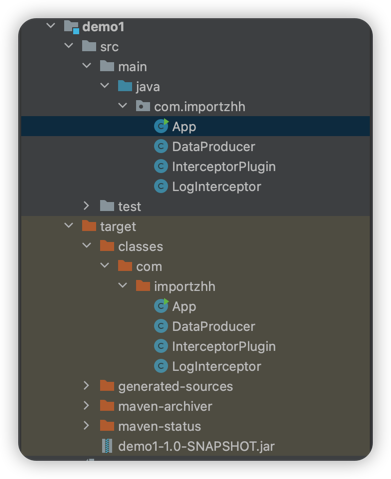

## OnMethodEnter Advice
先编写一个入门示例 项目源码结构如下


pom.xml
```xml
<project>
    <properties>
        <project.build.sourceEncoding>UTF-8</project.build.sourceEncoding>
    </properties>

    <dependencies>
        <dependency>
            <groupId>junit</groupId>
            <artifactId>junit</artifactId>
            <version>3.8.1</version>
            <scope>test</scope>
        </dependency>
    </dependencies>

    <build>
        <plugins>
            <plugin>
                <groupId>net.bytebuddy</groupId>
                <artifactId>byte-buddy-maven-plugin</artifactId>
                <version>1.14.5</version>
                <executions>
                    <execution>
                        <goals>
                            <goal>transform</goal>
                        </goals>
                    </execution>
                </executions>
                <configuration>
                    <transformations>
                        <transformation>
                            <plugin>com.importzhh.InterceptorPlugin</plugin>
                        </transformation>
                    </transformations>
                </configuration>
            </plugin>
        </plugins>
    </build>
</project>
```

DataProducer.java
```java
package com.importzhh;

public class DataProducer {
    public DataProducer() {
    }

    public void create() {
        System.out.println("Method start");
        System.out.println("create data");
    }
}
```

LogInterceptor.java
```java
package com.importzhh;

import net.bytebuddy.asm.Advice;

public class LogInterceptor {
    @Advice.OnMethodEnter
    public static void start() {
        System.out.println("Method start");
    }
}
```

```java
package com.importzhh;

import net.bytebuddy.asm.Advice;
import net.bytebuddy.build.Plugin;
import net.bytebuddy.description.type.TypeDescription;
import net.bytebuddy.dynamic.ClassFileLocator;
import net.bytebuddy.dynamic.DynamicType;
import net.bytebuddy.matcher.ElementMatchers;

import java.io.IOException;

public class InterceptorPlugin implements Plugin {
    @Override
    public DynamicType.Builder<?> apply(DynamicType.Builder<?> builder, TypeDescription typeDescription, ClassFileLocator classFileLocator) {
        return builder.visit(Advice.
                to(LogInterceptor.class).
                on(ElementMatchers.named("create")));
    }

    @Override
    public void close() throws IOException {
        System.out.println("InterceptorPlugin close method");
    }

    @Override
    public boolean matches(TypeDescription target) {
        System.out.println("Inspecting" + target.getName());
        if (target.getName().equals(DataProducer.class.getName())) {
            System.out.println("Found target code : " + target.getName());
            return true;
        } else {
            System.out.println("Inspected code" + target.getName() + "is not the target code");
            return false;
        }

    }
}
```

App.java
```java
package com.importzhh;

/**
 * Hello world!
 */
public class App {
    public static void main(String[] args) {
        System.out.println("Hello World!");
        new DataProducer().create();
    }
}
```

在`InterceptorPlugin`中定义了字节码转换规则（即为 `DataProducer.create` 方法添加日志），接下来的步骤是编译并测试这个插件。

1. **编译**：你可以使用Maven进行编译，确保整个项目没有语法错误和依赖问题。在项目的根目录运行以下命令进行编译：

```bash
mvn clean install
```

2. **运行**：`InterceptorPlugin` 定义了对 `DataProducer.create` 方法的转换逻辑。

在编译阶段，ByteBuddy Maven插件应该会修改 `DataProducer` 类的字节码，并为 `create` 方法添加 "Method start" 的输出。因此，调用 `DataProducer.create` 应该能看到这个输出。

运行这个 App.java 测试，如果一切正常，那么在控制台中应该看到 "Method start" 的输出。
```java
Hello World!
Method start
create data
```

