## 图示说明

- 
- 代表着主机
- 
- 代表服务器
- 
- 代表着路由器
- 
- 代表着网络

## 计算机网络在信息时代的作用

- 计算机网络已由一种**通信基础设施**发展成为一种重要的**信息服务基础设施**
- 计算机网络已经像水，电，煤气这些基础设施一样，成为我们**生活中不可或缺**的一部分
- 我国互联网发展状况 [中国互联网络信息中心CNNIC](http://www.cnnic.net.cn)

## 网络、互连网（互联网）和因特网

网络：网络（Network）由若干**结点-Node**和连接这些结点的**链路-Link**组成。


互连网（互联网）：多个网络通过路由器互连起来，这样就构成了一个覆盖范围更大的网络，即互连网（互联网）。因此，互联网又称为“网络的网络（Network of Networks）”。
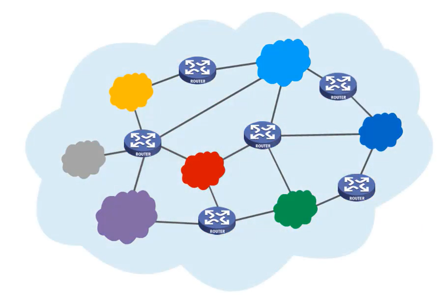

因特网：因特网（Internet）是世界上最大的互连网络（用户数以亿计，互连的网络数以百万计）。
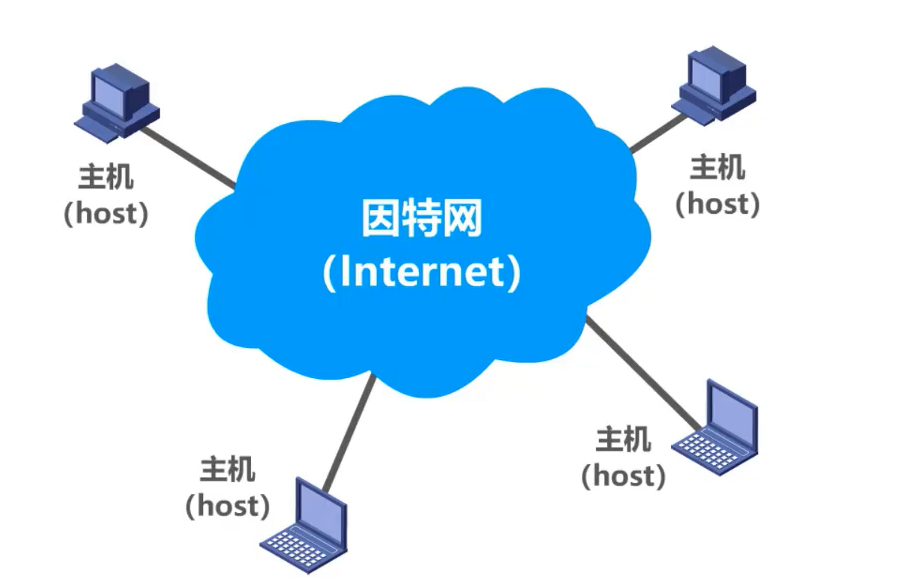

> **internet与Internet的区别**
>
> - **internet(互联网或互连网)**是一个通用名词，它泛指**多个计算机网络互连而成的网络**。在这些网络之间的通信协议可以是任意的。
> - **Internet（因特网）则是一个专用名词**，它指**当前全球最大的、开放的、由众多网络互连而成的特定计算机网络**，它采用TCP/IP协议族作为通信的规则，其前身是美国的ARPANET。
>
> **任意把几个计算机网络互连起来（不管采用什么协议），并能够相互通信，这样构成的是一个互连网(internet) ，而不是互联网(Internet)。**


## 因特网发展的三个阶段


### **因特网服务提供者 `ISP`(`I`nternet `S`ervice `P`rovider)**


> 普通用户是如何接入到因特网的呢？
>
> 答：**通过ISP接入因特网**
>
> ISP可以从因特网管理机构申请到成块的IP地址，同时拥有通信线路以及路由器等联网设备。任何机构和个人只需缴纳费用，就可从**ISP的得到所需要的IP地址**。
>
> **因为因特网上的主机都必须有IP地址才能进行通信，这样就可以通过该ISP接入到因特网**

### **中国的三大 `ISP`：中国电信，中国联通和中国移动**


### **基于ISP的三层结构的因特网**


> 一旦某个用户能够接入到因特网，那么他也可以成为一个ISP，所需要做的就是购买一些如调制解调器或路由器这样的设备，让其他用户可以和他相连。

## 因特网的标准化工作

- 因特网的标准化工作对因特网的发展起到了非常重要的作用。
- 因特网在指定其标准上的一个很大的特点是**面向公众。**
  - 因特网所有的**RFC**(Request For Comments)技术文档都可从因特网上免费下载；
  - 任何人都可以随时用电子邮件发表对某个文档的意见或建议。
- **因特网协会ISOC**是一个国际性组织，它负责对因特网进行全面管理，以及在世界范围内促进其发展和使用。
  - 因特网体系结构委员会IAB，负责管理因特网有关协议的开发；
  - 因特网工程部IETF，负责研究中短期工程问题，主要针对协议的开发和标准化；
  - 因特网研究部IRTF，从事理论方面的研究和开发一些需要长期考虑的问题。


- 制订因特网的正式标准要经过一下**4个阶段**：

  1、因特网草案（在这个阶段还不是RFC文档）

  2、建议标准（从这个阶段开始就成为RFC文档）

  3、草案标准

  4、因特网标准

## 因特网的组成

- 边缘部分

  由所有连接在因特网上的**主机**组成（台式电脑，大型服务器，笔记本电脑，平板，智能手机等）。这部分是**用户直接使用**的，用来进行**通信**（传送数据、音频或视频）和**资源共享**。
- 核心部分

  由**大量网络**和连接这些网络的**路由器**组成。这部分是**为边缘部分提供服务**的（提供连通性和交换）。


> 路由器是一种专用计算机，但我们不称它为主机，路由器是实现分组交换的关键构建，其任务是转发收到的分组，这是网络核心最重要的部分。
>
> 处在互联网边缘的部分就是连接在互联网上的所有的主机。这些主机又称为**端系统 (end system)**。
>
> **端系统在功能上可能有很大的差别：**
>
> 1. 小的端系统可以是一台普通个人电脑，具有上网功能的智能手机，甚至是一个很小的网络摄像头。
> 2. 大的端系统则可以是一台非常昂贵的大型计算机。
> 3. 端系统的拥有者可以是个人，也可以是单位（如学校、企业、政府机关等），当然也可以是某个ISP。

### 补充

**端系统之间通信的含义**

“主机 A 和主机 B 进行通信”实际上是指：“运行在主机 A 上的某个程序和运行在主机 B 上的另一个程序进行通信”。**即“主机** **A** **的某个进程和主机** **B** **上的另一个进程进行通信”。简称为“计算机之间通信”。**

端系统之间的通信方式通常可划分为两大类：


**客户-服务器方式：**

- 客户 (client) 和服务器 (server) 都是指通信中所涉及的两个应用进程。
- 客户 - 服务器方式所描述的是进程之间服务和被服务的关系。
- 客户是服务的请求方，服务器是服务的提供方。

> **服务请求方和服务提供方都要使用网络核心部分所提供的服务。**

**对等连接方式：**

- **对等连接** (peer-to-peer，简写为 **P2P** ) 是指两个主机在通信时并不区分哪一个是服务请求方还是服务提供方。
- 只要两个主机都运行了对等连接软件 ( P2P 软件) ，它们就可以进行**平等的、对等连接通信**。
- 双方都可以下载对方已经存储在硬盘中的共享文档。

## 三种交换方式

网络核心部分是互联网中最复杂的部分。

网络中的核心部分要向网络边缘中的大量主机提供连通性，使边缘部分中的任何一个主机都能够向其他主机通信（即传送或接收各种形式的数据）。

在网络核心部分起特殊作用的是**路由器**(router)。

**路由器**是实现**分组交换** (packet switching) 的关键构件，其任务是**转发**收到的分组，这是网络核心部分最重要的功能。

### 电路交换（Circuit Switching）

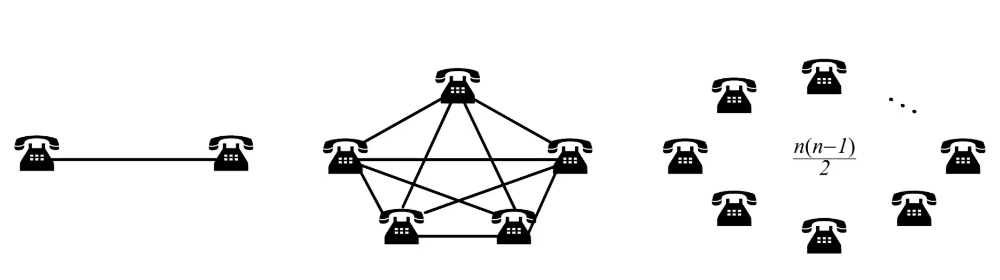

> 传统两两相连的方式，当电话数量很多时，电话线也很多，就很不方便
>
> 所以要使得每一部电话能够很方便地和另一部电话进行通信，就应该使用一个**中间设备**将这些电话连接起来，这个中间设备就是**电话交换机**
> 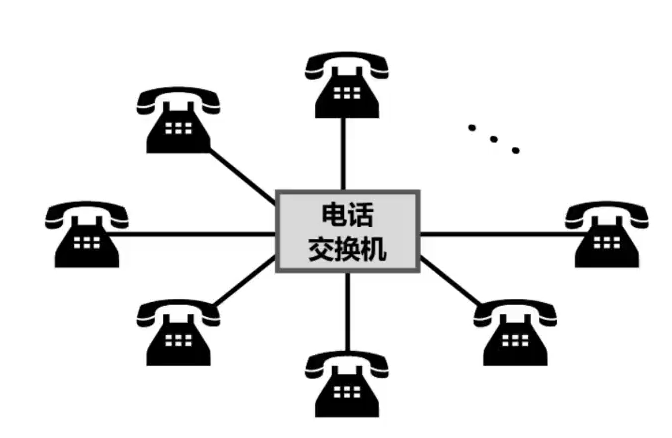

- 电话交换机接通电话线的方式称为电路交换；
- 从通信资源的分配角度来看，交换（Switching）就是按照某种方式动态地分配传输线路的资源；
- 电路交换的三个步骤：

  1、建立连接（分配通信资源）

  2、通话（一直占用通信资源）

  3、释放连接（归还通信资源）

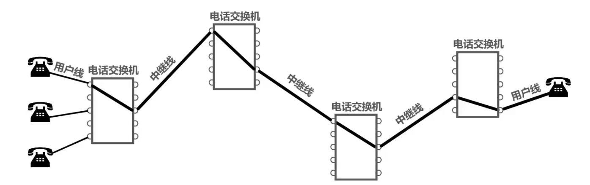

> 当使用电路交换来传送计算机数据时，其线路的传输效率往往很低。
>
> 这是因为计算机数据是突发式地出现在传输线路上的。
>
> 所以计算机通常采用的是**分组交换**，而不是线路交换

### 分组交换（Packet Switching）

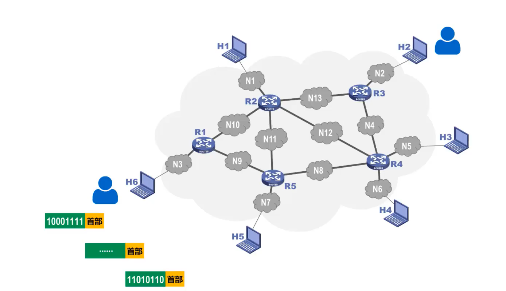

> 通常我们把表示**该消息的整块数据**成为一个**报文**。
>
> 在发送报文之前，先把较长的报文划分成一个个更小的**等长数据段**，在每一个数据段前面。加上一些由必**要的控制信息组成的首部**后，就构成一个分组，也可简称为“包”，相应地，首部也可称为“包头”。
>
> 首部包含了**分组的目的地址**
>
> 分组从源主机到目的主机，可走不同的路径。

发送方

- 构造分组
- 发送分组

路由器

- 缓存分组
- 转发分组
- 简称为“分组转发”

> 在路由器中的输入和输出端口之间没有直接连线。
>
> 路由器处理分组的过程是：
>
> 1. 把收到的分组先**放入缓存（暂时存储）；**
> 2. **查找转发表**，找出到某个目的地址应从哪个端口转发；
> 3. 把分组送到适当的端口**转发**出去。

接收方

- 接收分组
- 还原报文

### 报文交换（Message Switching）

报文交换中的交换结点也采用存储转发方式，但报文交换对报文的大小没有限制，这就要求交换结点需要较大的缓存空间。报文交换主要用于早期的电报通信网，现在较少使用，**通常被较先进的分组交换方式所取代**。

## 三种交换方式的对比

> 假设A，B，C，D是分组传输路径所要经过的4个结点交换机，纵坐标为时间

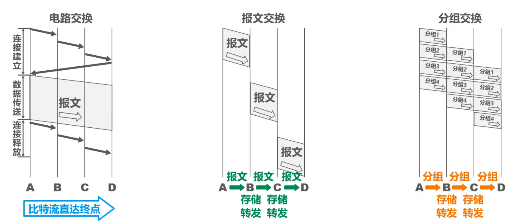

分析：

电路交换：

- 通信之前首先要建立连接；连接建立好之后，就可以使用已建立好的连接进行数据传送；数据传送后，需释放连接，以归还之前建立连接所占用的通信线路资源。
- 一旦建立连接，中间的各结点交换机就是直通形式的，比特流可以直达终点；

报文交换：

- 可以随时发送报文，而不需要事先建立连接；整个报文先传送到相邻结点交换机，全部存储下来后进行查表转发，转发到下一个结点交换机。
- 整个报文需要在各结点交换机上进行存储转发，由于不限制报文大小，因此需要各结点交换机都具有较大的缓存空间。

分组交换：

- 可以随时发送分组，而不需要事先建立连接。构成原始报文的一个个分组，依次在各结点交换机上存储转发。各结点交换机在发送分组的同时，还缓存接收到的分组。
- 构成原始报文的一个个分组，在各结点交换机上进行存储转发，相比报文交换，减少了转发时延，还可以避免过长的报文长时间占用链路，同时也有利于进行差错控制。


---

## 计算机网络的定义和分类

### 定义

- 计算机网络的精确定义并未统一
- 计算机网络的最简单的定义是：一些**互**相**连**接的、**自治**的计算机的**集合**。
  - 互连：是指计算机之间可以通过有线或无线的方式进行数据通信；
  - 自治：是指独立的计算机，他有自己的硬件和软件，可以单独运行使用；
  - 集合：是指至少需要两台计算机；
- 计算机网络的较好的定义是：计算机网络主要是由一些**通用的，可编程的硬件（一定包含有中央处理机CPU）互连**而成的，而这些硬件并非专门用来实现某一特定目的（例如，传送数据或视频信号）。这些可编程的硬件能够用来**传送多种不同类型的数据**，并能**支持广泛的和日益增长的应用**。
  - 计算机网络所连接的硬件，并不限于一般的计算机，而是包括了智能手机等智能硬件。
  - 计算机网络并非专门用来传送数据，而是能够支持很多种的应用（包括今后可能出现的各种应用）。

### 分类

**按交换技术分类：**

- 电路交换网络
- 报文交换网络
- 分组交换网络

**按使用者分类：**

- 公用网
- 专用网

**按传输介质分类：**

- 有线网络
- 无线网络

**按覆盖范围分类：**

- 广域网WAN（Wide Area Network）

作用范围通常为几十到几千公里，因而有时也称为远程网（long haul network）。广域网是互联网的核心部分，其任务是通过长距离（例如，跨越不同的国家）运送主机所发送的数据。

- 城域网MAN

作用范围一般是一个城市，可跨越几个街区甚至整个城市。并有趋势将传统的电信服务、有线电视服务、互联网服务融为一体。

- 局域网LAN

一般用微型计算机或工作站通过高速通信线路相连（速率通常在 10 Mbit/s 以上），但地理上范围较小（1 km 左右）。例如校园网、企业内网。

- 个域网WPAN

就是在个人工作的地方把个人使用的电子设备例如耳机、鼠标、键盘、打印机等用无线技术连接起来的网络。需要注意的是若中央处理机之间的距离非常近，例如仅1m的数量级或更小，

则一般称为多处理机系统，而不称它为计算机网络

**按拓扑结构分类：**

- 总线型网络


- 星型网络


- 环形网络


- 网状型网络

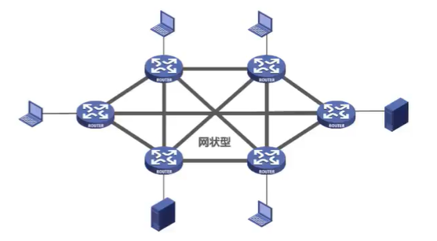

## 计算机网络的性能指标

### 速率


### 带宽


### 吞吐量


> 带宽1 Gb/s的以太网，代表其额定速率是1 Gb/s，这个数值也是该以太网的**吞吐量的绝对上限值**。因此，对于带宽1 Gb/s的以太网，可能实际吞吐量只有 700 Mb/s，甚至更低。
>
> 注意：吞吐量还可以用每秒传送的字节数或帧数表示

### 时延

时延时指数据（一个报文或分组，甚至比特）从网络（或链路）的一端传送到另一端所需的时间。

网络时延由几部分组成：

- 发送时延

主机或路由器发送数据帧所需要的时间，也就是从发送数据帧的第一个比特算起，到该帧的最后一个比特发送完毕所需的时间。

- 传播时延

电磁波在信道中传播一定的距离需要花费的时间。

- 处理时延

主机或路由器在收到分组时要花费一定时间进行处理

- 排队时延

分组在进过网络传输时，要经过许多路由器。但分组在进入路由器后要先在输入队列中排队等待处理。

> 有时会把排队时延看成**处理时延 一部分**
>
> 总时延 = 发送时延 + 传播时延 + 处理时延 （处理时延 + 排队时延）


> 当处理时延忽略不计时，发送时延 和 传播时延谁占主导，要具体情况具体分析

### 时延带宽积

时延带宽积 = 传播时延 * 带宽


### 往返时间

互联网上的信息不仅仅单方向传输而是双向交互的。因此，我们有时很需要知道**双向交互一次所需的时间**。


### 利用率

利用率有**信道利用率**和**网络利用率**两种。


### 丢包率


---

## 计算机网络体系结构

### 常见的计算机网络体系结构


> 如今用的最多的是TCP/IP体系结构，现今规模最大的、覆盖全球的、基于TCP/IP的互联网并未使用OSI标准。
>
> TCP/IP体系结构相当于将OSI体系结构的**物理层**和**数据链路层**合并为了**网络接口层**，并去掉了**会话层**和**表示层**。
>
> TCP/IP在网络层使用的协议是IP协议，IP协议的意思是网际协议，因此**TCP/IP体系结构的网络层称为网际层**


> 在用户主机的操作系统中，通常都带有符合TCP/IP体系结构标准的TCP/IP协议族。
>
> 而用于网络互连的路由器中，也带有符合TCP/IP体系结构标准的TCP/IP协议族。
>
> 只不过路由器一般只包含网络接口层和网际层。


> **网络接口层**：并没有规定具体内容，这样做的目的是可以互连全世界各种不同的网络接口，例如：有线的以太网接口，无线局域网的WIFI接口等。
>
> **网际层**：它的核心协议是IP协议。
>
> **传输层**：TCP和UDP是这层的两个重要协议。
>
> **应用层**：这层包含了大量的应用层协议，如 HTTP , DNS 等。

> **IP协议（网际层）**可以将不同的**网络接口（网络接口层）**进行互连，并向其上的**TCP协议和UDP协议（传输层）**提供网络互连服务
>
> 而**TCP协议**在享受IP协议提供的网络互连服务的基础上，可向**应用层的相应协议**提供**可靠**的传输服务。
>
> **UDP协议**在享受IP协议提供的网络互连服务的基础上，可向**应用层的相应协议**提供**不可靠**的传输服务。

> TCP/IP体系结构中最重要的是**IP协议**和**TCP协议**，因此用TCP和IP来表示整个协议大家族。


> 教学时把TCP/IP体系结构的**网络接口层**分成了**物理层**和**数据链路层**

### 计算机网络体系结构分层的必要性


**物理层问题**


> 这图说明
>
> - 第一，严格来说，传输媒体并不属于物理层
> - 计算机传输的信号，并不是图示的方波信号
>
> 这样举例只是让初学者容易理解

**数据链路层问题**


需要说明的是，这种总线型的网络早已经被淘汰，现在常用的是以太网交换机将多台主机互连形成的交换式以太网

**网络层问题**


**传输层问题**


> 如何标识与网络通信相关的应用进程：一个分组到来，我们应该交给哪个进程处理呢？浏览器进程还是QQ进程

**应用层问题**

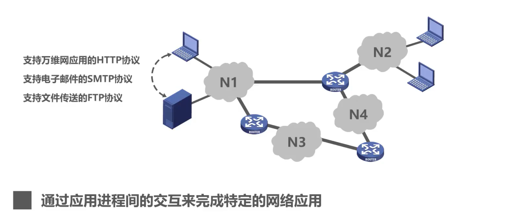

> 应用层该用什么方法（应用层协议）去解析数据

**总结**

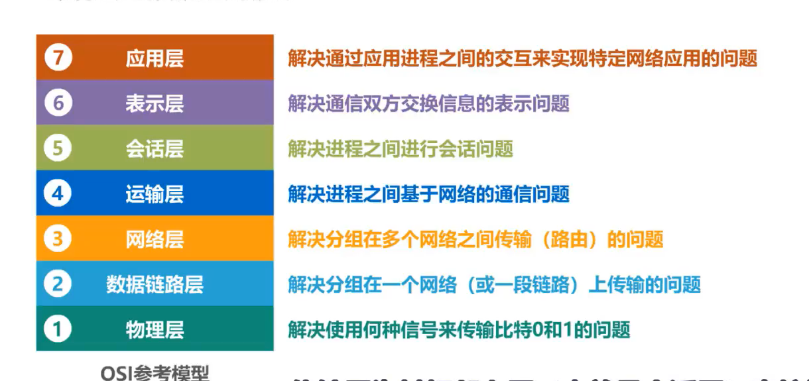


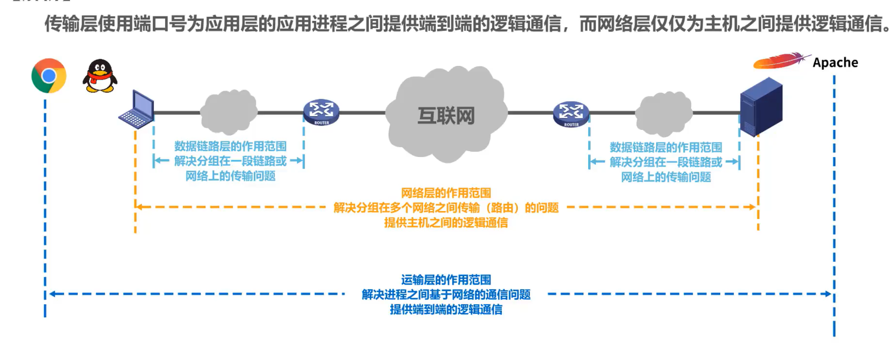

### 计算机网络体系结构分层思想举例

例子：主机的浏览器如何与Web服务器进行通信


**解析：**

主机和Web服务器之间基于网络的通信，实际上是主机中的**浏览器应用进程**与Web服务器中的**Web服务器应用进程**之间基于**网络的通信**


**体系结构的各层在整个过程中起到怎样的作用？**

#### **发送方发送**

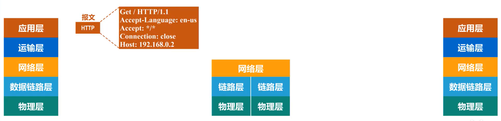

##### 第一步：http报文

> - **应用层**按照HTTP协议的规定构建一个**HTTP请求报文**
> - 应用层将**HTTP请求报文**交付给**传输层**处理


##### 第二步：TCP报文段

> - **传输层**给**HTTP请求报文**添加一个**TCP首部**，使之成为**TCP报文段**
> - **TCP报文段的首部格式**作用是区分应用进程以及实现可靠传输
> - **传输层**将T**CP报文段**交付给**网络层**处理


##### 第三步：IP数据段

> - **网络层**给**TCP报文段**添加一个**IP首部**，使之成为**IP数据报**
> - **IP数据报的首部格式**作用是使**IP数据报**可以在互联网传输，也就是被路由器转发
> - **网络层**将**IP数据报**交付给**数据链路层**处理


##### 第四步：帧

> - **数据链路层**给**IP数据报**添加一个**首部**和一个**尾部**，使之成为**帧**     （图示右边为首部，左边为尾部）
> - 该**首部**的作用主要是为了让**帧**能够在一段链路上或一个网络上传输，能够被相应的目的主机接收
> - 该**尾部**的作用是让目的主机检查所接收到的**帧**是否有误码
> - **数据链路层**将**帧**交付给**物理层**

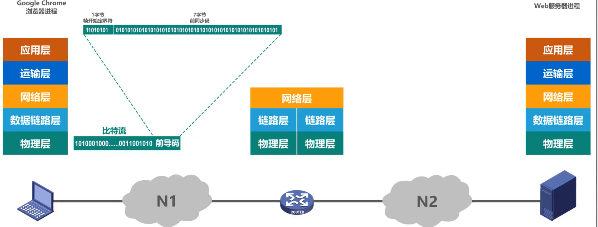

##### 第五步：比特流 前导码

> - **物理层**先将**帧**看做是**比特流**，这里的网络N1假设是以太网，所以**物理层**还会给该**比特流**前面添加**前导码**
> - **前导码**的作用是为了让目的主机做好接收帧的准备
> - **物理层**将装有**前导码**的**比特流**变换成相应的**信号**发送给传输媒体


##### 第六步：到达路由器

> - **信号**通过**传输媒体**到达**路由器**

#### **路由器转发**


> 在路由器中
>
> - **物理层**将**信号**变为**比特流**，然后去掉**前导码**后，将其交付给**数据链路层**
> - **数据链路层**将**帧**的**首部**和**尾部**去掉后，将其交付给**网络层**，这实际交付的是**IP数据报**
> - **网络层**解析**IP数据报**的**首部**，从中提取**目的网络地址**


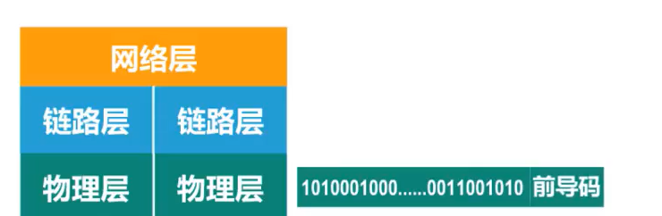

> 在路由器中
>
> - 提取**目的网络地址**后查找**自身路由表**。确定**转发端口**， 以便进行转发
> - **网络层**将**IP数据报**交付给**数据链路层**
> - **数据链路层**给**IP数据报**添加一个**首部**和一个**尾部**，使之成为**帧**
> - **数据链路层**将帧交付给**物理层**
> - **物理层**先将**帧**看成**比特流**，这里的网络N2假设是以太网，所以**物理层**还会给该**比特流**前面添加**前导码**
> - 物理层将装有**前导码**的**比特流**变换成相应的**信号**发送给传输媒体，信号通过传输媒体到达**Web服务器**

#### **接收方接收**

> 和发送方（主机）发送过程的封装正好是反着来
>
> 在Web 服务器上
>
> - **物理层**将**信号**变换为**比特流**，然后去掉**前导码**后成为**帧**，交付给**数据链路层**
> - **数据链路层**将**帧**的**首部**和**尾部**去掉后成为**IP数据报**，将其交付给**网络层**
> - **网络层**将**IP数据报**的**首部**去掉后成为**TCP报文段**，将其交付给**传输层**
> - **传输层**将**TCP报文段**的**首部**去掉后成为**HTTP请求报文**，将其交付给**应用层**
> - **应用层**对**HTTP请求报文**进行**解析**，然后给主机发回**响应报文**
>
> **发回响应报文的步骤和之前过程类似**


### 补充


我们如果想通过域名来访问某个网站的话 就必须得到这个域名所绑定的ip地址
那这个ip地址的话我们应该找 dns服务器获取 但是他不是一开始就去找dns服器的
首先他会检查那个浏览器的缓存还有本地的缓存
里面 之前有没有访问过baidu.com
里面有没有他的域名 如果说之前没有访问
没有缓存的话 他就会检查那个本地的hosts文件 看看里面有没有添加映射关系
如果说hosts文件里面也没有的话 他就会将请求发送到电脑中配置的dns服务器
也就是这8.8.8.8这个服务器上去

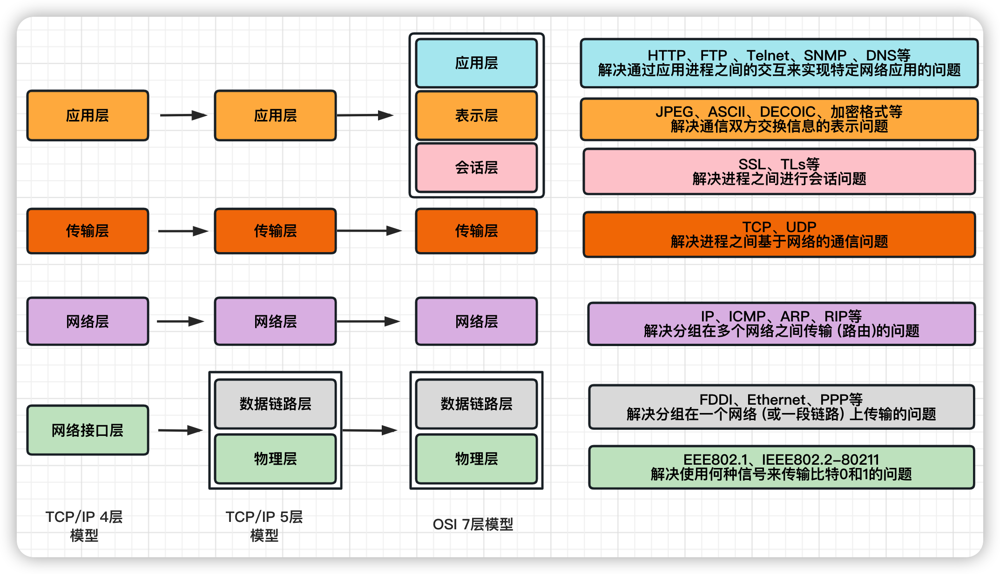

```
dns是一个应用层的协议 它主要就是 用来获取域名所绑定的ip地址 那么它就会构造一个 比如说 请告诉我 baidu.com的ip地址 这个协议 它会生成一个这个请求
这是dns的协议 生成这个请求之后dns是应用层的数据 对不对

然后他要通过这个模型一层一层往下传传到物理层 也就是我们的网卡的那个接口
生成的那个请求数据 之后他会传到传输层
传输层 它会对应用层的数据进行封装
它封装了一个**源端口**和**目标端口** 比如说 我们前面是源端口
我们写个404 目标端口的话 dns默认是53号端口 它会封装成这么一个
数据包 然后接着往下传 这里的话我们就要注意一下
传输层他主要做什么 传输层主要是有端口这个概念对不对

然后来到网络层 网络层 他也会在前面封装一个 包头 他前面封装的是什么 **源ip**和**目标ip**
也就是本机的电脑ip和你要访问的服务器ip 这里我们的源ip是什么 这个192.168.1.10对不对 
我们的目标ip都8.8.8.8 对不对 

那么我们把这个数据封装好了 之后我们再来到链路层
那么我们这现在知道网络层 他会干什么 他会添加ip地址 对不对
网络层封装这个数据后 一看 你这个目标的ip地址
并不在我的这个网段范围之内 我找不到这个ip地址
当我们的电脑找不到这个ip地址的时候 他就会去找网关
我们家里的网关一般是路由器 那么这里的话我们就会把这个请求
发送给网关来到下面这一层之后

我们这里的网关地址是多少 这个GW就是网关 是192.168.1.1对不对也就是我们这路由器的这个端口
在同一个局域网里面通信 他使用的是MAC地址 也是我们的MAC地址 那么这个数据他会来到下一层
准备发往网关数据面 数据链路层会在前面加上网关的 **MAC地址**和你的**源MAC地址**
也就是我们本机的MAC地址是什么 AA对不对 这是我们本机的MAC地址
目标mac地址是CC 但我们怎么得到这个CC呢

这个的话是通过**ARP协议**来获取到这个网关的CC的MAC地址
这个的话我们就不展开讲了 然后的话 假设我们就直接获取到了cc的MAC地址

当然这个数据链路层的话 最也会在后面插上一些
其他数据用作校验 这里的话我们就不涉及那么多细节了

```


```
然后这条数据就会顺着物理层来到网卡的接口
它就会通过网卡从网线中发出去 来到了交换机这个位置

交换机它是一个二层的设备
也就是说他只能解析两层的数据 比如说我们这里复制一层出来
这是 这是那个交换机能干的事情
所有上面的数据他都是没办法进行解析的 那么 从这里 过来 这个数据包从这里来到交换机 交换机收到这个数据之后 他可以
看一下它里面的MAC地址 源MAC地址是这个地方 目标MAC地址是cc

他一看 这cc不是在我这个端口挂着吗  于是乎 他就将这个数据包转发到路由器的这个端口
也就是MAC地址为cc的这个端口 而这个路由器 它是一个三层设备 所以说 它能解析三层的数据

这个是路由器能干的事情 从过这里过来
所以说这数据从这里到了这个端口 之后数据从路由器的网口进来
传到数据链路层 数据链路层一看 哎 这个cc这个目标地址不就是我吗

于是乎他就接受了这个数据包 接收之后 他会把这个 头部拿掉 拿掉之后 他会往上传

传到这个网络层 网络层拿到这个数据 一看源ip地址和目标ip地址
哦 这是192.168.1.10这个小伙子发过来的数据包
那么他要发到哪里 发到8.8.8.8他一看
这不妙 我这里没有跟8.8.8.8直接连接呀
我也找不到他 他不在我附近 那么路由器 他的工作就是把这个数据再路由出去
再转发出去 那么他会转发到哪里去了 路由器他会设置一个**默认路由**
当我发现我这里找不到这个8.8.8.8的时候
他就会发送到我这个默认路由一般来说
就是直接发送到公网的其他的路由器了 这里就我们就不用管了

于是乎他会把这个数据转发给公网上的其他路由器
他准备把我们的这个数据包从我们的 WAN口 我们的路由器不是有一个颜色不一样的吗 叫做WAN口
那是通往互联网的道路 这个WAN口它有一个公网的ip地址
也就是这个 我们这里是配的20.20.20.20
那么他需要将这个里面的内网的数据转发出去

但是这里的话路由器他还要做一个操作 就是**NAT**
也就是网络地址转换 为什么要做转换呢 
因为我们这个 源IP地址 他是一个内网的网段 他不能在公网上进行传输
必须转成这个WAN口他允许公网传输的这么一个IP地址
那么他是怎么转的 首先 这个路由器 它有一个NAT的映射表
它会先将我们的本地的这个地址先保存在这里
还有 本地的端口404就保存在这里 直接重新写一个吧 192.168.1.10
那端口是404这是这个数据包里面的 源ip地址和源端口 都会放到这里 然后把他的公网i p 也就是20.20.20.20
塞到这里去 然后他的端口的话也会随机找一个端口 比如叫505吧
改成这样子 同时他也会在这里记录一下他们的映射关系
也就是20.20.20.20
端口号是505 他们是一个对应关系 他会先保存在这里
路由器就把你的包改成了这个样子 然后他就会再回到这个数据链路层
数据链路层的话 他就会前面再加上源MAC地址和目标MAC地址
源MAC地址就是我们现在的这个WAN口的mac地址了 我们要改成DD
目标MAC地址就是他的下一跳的路由器的那个MAC地址
这里的话我们就简化了没画 假设是XX吧 那么他这个数据包就会从
你家里面的那个路由器 那个WAN口出去来到了互联网上其他路由器
```


```
然后他会经过十来个路由器的样子 最终找到这个dns服务器
然后将数据交给这台dns服务器 我们知道dns是一个应用层的协议
所以说这台服务器也能够解析到应用层
所以说 这个整个层 我们都要拿过来 当这个服务器收到这条数据之后
他会从下面往上读 另外 要要再说明的是 他经过每一跳他的MAC地址他都会修改
也就是说从DD跳到XX XX再解开数据包一看
哦 这是DD发过来的 他的目标地址是8.8.8.8
那么我也可以发给我的下一个路由器
他发的时候他就会把他的源MAC地址改成他自己
也就是XX 目标MAC地址就改成他的下一条路由器
假如我们这里就直接改成这个
这个FF这是最终 他的最后一个路由器传给他的这个数据包
这个服务器拿到数据包之后
从物理层到数据链路 链路层一看目标MAC地址是FF 我的
MAC地址是FF  没错 这个包是发给我的 于是乎他会把这里拿掉
拿掉之后 他就会在往上传这个数据包 传到网络层的时候
一看是发给我这个ip地址的
他是从20.20.20.20这个地方发到给我这个服务器的
于是乎这一段也拿掉了然后再往上传传都传输层的时候
传输层是干的是什么 他是添加了端口 对不对
他是从他的505端口发到我的53号端口 我的53号端口是提供dns服务对不对
因为他默认dns的端口就是53号 于是乎 他知道了他是想干什么
他是想做dns解析 那么他就会把这个报文
发送给应用层的dns应用 这个dns收到这个请求之后
知道了他要干嘛 他想要百度的ip地址 至此的话 我们这个数据包
就走到了这个地方 那么他要百度的ip地址 这个dns服务器就是干这个事的
然后他会经过一些手段把他的百度ip地址获取到 比如说
他得到了百度的ip地址 百度
ip地址是7.7.7.7 这是这台服务器的响应
生成了一个dns的响应 之后它就会往回传
来到传输层 现在这里就要改一下了 他的源端口是什么
源端口是他本机的端口是53号 对不对
53号发往哪里 发往505对不对
就刚才我们发过来的他现在要原地返还给他
反还给的505端口 这个传输层的事就干完了
然后他就会发到这个网络层 网络层会干什么 网络层会
添加一个ip地址对不对 所以他这里会加上一个ip地址
源ip地址就是本机的ip 8.8.8.8
目标ip地址就是刚才数据包发给他的这个20.20.20.20
```

```
那么他就会再往下走来到数据链路层
数据链路层会添加一个MAC地址 比如说我的源MAC地址是什么FF对不对
那他的下一跳就是网络中的那个某一台路由器
假设是XX 那么这个数据包就算是完成了 然后他就会从这个
物理的网口出去 来到互联网上 再经过好几个路由器跳跳跳跳
跳来跳去 最后跳到这个路由器这个端口
这个路由器拿到数据一看 当然这个
中间的这个MAC地址一直都在在发生变化的 所以说我们这个MAC地址我们要给他改一下
跳到最后将会是XX发送给
DD的对不对 源MAC地址是XX 那目标那个是DD
收到的是将是这么一个数据 那么这里的时候物理层
它会往上传传到这个数据链路层
这个路由器一看这个DD这不是我的MAC地址吗
于是乎他接受了这个数据包 然后将前面拿掉
然后继续将这个数据包往上传
因为这个网络 他只能解析到网络层 不过他加了NAT之后也能解析到这个
传输层 但实际上 他还是一个三层设备 那么他会检查
是8.8.8.8发到我这个地址的 那么它是从53号端口发往
505这个时候 他检查一
看 这505号不是在这个NAT这里映射了关系吗 于是乎 他会
把这个数据包改回来 20.20.20.20
他实际上对应的是192.168.1.10对不对
然后这个端口505端口对应的是404对不对
就这192.168.1.10目标端口就改成404
然后将这个数据包改好之后重新
返回到了数据链路层 然后再添加头部
这个头部还是MAC地址 源MAC地是什么
源MAC地址 他会转到内网这边来 源MAC地址就变成了cc
目标MAC地址就是a a 你说这里我们知怎么知道他是要a a
因为他这个ip地址就是192.168.1.10他已经获取到了这个192.168.1.10的MAC地址
那么这个数据包弄装好之后 他就会来到数据链路层
在原路返回 这里是二层的交换
机 交换机一看 你的目标MAC地址是a a对不对 aa在我这个口上插着
你去吧  来到这里 这个数据帮拿到之后
他来到数据链路层这个aa 这不是发给我的吗
于是乎 他拿掉了这前面的 我们就不再一直拿了
拿掉之后 他会发到网络层 网络上一看
这不是8.8.8.8给我回的吗 给我192.168.1.10回的吗
确实是我的数据包 那我要了
来到传输层 一看这是53号端口
给我的404端口回的 404是谁开的
404是浏览器开的一个随机的端口
所以说这个请求 他会发送给浏览器来到应用层
浏览器拿到这个数据中获取到了 百度的ip地址是7.7.7.7
这个时候把dns解析的部分就算是结束了
也就是说这台电脑 它得到了百度的ip地址
这台主机收到了百度的ip地址之后就会重新构造一个请求
请把首页数据给我
这个时候 这个数据包又会跟刚才一样来到应用层
这个是HTTP协议 来到这里之后
前面还会添加之前一样端口号
源端口 他也会随机起一个端口 那目标端口的话就是80端口
HTTP协议的默认端口你没指定的话 他就是默认的就是80
然后再到网络层 网络层一样前面加一个ip地址
源ip地址和目标ip地址往后的顺序都是
跟刚才dns解析的流程是一模一样的
数据最终将会到达这个百度的WEB服务器
一看哦 原来你是要我的首页数据 然后他就会构造一个
回应首页的内容这么一个数据包
里面放了就是百度的首页的内容 那么他也会跟
刚才回包的时候 一样 通过这个传输层
添加那个端口号 再添加那个ip地址
再添加那个MAC地址 然后就从互联网上经过
路由器不停的跳跳跳 最后跳到你家里面的路由器
最后再通过nat转换
映射到你的内网中 某一台机器最终将会获得百度的内容
具体就是这么个流程
```

### 计算机网络体系结构中的专用术语

以下介绍的专用术语来源于OSI的七层协议体系结构，但也适用于TCP/IP的四层体系结构和五层协议体系结构

#### **实体**

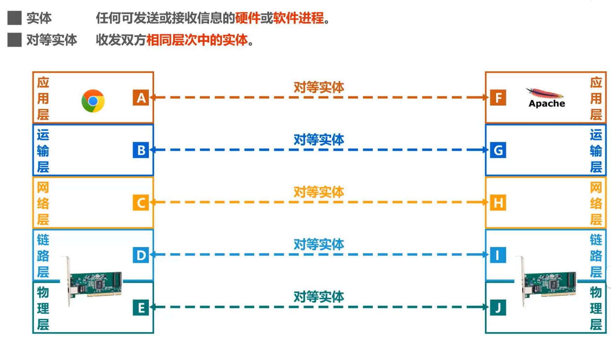

#### **协议**


> 协议：控制两个对等实体进行逻辑通信的规则的集合
>
> 协议三要素：
>
> - 语法：定义所交换信息的格式
> - 语义：定义收发双方所要完成的操作
> - 同步：定义收发双发的时序关系 例如TCP三次握手

#### **服务**

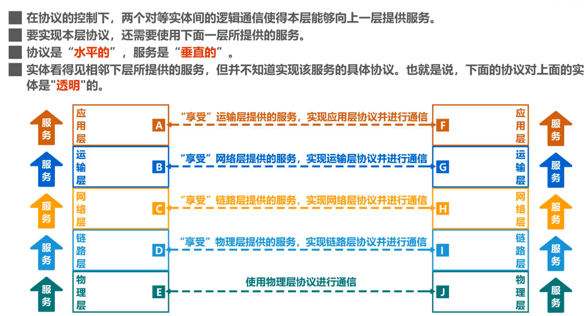

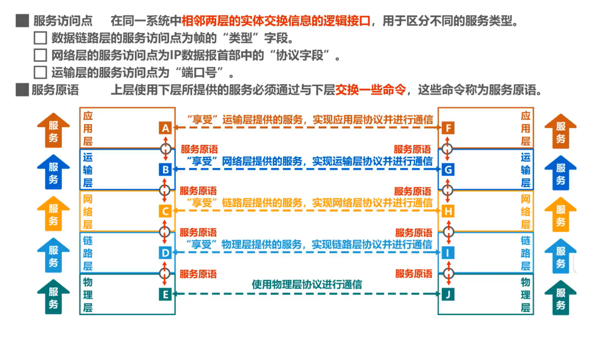


#### 术语总结


## 习题

### 体系结构题目


---


---


```
TCP/IP模型的网络层（对应OSI参考模型的网络层）主要负责数据包的逐跳（hop-to-hop）路由和传输，也就是确定如何将数据包从源主机发送到目标主机。在这一层，最常见的协议就是IP协议（Internet Protocol）。

网络层提供的是无连接的服务，主要是因为它负责的是分包（IP）转发，而并非是数据报文的传输状态管理。在每一跳传输过程中，网络层都独立而不与其他传输节点的状态相关，它不怎么关心是否建立了一个连接，也不关心数据报是否被成功接收。它只是根据目标地址尽可能把分包推送到下一跳。

网络层提供的服务是不可靠的，主要是因为其设计原则是尽力而为（best effort）的服务模型。也就是说，网络层会尽可能地传送数据包，但不提供任何确保到达目标主机或者保证数据包顺序或错误检查的机制，也不提供处理丢包、延迟等问题的机制。

有时，这种无连接和不可靠的服务更高效，因为它省去了需要建立和维护复杂连接的开销，并可以充分地利用网络资源和适应复杂变化的互联网环境。

要理解为什么理解这种无连接和不可靠服务的设置是合理的，首先需要认识到网络层的主要职责、功能、规模和其在网络架构中的位置。

这种无连接、不可靠的服务并不意味着高层的应用就不能得到有连接、可靠的服务。例如，在TCP/IP模型中，更高层次的传输层（包括TCP协议）提供了为端到端通信提供可靠性、有序性、错误检查和修复等服务。这样，应用层在使用TCP协议的情况下，可以享受到建立在不可靠服务之上的可靠服务。
```

```
RTP（Real-time Transport Protocol）是即时传输协议，它是一种网络协议，专门用于Internet上进行实时的音频或视频数据传输。它是由Internet Engineering Task Force（IETF）的多媒体数据传输工作小组开发的，RTP的详细规定在RFC 3550中。

RTP在OSI模型中位于应用层，它通常与RTCP（RTP Control Protocol, RTP控制协议）一起使用，主要处理实时数据传输过程中的流控和同步问题。

RTP在实时应用（如VoIP呼叫、视频会议）中定义了传输数据的标准包格式，包括时间戳、序列号等元素。这些元素帮助接收端重新组装数据流并实现实时播放。

RTP使用上游协议（通常是UDP，有时也可是TCP或其他）来传输数据。此外，RTP不提供任何机制来实现服务质量（QoS），也不提供任何机制来确保数据的安全传输。这些功能需要通过RTP之外的工具或协议来实现。

为了加强可靠性，RTP经常和RTCP一起使用，它们可以为媒体数据提供同步、组件探测、统计信息等功能。
```

---


---


---


---


---


---


---


---


### 时延相关题目


---


---


---


---


---


